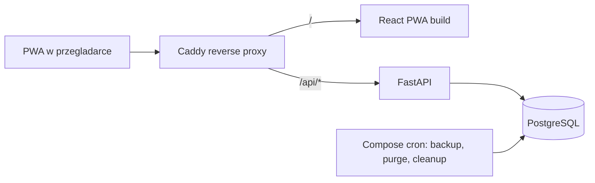

# Plan implementacji Trainer — Faza 1

Źródła prawdy: [docs/prd.md](docs/prd.md) (wymagania), [docs/db-plan.md](docs/db-plan.md) (schemat), reguły w [.cursor/rules](.cursor/rules). Repozytorium zawiera dziś wyłącznie dokumenty — cały kod powstaje od zera.

## Architektura dostawy



Same-origin (FR-005a) obowiązuje też w dev, więc cookie `__Host-trainer_session` i brak CORS działają identycznie lokalnie i na produkcji.

## Struktura repozytorium

```text
backend/    # FastAPI: api/routers, schemas, services, repositories, models, migrations, seed, tests
frontend/   # Vite + React PWA: features/, lib/api, lib/db (IndexedDB), locales/pl-PL
infra/      # Caddyfile, compose override prod, skrypty backup/restore
.github/workflows/ci.yml
docker-compose.yml
```

## E0. Fundament (F1.0, blokuje wszystko)

- `docker-compose.yml`: `db` (PostgreSQL), `api` (uvicorn), `web`, `proxy` (Caddy `/` → web, `/api/*` → api), plus serwisy jednorazowe `backup` i `purge` uruchamiane z crona hosta.
- Backend tooling: `uv`, Ruff, mypy (strict), pytest z markerami `idor` i `concurrency`; migracje i testy wyłącznie w kontenerze (reguła backendu §8).
- Frontend tooling: TypeScript strict, Tailwind + shadcn/ui, TanStack Query, Zustand, React Hook Form + Zod, `vite-plugin-pwa`, `react-i18next` z jednym pakietem `pl-PL` i fallbackiem; testy: **Vitest** (unit, coverage ≥80%) + **Playwright** (E2E).
- CI (GitHub Actions): ruff + mypy, `alembic upgrade head` na czystej bazie, `pytest`, osobny job `pytest -m idor`, Vitest (coverage ≥80%), Playwright E2E (Compose + Chromium), job kompletności i18n (brakujące klucze `pl-PL` = fail), job content gate (twardy dopiero dla F1.prod).

## E1. Schemat bazy (F1.0)

- Alembic w kolejności z [docs/db-plan.md](docs/db-plan.md) „Kolejność migracji”: role `trainer_app` / `trainer_migrator` → `users`/`auth_sessions`/`oauth_states`/`legal_documents` + `legal_document_translations` → katalog + tabele `*_translations` → sesje/logi/progresja → sync/rate limit.
- Twarde inwarianty w DDL, nie w kodzie: `UNIQUE (id, user_id)` na `workout_sessions` i composite FK `(session_id, user_id)` z logów; partial UNIQUE FR-039; partial index silnika z `counts_for_progression = true`; RLS włączone tylko na `body_measurements`.
- Jedyne dwa triggery: `trg_satellite_limit` (z `pg_advisory_xact_lock`) i `trg_progress_exercise_owner`. Reszta (limit sesji auth, `updated_at`, denormalizacja logów, kaskada `superseded_at`) jawnie w serwisach — zgodnie z §4.4 planu DB.
- Seed rozdzielony: encje neutralne językowo (`cc_big_six`, 3 dni, 6 ćwiczeń × 10 kroków, `progression_schemas`) osobno od tłumaczeń `pl-PL` i `legal_document_translations`.

## E2. Auth, sesja, ochrona platformy (F1.0)

- OAuth Google: Authorization Code + PKCE, `oauth_states` z jednorazowym consume, walidacja ID tokenu przez JWKS (`iss`/`aud`/`exp`/`sub`), wymóg `email_verified`, tożsamość po `google_sub`.
- Sesje: losowy token tylko w cookie `__Host-trainer_session`, w bazie `token_hash`; sliding 30 dni z bumpem maks. raz na dobę i rotacją, hard cap 90 dni, limit 10 aktywnych z serializacją `SELECT id FROM users WHERE id = :uid FOR UPDATE` przed `COUNT`/revoke/INSERT.
- Middleware: rate limit na `rate_limit_buckets` (`INSERT … ON CONFLICT DO UPDATE … RETURNING count`), limit body ~1 MB, CSRF na `POST /account/export`, `POST /account/delete`, `PATCH /account/schedule`.
- Warstwa dostępu: `get_for_user(session_user_id, id)` jako jedyna ścieżka do zasobów user-owned; cudzy lub nieistniejący identyfikator zawsze 404. Suite `pytest -m idor` powstaje razem z pierwszym routerem, nie na końcu.

## E3. Domena i silnik progresji (F1.0, rdzeń nie do de-scope)

- Kontrakty: każdy JSONB i payload API ma `schema_version` i model `*V1`; parser wybierany po wersji, brak cichego fallbacku.
- `resolve_cc_day`: fixed weekdays z `anchor_weekday` i promote `pending_*` gdy `local_date >= *_effective_on`.
- `ProgressionEngine` w tej samej transakcji co utrwalenie sesji:
  - klasyfikacja tip vs spóźniony po `(local_date, performed_at, id)`;
  - tip → pełna ocena, fold `fail_streak`, `advance`/`regress`, `progression_events`;
  - spóźniony → `applied` z `counts_for_progression=false`, bez mutacji kroku i bez eventów, ACK `progression_skipped=late_log`;
  - zawsze `rules_snapshot` + `progression_schema_version` + `content_locale` na logu.
- Sesje: `performed_at`/`local_date` immutable od create (`409 session_date_immutable`), zamrożenie pól po evaluate (`409 session_immutable_after_evaluate`), korekta = soft-delete plus nowa sesja, `manual_override` jako first-class operacja.
- Satelity: limit 10 z `users FOR UPDATE`, wymóg co najmniej jednego kroku, cel w `rules.goal`.
- Legal gate: brak aktualnej akceptacji `health_disclaimer` blokuje apply sesji (`legal_required`), pomiary i satelity bez gate.

## E4. API read/write (F1.0)

- `GET /today` jako jedyne źródło ekranu dnia (`TodaySessionDto`), z opcjonalnym `cc_day_override` tylko w dniu rest.
- Sesje (create, detail, soft-delete), pomiary, satelity z krokami, `GET /progress`, `POST /progress/{exercise_id}/override`.
- `GET /catalog/cc?locale=…` z ETagiem `(program, resolved_locale, catalog_version)` i odpowiedzią 304; przy niekompletnym locale cały katalog wraca w `pl-PL`.
- Konto: `POST /account/export` (streaming NDJSON, keyset po kolekcjach, bez `rules_snapshot` i sekretów), `POST /account/delete` (`AccountDeletionService`), `PATCH /account/schedule` (pending + `effective_on = jutro`).
- Write DTO strip: `goal_met`, `rules_snapshot`, `goal_evaluated_at`, `counts_for_progression`, `content_locale`, `current_step_number`, `fail_streak`.

## E5. Sync serwerowy (F1.0 happy-path)

- `POST /sync/push`: batch maks. 20 itemów, sort segmentów legal → sesje → pomiary → satelity, transakcja per item, claim w `client_mutations`, a następnie atomowy CAS:

```sql
UPDATE workout_sessions
   SET ..., updated_at = now()
 WHERE id = :id AND user_id = :uid AND revision = :incoming - 1;
```

  `rowcount = 0` uruchamia reklasyfikację (`conflict_lost` / `idempotent` / `tie_revision` / `revision_jump`), nigdy read-then-write. Odpowiedź `results[]` 1:1 plus `progression_events[]`.
- `GET /sync/pull`: initial bez `since` (≤30 sesji, pomiary 365 dni, aktywne satelity), incremental z wymaganym `since`, tombstones, pełny `progress[]`, `server_time`, `resolved_locale`, `resync_required` przy `since` starszym niż 30 dni.
- Testy współbieżności jako część definicji ukończenia: dwa równoległe pushe `rev=existing+1`, dwa równoległe loginy przy 9 sesjach, dwa równoległe create satelity przy 9 aktywnych.

## E6. Frontend online (F1.0)

- Shell PWA, `react-i18next` z kluczami od pierwszego komponentu, mapowanie błędów po `error_code`, `credentials: 'include'` na `/api`.
- Ekrany: login, onboarding z disclaimerem (zapis `accepted_locale` i `accepted_content_hash`), ekran dnia z jednego `GET /today`, logowanie sesji pod cel poniżej 3 minut, satelity, pomiary, ustawienia, „Mój progres CC” z override.
- Jedna ścieżka `onProgressionEvents` (modal lub sticky banner), idempotentna po `event.id`; brak jakiejkolwiek lokalnej oceny awansu.

## E7. Offline i konflikty (F1.1, gate public beta)

- IndexedDB z namespace per użytkownik i per `resolved_locale` dla katalogu; outbox z `client_mutation_id` nadawanym przy enqueue oraz `revision = last_known + 1`.
- Kolejność FR-072a wraz z soft-delete przed kolidującym create, macierz retry i quarantine FR-072b, pętla okien ≤20 z ACK wyłącznie po `results[i]`.
- UX konfliktów FR-073a (toast dla `conflict_lost`, modal dla tie i immutable, lista w ustawieniach, recovery jako nowa encja), `navigator.storage.persist()` z bannerem, „Trenuj mimo to”, zmiana splitu i strefy czasowej.

## E8. Operacje (backup w F1.0, drill w F1.prod)

- Nocny `pg_dump` szyfrowany i wysyłany poza host aplikacji, rotacja, logi `backup.ok` / `backup.fail` plus heartbeat; RPO 24 h, RTO 4 h, retencja do 30 dni.
- Purge kont jako serwis Compose: claim `pending_job`, jedna transakcja z kolejnością DELETE pod FK RESTRICT, rerun-safe, heartbeat z progiem 36 h; zakaz triggera HTTP.
- Cron cleanup: `auth_sessions`, `oauth_states`, `rate_limit_buckets`. Runbook restore w `infra/`.

## E9. Content track (równolegle od tygodnia 1)

- Źródło w `backend/seed/cc/{locale}/*.json`, statusy `draft` → `ready` akceptowane przez PCO, bump `catalog_version` per locale.
- F1.prod wymaga kompletnego `pl-PL`: program, 3 dni, 6 ćwiczeń i 60 kroków `ready`, zero `[DRAFT]`, weryfikowane w CI.

## Kolejność PR-ów dla F1.0

1. Scaffold monorepo, Compose, Caddy, tooling. 2. CI. 3. Migracje bazowe plus role i RLS. 4. Migracje katalogu, tłumaczeń i sync. 5. Seed neutralny plus `pl-PL` draft. 6. OAuth i sesje. 7. Rate limit, CSRF, warstwa deny-by-default plus pierwsza suite IDOR. 8. Kontrakty i `resolve_cc_day`. 9. Onboarding i legal gate. 10. Silnik progresji z testami tip/late. 11. Sesje, satelity, pomiary. 12. `GET /today` i katalog z ETagiem. 13. `POST /sync/push`. 14. `GET /sync/pull`. 15. Eksport, usunięcie konta, `PATCH /account/schedule`. 16. Frontend shell, i18n, login, onboarding. 17. Ekran dnia i logowanie sesji. 18. Satelity, pomiary, ustawienia, surface progresji. 19. Backup i purge plus runbook.

## Bramki jakości

- F1.0 (dogfood): pełna pętla online, sync happy-path z CAS i immutability, backup działa, `pytest -m idor` zielony, testy współbieżności przechodzą.
- F1.1 (public beta): outbox z retry i quarantine, UX konfliktów, `storage.persist`, rest-day override, ustawienia splitu i strefy; katalog może być częściowy z bannerem.
- F1.prod: udany restore drill, kompletny katalog `pl-PL`, świeży backup przed migracją produkcyjną.

## Przyjęte założenia (do korekty przed startem)

- SQLAlchemy 2.0 w trybie async z `asyncpg`, jeden styl w całym projekcie.
- PostgreSQL 16, Python 3.13+, Node LTS, UUID v7 generowane w aplikacji.
- Testy integracyjne na realnej bazie w Compose (bez sqlite), `pytest-asyncio` i `httpx.AsyncClient`.
- Brak Redis, ARQ, R2 i OpenTelemetry poza podstawowym logowaniem strukturalnym; pełna obserwowalność to Faza 2.