# PostgreSQL Schema Plan — Trainer MVP (Faza 1)

Źródła: [docs/prd.md](../docs/prd.md), discovery DB (3 rundy), stack: FastAPI + SQLAlchemy 2 + Alembic + PostgreSQL/JSONB.

Konwencje:
- PK syncowanych encji: `UUID` (v7, generowane też offline)
- Czas: `TIMESTAMPTZ`; dzień lokalny sesji: `DATE` (`local_date`)
- Soft-delete: `deleted_at TIMESTAMPTZ NULL`
- Sync: `updated_at TIMESTAMPTZ NOT NULL`; LWW po `updated_at` (sesje, pomiary, satelity, mutacje klienta)
- **Silnik progresji wyłącznie na serwerze** — klient nie zapisuje awansu/regresu/`goal_met`; te pola wynikają z `ProgressionEngine` po apply sesji
- **JSONB = zawsze wersjonowany kontrakt:** każdy dokument JSONB ma wymagane `schema_version` (INT ≥ 1); walidacja Pydantic (backend) / Zod (frontend) per wersja; brak „gołego” JSON bez wersji
- Izolacja F1: warstwa aplikacji (`user_id`); schemat RLS-ready, RLS wyłączone
- Role DB: `trainer_app` (DML), `trainer_migrator` (DDL/Alembic)

### Kontrakty JSONB (obowiązkowe)

Envelope (płaski obiekt z top-level `schema_version`):

```json
{ "schema_version": 1, "...": "pola kontraktu v1" }
```

| Dokument | Tabela.kolumna | Kontrakt Pydantic (przykład) | Uwagi |
|----------|----------------|------------------------------|--------|
| Preferencje metryk | `users.body_metric_prefs` | `BodyMetricPrefsV1` | Nie tablica „goła” — obiekt z `metrics: string[]` |
| Onboarding | `user_onboarding.*` | `OnboardingQuestionnaireV1` itd. | Każde pole JSONB osobny kontrakt + version |
| Metryki ćwiczenia | `exercises.active_metrics` | `ActiveMetricsV1` | |
| Reguły kroku | `exercise_steps.rules` | `ProgressionRulesV1` | Zgodne z `progression_schemas.schema_version` |
| Serie sesji | `session_exercise_logs.sets` | `SessionSetsV1` | Przy `skipped=false` wymagane |
| Snapshot reguł oceny | `session_exercise_logs.rules_snapshot` | kopia `ProgressionRulesV*` użyta przy ocenie | **Historia nie zależy od późniejszego seedu** |
| Pomiary | `body_measurements.metrics` | `BodyMetricsV1` | |
| Konflikt sync | `sync_conflict_logs.losing_payload` | `SyncLosingPayloadV1` | Zawiera `entity_schema_version` |

CHECK w DB (minimum): `(col ? 'schema_version') AND (col->>'schema_version')::int >= 1` dla NOT NULL JSONB.  
Pełna walidacja kształtu: wyłącznie warstwa kontraktów (Pydantic); silnik wybiera parser po `schema_version` (brak cichego fallbacku na „najnowszy” przy starych logach).

---

## 1. Lista tabel

### 1.1 `users`

| Kolumna | Typ | Ograniczenia |
|---------|-----|--------------|
| `id` | `UUID` | PK |
| `google_sub` | `TEXT` | UNIQUE, NULL po anonimizacji |
| `email` | `CITEXT` | NULL po anonimizacji |
| `display_name` | `TEXT` | NULL |
| `timezone` | `TEXT` | NOT NULL, DEFAULT `'Europe/Warsaw'` (IANA) |
| `body_metric_prefs` | `JSONB` | NOT NULL, DEFAULT `'{"schema_version":1,"metrics":["weight_kg","waist_cm","biceps_cm"]}'`, CHECK `(body_metric_prefs ? 'schema_version')` |
| `onboarding_completed_at` | `TIMESTAMPTZ` | NULL |
| `deleted_at` | `TIMESTAMPTZ` | NULL (soft-delete konta) |
| `created_at` | `TIMESTAMPTZ` | NOT NULL, DEFAULT `now()` |
| `updated_at` | `TIMESTAMPTZ` | NOT NULL, DEFAULT `now()` |

Uwagi: aktywne konta wymagają `google_sub` (egzekwowane w aplikacji / partial UNIQUE gdzie `deleted_at IS NULL`).

---

### 1.2 `auth_sessions`

| Kolumna | Typ | Ograniczenia |
|---------|-----|--------------|
| `id` | `UUID` | PK |
| `user_id` | `UUID` | NOT NULL, FK → `users(id)` RESTRICT |
| `token_hash` | `BYTEA` | NOT NULL, UNIQUE (SHA-256) |
| `expires_at` | `TIMESTAMPTZ` | NOT NULL |
| `revoked_at` | `TIMESTAMPTZ` | NULL |
| `user_agent` | `TEXT` | NULL |
| `created_at` | `TIMESTAMPTZ` | NOT NULL, DEFAULT `now()` |

---

### 1.3 `legal_documents`

| Kolumna | Typ | Ograniczenia |
|---------|-----|--------------|
| `id` | `UUID` | PK |
| `slug` | `TEXT` | NOT NULL (np. `health_disclaimer`, `privacy_policy`) |
| `version` | `TEXT` | NOT NULL |
| `title` | `TEXT` | NOT NULL |
| `body` | `TEXT` | NOT NULL |
| `published_at` | `TIMESTAMPTZ` | NOT NULL |
| `created_at` | `TIMESTAMPTZ` | NOT NULL, DEFAULT `now()` |

UNIQUE (`slug`, `version`).

---

### 1.4 `user_legal_acceptances`

| Kolumna | Typ | Ograniczenia |
|---------|-----|--------------|
| `id` | `UUID` | PK |
| `user_id` | `UUID` | NOT NULL, FK → `users(id)` RESTRICT |
| `document_id` | `UUID` | NOT NULL, FK → `legal_documents(id)` RESTRICT |
| `accepted_at` | `TIMESTAMPTZ` | NOT NULL, DEFAULT `now()` |

UNIQUE (`user_id`, `document_id`).

---

### 1.5 `user_onboarding`

| Kolumna | Typ | Ograniczenia |
|---------|-----|--------------|
| `user_id` | `UUID` | PK, FK → `users(id)` RESTRICT (1:1) |
| `questionnaire` | `JSONB` | NOT NULL, DEFAULT `'{"schema_version":1}'`, CHECK `(questionnaire ? 'schema_version')` |
| `placement_test` | `JSONB` | NOT NULL, DEFAULT `'{"schema_version":1}'`, CHECK `(placement_test ? 'schema_version')` |
| `recommended_steps` | `JSONB` | NOT NULL, DEFAULT `'{"schema_version":1}'`, CHECK `(recommended_steps ? 'schema_version')` |
| `chosen_steps` | `JSONB` | NOT NULL, DEFAULT `'{"schema_version":1}'`, CHECK `(chosen_steps ? 'schema_version')` |
| `completed_at` | `TIMESTAMPTZ` | NULL |
| `created_at` | `TIMESTAMPTZ` | NOT NULL, DEFAULT `now()` |
| `updated_at` | `TIMESTAMPTZ` | NOT NULL, DEFAULT `now()` |

---

### 1.6 `programs`

| Kolumna | Typ | Ograniczenia |
|---------|-----|--------------|
| `id` | `UUID` | PK |
| `slug` | `TEXT` | NOT NULL, UNIQUE (np. `cc_big_six`) |
| `name` | `TEXT` | NOT NULL |
| `description` | `TEXT` | NULL |
| `is_system` | `BOOLEAN` | NOT NULL, DEFAULT `true` |
| `created_at` | `TIMESTAMPTZ` | NOT NULL, DEFAULT `now()` |
| `updated_at` | `TIMESTAMPTZ` | NOT NULL, DEFAULT `now()` |

---

### 1.7 `program_days`

| Kolumna | Typ | Ograniczenia |
|---------|-----|--------------|
| `id` | `UUID` | PK |
| `program_id` | `UUID` | NOT NULL, FK → `programs(id)` RESTRICT |
| `day_index` | `SMALLINT` | NOT NULL, CHECK (`day_index` BETWEEN 1 AND 3) |
| `name` | `TEXT` | NOT NULL |
| `sort_order` | `SMALLINT` | NOT NULL, DEFAULT `0` |

UNIQUE (`program_id`, `day_index`).

---

### 1.8 `exercises`

| Kolumna | Typ | Ograniczenia |
|---------|-----|--------------|
| `id` | `UUID` | PK |
| `user_id` | `UUID` | NULL, FK → `users(id)` RESTRICT (NULL = system/CC) |
| `program_id` | `UUID` | NULL, FK → `programs(id)` RESTRICT |
| `slug` | `TEXT` | NULL (wymagany dla systemowych) |
| `name` | `TEXT` | NOT NULL |
| `kind` | `TEXT` | NOT NULL, CHECK (`kind IN ('cc','satellite')`) |
| `exercise_type` | `TEXT` | NOT NULL, CHECK (`exercise_type IN ('A','B','C')`) |
| `description` | `TEXT` | NULL |
| `active_metrics` | `JSONB` | NOT NULL, DEFAULT `'{"schema_version":1,"metrics":["reps"]}'`, CHECK `(active_metrics ? 'schema_version')` |
| `equipment` | `TEXT[]` | NOT NULL, DEFAULT `'{}'` |
| `tags` | `TEXT[]` | NOT NULL, DEFAULT `'{}'` |
| `schedule_kind` | `TEXT` | NULL, CHECK (`schedule_kind IN ('daily','weekdays','category')`) |
| `weekdays` | `SMALLINT[]` | NULL (ISO 1=Mon … 7=Sun) |
| `schedule_category` | `TEXT` | NULL, CHECK (`schedule_category IN ('anytime','post_workout','rest_day')`) |
| `cloned_from_exercise_id` | `UUID` | NULL, FK → `exercises(id)` SET NULL |
| `deleted_at` | `TIMESTAMPTZ` | NULL |
| `created_at` | `TIMESTAMPTZ` | NOT NULL, DEFAULT `now()` |
| `updated_at` | `TIMESTAMPTZ` | NOT NULL, DEFAULT `now()` |

CHECK:
- CC: `kind = 'cc'` ⇒ `user_id IS NULL` AND `program_id IS NOT NULL` AND `schedule_kind IS NULL`
- Satelita: `kind = 'satellite'` ⇒ `user_id IS NOT NULL` AND `schedule_kind IS NOT NULL`
- `schedule_kind = 'weekdays'` ⇒ `weekdays IS NOT NULL AND cardinality(weekdays) > 0`
- `schedule_kind = 'category'` ⇒ `schedule_category IS NOT NULL`
- `schedule_kind = 'daily'` ⇒ `weekdays IS NULL AND schedule_category IS NULL`

UNIQUE partial (system): (`slug`) WHERE `kind = 'cc' AND deleted_at IS NULL`.

Limit 10 aktywnych satelitów: egzekwowany triggerem / aplikacją  
`COUNT(*) WHERE user_id = X AND kind = 'satellite' AND deleted_at IS NULL ≤ 10`.

---

### 1.9 `program_day_exercises`

| Kolumna | Typ | Ograniczenia |
|---------|-----|--------------|
| `id` | `UUID` | PK |
| `program_day_id` | `UUID` | NOT NULL, FK → `program_days(id)` CASCADE |
| `exercise_id` | `UUID` | NOT NULL, FK → `exercises(id)` RESTRICT |
| `sort_order` | `SMALLINT` | NOT NULL, DEFAULT `0` |

UNIQUE (`program_day_id`, `exercise_id`).

---

### 1.10 `progression_schemas`

| Kolumna | Typ | Ograniczenia |
|---------|-----|--------------|
| `id` | `UUID` | PK |
| `slug` | `TEXT` | NOT NULL |
| `schema_version` | `INT` | NOT NULL |
| `description` | `TEXT` | NULL |
| `created_at` | `TIMESTAMPTZ` | NOT NULL, DEFAULT `now()` |

UNIQUE (`slug`, `schema_version`).

---

### 1.11 `exercise_steps`

| Kolumna | Typ | Ograniczenia |
|---------|-----|--------------|
| `id` | `UUID` | PK |
| `exercise_id` | `UUID` | NOT NULL, FK → `exercises(id)` CASCADE |
| `step_number` | `SMALLINT` | NOT NULL, CHECK (`step_number >= 1`) |
| `name` | `TEXT` | NOT NULL |
| `description` | `TEXT` | NULL |
| `rules` | `JSONB` | NOT NULL, CHECK `(rules ? 'schema_version') AND (rules->>'schema_version')::int >= 1` |
| `progression_schema_id` | `UUID` | NOT NULL, FK → `progression_schemas(id)` RESTRICT |
| `sort_order` | `SMALLINT` | NOT NULL, DEFAULT `0` |
| `created_at` | `TIMESTAMPTZ` | NOT NULL, DEFAULT `now()` |
| `updated_at` | `TIMESTAMPTZ` | NOT NULL, DEFAULT `now()` |

UNIQUE (`exercise_id`, `step_number`).  
CC: kroki 1–10; satelity z mini-progresją: 2–5 (walidacja aplikacji).  
`progression_schema_id` obowiązkowe — wiąże krok z wersją kontraktu reguł; `rules.schema_version` musi być równe `progression_schemas.schema_version` (egzekwowane w serwisie seed/write).

Przykładowy kształt `rules` (typ A, v1):
```json
{
  "schema_version": 1,
  "advance": { "sets": 3, "min_reps": 10, "require_both_sides": false },
  "regress": { "fail_sessions": 2 },
  "goal": null
}
```

---

### 1.12 `user_program_enrollments`

| Kolumna | Typ | Ograniczenia |
|---------|-----|--------------|
| `id` | `UUID` | PK |
| `user_id` | `UUID` | NOT NULL, FK → `users(id)` RESTRICT |
| `program_id` | `UUID` | NOT NULL, FK → `programs(id)` RESTRICT |
| `started_on` | `DATE` | NOT NULL |
| `anchor_weekday` | `SMALLINT` | NULL, CHECK (`anchor_weekday` BETWEEN 1 AND 7) |
| `rotation_offset` | `SMALLINT` | NOT NULL, DEFAULT `0` |
| `is_active` | `BOOLEAN` | NOT NULL, DEFAULT `true` |
| `created_at` | `TIMESTAMPTZ` | NOT NULL, DEFAULT `now()` |
| `updated_at` | `TIMESTAMPTZ` | NOT NULL, DEFAULT `now()` |

UNIQUE partial (`user_id`) WHERE `is_active = true`.

---

### 1.13 `user_exercise_progress`

| Kolumna | Typ | Ograniczenia |
|---------|-----|--------------|
| `id` | `UUID` | PK |
| `user_id` | `UUID` | NOT NULL, FK → `users(id)` RESTRICT |
| `exercise_id` | `UUID` | NOT NULL, FK → `exercises(id)` RESTRICT |
| `current_step_number` | `SMALLINT` | NOT NULL, CHECK (`current_step_number >= 1`) |
| `fail_streak` | `INT` | NOT NULL, DEFAULT `0`, CHECK (`fail_streak >= 0`) |
| `last_session_at` | `TIMESTAMPTZ` | NULL |
| `is_active` | `BOOLEAN` | NOT NULL, DEFAULT `true` |
| `updated_at` | `TIMESTAMPTZ` | NOT NULL, DEFAULT `now()` |
| `created_at` | `TIMESTAMPTZ` | NOT NULL, DEFAULT `now()` |

UNIQUE (`user_id`, `exercise_id`).

---

### 1.14 `progression_events`

| Kolumna | Typ | Ograniczenia |
|---------|-----|--------------|
| `id` | `UUID` | PK |
| `user_id` | `UUID` | NOT NULL, FK → `users(id)` RESTRICT |
| `exercise_id` | `UUID` | NOT NULL, FK → `exercises(id)` RESTRICT |
| `session_id` | `UUID` | NULL, FK → `workout_sessions(id)` SET NULL |
| `event_type` | `TEXT` | NOT NULL, CHECK (`event_type IN ('advance','regress','manual_override','initial')`) |
| `from_step` | `SMALLINT` | NOT NULL |
| `to_step` | `SMALLINT` | NOT NULL |
| `reason` | `TEXT` | NULL |
| `rules_snapshot` | `JSONB` | NULL, CHECK (`rules_snapshot IS NULL OR (rules_snapshot ? 'schema_version')`) |
| `progression_schema_version` | `INT` | NULL |
| `created_at` | `TIMESTAMPTZ` | NOT NULL, DEFAULT `now()` |

Append-only (brak `updated_at` / soft-delete).  
Dla `advance`/`regress`: `rules_snapshot` + `progression_schema_version` wypełniane przez silnik (te same wartości co na logu sesji).

---

### 1.15 `workout_sessions`

| Kolumna | Typ | Ograniczenia |
|---------|-----|--------------|
| `id` | `UUID` | PK |
| `user_id` | `UUID` | NOT NULL, FK → `users(id)` RESTRICT |
| `performed_at` | `TIMESTAMPTZ` | NOT NULL |
| `local_date` | `DATE` | NOT NULL |
| `notes` | `TEXT` | NULL, CHECK (`char_length(notes) <= 2000`) |
| `client_mutation_id` | `UUID` | NULL |
| `deleted_at` | `TIMESTAMPTZ` | NULL |
| `created_at` | `TIMESTAMPTZ` | NOT NULL, DEFAULT `now()` |
| `updated_at` | `TIMESTAMPTZ` | NOT NULL, DEFAULT `now()` |

UNIQUE partial (`user_id`, `client_mutation_id`) WHERE `client_mutation_id IS NOT NULL`.  
**Brak** UNIQUE na (`user_id`, `local_date`) — wiele sesji dziennie dozwolone.

---

### 1.16 `session_exercise_logs`

| Kolumna | Typ | Ograniczenia |
|---------|-----|--------------|
| `id` | `UUID` | PK |
| `session_id` | `UUID` | NOT NULL, FK → `workout_sessions(id)` CASCADE |
| `user_id` | `UUID` | NOT NULL, FK → `users(id)` RESTRICT |
| `exercise_id` | `UUID` | NOT NULL, FK → `exercises(id)` RESTRICT |
| `exercise_kind` | `TEXT` | NOT NULL, CHECK (`exercise_kind IN ('cc','satellite')`) |
| `section` | `TEXT` | NOT NULL, CHECK (`section IN ('main','accessories')`) |
| `step_number` | `SMALLINT` | NULL |
| `exercise_name_snapshot` | `TEXT` | NOT NULL |
| `step_label_snapshot` | `TEXT` | NULL |
| `skipped` | `BOOLEAN` | NOT NULL, DEFAULT `false` |
| `sets` | `JSONB` | NULL |
| `rules_snapshot` | `JSONB` | NULL |
| `progression_schema_version` | `INT` | NULL, CHECK (`progression_schema_version IS NULL OR progression_schema_version >= 1`) |
| `goal_met` | `BOOLEAN` | NOT NULL, DEFAULT `false` |
| `goal_evaluated_at` | `TIMESTAMPTZ` | NULL |
| `notes` | `TEXT` | NULL, CHECK (`char_length(notes) <= 1000`) |
| `sort_order` | `SMALLINT` | NOT NULL, DEFAULT `0` |
| `client_mutation_id` | `UUID` | NULL |
| `created_at` | `TIMESTAMPTZ` | NOT NULL, DEFAULT `now()` |
| `updated_at` | `TIMESTAMPTZ` | NOT NULL, DEFAULT `now()` |

CHECK:
- `skipped = true` ⇒ (`sets IS NULL`) AND `goal_met = false` AND `rules_snapshot IS NULL`
- `skipped = false` ⇒ `sets IS NOT NULL` AND `(sets ? 'schema_version')` AND `rules_snapshot IS NOT NULL` AND `(rules_snapshot ? 'schema_version')` AND `progression_schema_version IS NOT NULL`

UNIQUE partial (`user_id`, `client_mutation_id`) WHERE `client_mutation_id IS NOT NULL`.

Przykładowy `sets` (v1):
```json
{
  "schema_version": 1,
  "entries": [
    { "reps": 10, "sides": "left" },
    { "reps": 10, "sides": "right" },
    { "duration_sec": 60, "weight_kg": null, "sides": "none" }
  ]
}
```

`rules_snapshot`: głęboka kopia `exercise_steps.rules` **w momencie oceny** (ten sam `schema_version`). Późniejsza zmiana seedu CC nie zmienia znaczenia historycznego `goal_met` / eventów awansu — audyt i support czytają snapshot, nie bieżący katalog.

---

### 1.17 `body_measurements`

| Kolumna | Typ | Ograniczenia |
|---------|-----|--------------|
| `id` | `UUID` | PK |
| `user_id` | `UUID` | NOT NULL, FK → `users(id)` RESTRICT |
| `measured_at` | `TIMESTAMPTZ` | NOT NULL |
| `local_date` | `DATE` | NOT NULL |
| `metrics` | `JSONB` | NOT NULL, CHECK `(metrics ? 'schema_version') AND (metrics->>'schema_version')::int >= 1` |
| `notes` | `TEXT` | NULL, CHECK (`char_length(notes) <= 1000`) |
| `client_mutation_id` | `UUID` | NULL |
| `deleted_at` | `TIMESTAMPTZ` | NULL |
| `created_at` | `TIMESTAMPTZ` | NOT NULL, DEFAULT `now()` |
| `updated_at` | `TIMESTAMPTZ` | NOT NULL, DEFAULT `now()` |

Dozwolone klucze w `metrics` v1 (obok `schema_version`; walidacja Pydantic `BodyMetricsV1`):  
`weight_kg`, `waist_cm`, `biceps_cm`, `chest_cm`, `thigh_cm`, `neck_cm`.  

Przykład:
```json
{ "schema_version": 1, "weight_kg": 78.5, "waist_cm": 82, "biceps_cm": 34 }
```

UNIQUE partial (`user_id`, `client_mutation_id`) WHERE `client_mutation_id IS NOT NULL`.

---

### 1.18 `sync_conflict_logs`

| Kolumna | Typ | Ograniczenia |
|---------|-----|--------------|
| `id` | `UUID` | PK |
| `user_id` | `UUID` | NOT NULL, FK → `users(id)` RESTRICT |
| `entity_type` | `TEXT` | NOT NULL |
| `entity_id` | `UUID` | NOT NULL |
| `winning_updated_at` | `TIMESTAMPTZ` | NOT NULL |
| `losing_payload` | `JSONB` | NOT NULL, CHECK `(losing_payload ? 'schema_version')` |
| `device_id` | `TEXT` | NULL |
| `created_at` | `TIMESTAMPTZ` | NOT NULL, DEFAULT `now()` |

---

### 1.19 `sync_devices`

| Kolumna | Typ | Ograniczenia |
|---------|-----|--------------|
| `id` | `UUID` | PK |
| `user_id` | `UUID` | NOT NULL, FK → `users(id)` RESTRICT |
| `device_id` | `TEXT` | NOT NULL |
| `last_pull_at` | `TIMESTAMPTZ` | NULL |
| `last_push_at` | `TIMESTAMPTZ` | NULL |
| `user_agent` | `TEXT` | NULL |
| `created_at` | `TIMESTAMPTZ` | NOT NULL, DEFAULT `now()` |
| `updated_at` | `TIMESTAMPTZ` | NOT NULL, DEFAULT `now()` |

UNIQUE (`user_id`, `device_id`).  
Cursor pull (`since`) trzymany po stronie klienta — tabela diagnostyczna.

---

### 1.20 `client_mutations` (idempotencja outbox)

| Kolumna | Typ | Ograniczenia |
|---------|-----|--------------|
| `id` | `UUID` | PK |
| `user_id` | `UUID` | NOT NULL, FK → `users(id)` RESTRICT |
| `client_mutation_id` | `UUID` | NOT NULL |
| `entity_type` | `TEXT` | NOT NULL |
| `entity_id` | `UUID` | NOT NULL |
| `processed_at` | `TIMESTAMPTZ` | NOT NULL, DEFAULT `now()` |

UNIQUE (`user_id`, `client_mutation_id`).

---

## 2. Relacje między tabelami

| Relacja | Kardynalność | Opis |
|---------|--------------|------|
| `users` → `auth_sessions` | 1:N | Sesje logowania |
| `users` → `user_onboarding` | 1:1 | Audyt onboardingu |
| `users` → `user_legal_acceptances` | 1:N | Akceptacje dokumentów |
| `legal_documents` → `user_legal_acceptances` | 1:N | Wersje dokumentów |
| `programs` → `program_days` | 1:N | Split 3-dniowy |
| `program_days` → `program_day_exercises` | 1:N | Ćwiczenia dnia |
| `exercises` → `program_day_exercises` | 1:N | CC w splcie (M:N przez łączącą) |
| `programs` → `exercises` | 1:N | Ćwiczenia CC programu |
| `users` → `exercises` | 1:N | Satelity użytkownika |
| `exercises` → `exercise_steps` | 1:N | Kroki + `rules` JSONB |
| `progression_schemas` → `exercise_steps` | 1:N | Wersja schematu reguł |
| `exercises` → `exercises` | 1:N | `cloned_from_exercise_id` |
| `users` → `user_program_enrollments` | 1:N | Max 1 aktywny |
| `programs` → `user_program_enrollments` | 1:N | Enrollment |
| `users` + `exercises` → `user_exercise_progress` | N:M (łącząca 1 wiersz) | Bieżący krok / streak |
| `users` → `progression_events` | 1:N | Audyt awans/regres/override |
| `workout_sessions` → `progression_events` | 1:N | Opcjonalne powiązanie |
| `users` → `workout_sessions` | 1:N | Wiele sesji / `local_date` |
| `workout_sessions` → `session_exercise_logs` | 1:N | Wpisy ćwiczeń |
| `exercises` → `session_exercise_logs` | 1:N | FK + snapshot nazwy |
| `users` → `body_measurements` | 1:N | Pomiary sylwetki |
| `users` → `sync_conflict_logs` | 1:N | Konflikty LWW |
| `users` → `sync_devices` | 1:N | Diagnostyka sync |
| `users` → `client_mutations` | 1:N | Idempotencja |

```mermaid
erDiagram
    users ||--o| user_onboarding : has
    users ||--o{ auth_sessions : has
    users ||--o{ user_legal_acceptances : accepts
    legal_documents ||--o{ user_legal_acceptances : versioned
    users ||--o{ user_program_enrollments : enrolled
    programs ||--o{ user_program_enrollments : program
    programs ||--o{ program_days : days
    program_days ||--o{ program_day_exercises : slots
    exercises ||--o{ program_day_exercises : cc
    programs ||--o{ exercises : catalog
    users ||--o{ exercises : satellites
    exercises ||--o{ exercise_steps : steps
    progression_schemas ||--o{ exercise_steps : schema
    users ||--o{ user_exercise_progress : progress
    exercises ||--o{ user_exercise_progress : tracks
    users ||--o{ progression_events : events
    users ||--o{ workout_sessions : sessions
    workout_sessions ||--o{ session_exercise_logs : logs
    exercises ||--o{ session_exercise_logs : ref
    users ||--o{ body_measurements : measures
    users ||--o{ sync_conflict_logs : conflicts
    users ||--o{ sync_devices : devices
    users ||--o{ client_mutations : mutations
```



---

## 3. Indeksy

| Tabela | Indeks | Cel |
|--------|--------|-----|
| `users` | UNIQUE (`google_sub`) WHERE `deleted_at IS NULL AND google_sub IS NOT NULL` | Logowanie OAuth |
| `auth_sessions` | (`user_id`, `expires_at`) WHERE `revoked_at IS NULL` | Aktywne sesje |
| `auth_sessions` | UNIQUE (`token_hash`) | Lookup tokenu |
| `legal_documents` | UNIQUE (`slug`, `version`) | Wersjonowanie |
| `user_legal_acceptances` | (`user_id`, `accepted_at` DESC) | Gate / historia |
| `program_days` | (`program_id`, `day_index`) | Split lookup |
| `program_day_exercises` | (`program_day_id`, `sort_order`) | Ekran dnia |
| `exercises` | (`user_id`) WHERE `kind = 'satellite' AND deleted_at IS NULL` | Lista satelitów / limit 10 |
| `exercises` | UNIQUE (`slug`) WHERE `kind = 'cc' AND deleted_at IS NULL` | Katalog CC |
| `exercise_steps` | (`exercise_id`, `step_number`) | Silnik progresji |
| `user_program_enrollments` | UNIQUE (`user_id`) WHERE `is_active` | Jeden aktywny program |
| `user_exercise_progress` | (`user_id`, `exercise_id`) UNIQUE | Stan kroku |
| `user_exercise_progress` | (`user_id`, `updated_at`) | Pull sync |
| `progression_events` | (`user_id`, `created_at` DESC) | Historia / UI |
| `progression_events` | (`user_id`, `exercise_id`, `created_at` DESC) | Per ćwiczenie |
| `workout_sessions` | (`user_id`, `performed_at` DESC) WHERE `deleted_at IS NULL` | Ostatnie 30 / historia |
| `workout_sessions` | (`user_id`, `local_date`, `performed_at`) WHERE `deleted_at IS NULL` | Sesje „dziś” |
| `workout_sessions` | (`user_id`, `updated_at`) | Pull sync delta |
| `workout_sessions` | UNIQUE (`user_id`, `client_mutation_id`) WHERE `client_mutation_id IS NOT NULL` | Idempotencja |
| `session_exercise_logs` | (`session_id`, `sort_order`) | Szczegóły sesji |
| `session_exercise_logs` | (`user_id`, `exercise_id`, `created_at` DESC) | Historia per ćwiczenie |
| `session_exercise_logs` | (`user_id`, `updated_at`) | Pull sync |
| `body_measurements` | (`user_id`, `measured_at` DESC) WHERE `deleted_at IS NULL` | Historia pomiarów |
| `body_measurements` | (`user_id`, `updated_at`) | Pull sync |
| `body_measurements` | UNIQUE (`user_id`, `client_mutation_id`) WHERE `client_mutation_id IS NOT NULL` | Idempotencja |
| `sync_conflict_logs` | (`user_id`, `created_at` DESC) | UI konfliktów |
| `sync_devices` | UNIQUE (`user_id`, `device_id`) | Diagnostyka |
| `client_mutations` | UNIQUE (`user_id`, `client_mutation_id`) | Idempotencja globalna |

GIN na `equipment` / `tags` — **nie** w MVP (brak filtrowania po sprzęcie).

Partycjonowanie — **nie** w MVP.

---

## 4. Zasady PostgreSQL (role, RLS, triggery)

### 4.1 Role

| Rola | Uprawnienia |
|------|-------------|
| `trainer_migrator` | DDL (Alembic), właściciel obiektów podczas migracji |
| `trainer_app` | CONNECT + DML (SELECT/INSERT/UPDATE/DELETE) na tabelach aplikacji; **bez** DDL |
| (opcjonalnie) `trainer_readonly` | SELECT — analytics / support |

Połączenie ORM FastAPI: `trainer_app`.

### 4.2 RLS (Faza 1)

**RLS wyłączone** w MVP. Izolacja: filtry `user_id` w serwisach + testy IDOR.

Konwencja RLS-ready (każda tabela user-owned ma `user_id NOT NULL`):
- `auth_sessions`, `user_onboarding`, `user_legal_acceptances`
- `exercises` (satelity), `user_program_enrollments`, `user_exercise_progress`
- `progression_events`, `workout_sessions`, `session_exercise_logs`
- `body_measurements`, `sync_conflict_logs`, `sync_devices`, `client_mutations`

Szkic polityk na Fazę 2+ (nie wdrażać w F1):

```sql
-- Przykład (Faza 2+):
-- ALTER TABLE workout_sessions ENABLE ROW LEVEL SECURITY;
-- CREATE POLICY workout_sessions_owner ON workout_sessions
--   USING (user_id = NULLIF(current_setting('app.user_id', true), '')::uuid)
--   WITH CHECK (user_id = NULLIF(current_setting('app.user_id', true), '')::uuid);
-- W request: SET LOCAL app.user_id = '<uuid>';
```

Tabele systemowe (`programs`, `program_days`, `program_day_exercises`, `legal_documents`, `progression_schemas`, CC `exercises`) — odczyt dla wszystkich uwierzytelnionych; zapis tylko przez migrator/seed.

### 4.3 Trigery / logika DB

| Trigger / mechanizm | Opis |
|---------------------|------|
| `trg_satellite_limit` (BEFORE INSERT/UPDATE na `exercises`) | Odrzuć, gdy aktywnych satelitów użytkownika > 10 |
| `trg_set_updated_at` | Opcjonalnie `BEFORE UPDATE` ustawia `updated_at` (lub wyłącznie aplikacja przy LWW — **preferuj aplikację/klienta** dla sync) |
| Brak `ON DELETE CASCADE` od `users` | Usuwanie konta wyłącznie serwisem (soft-delete + anonimizacja) |

FK od `users`: `ON DELETE RESTRICT`.  
Hard delete ćwiczenia: `ON DELETE RESTRICT` wobec logów; satelity tylko soft-delete.

---

## 5. Dodatkowe uwagi projektowe

1. **Silnik progresji — tylko serwer:** `user_exercise_progress`, `progression_events`, `session_exercise_logs.goal_met` są mutowane wyłącznie przez backendowy `ProgressionEngine` w tej samej transakcji co utrwalenie sesji (zapis online lub apply outbox). Klient **nie** wysyła `current_step_number` / `fail_streak` / `goal_met` jako źródła prawdy; po sync nadpisuje lokalny cache wynikiem pull z serwera. Unika podwójnej implementacji reguł (JS + Python) i rozjazdu przy LWW.
2. **Offline / LWW:** klient ustawia `updated_at` i `id` (UUID v7) przed zapisem lokalnym sesji/pomiarów/satelitów; serwer upsertuje gdy `incoming.updated_at >= existing.updated_at`; przegrana wersja → `sync_conflict_logs`. Stan progresji **nie** podlega LWW z klienta — jest wynikiem silnika po przyjęciu wygranej sesji.
3. **Idempotencja:** każdy push outbox niesie `client_mutation_id`; duplikaty zwracają istniejący zasób (200/idempotent); ponowne apply nie dubluje `progression_events` (idempotencja po `session_id` + exercise lub mutation id).
4. **Wiele sesji / dzień:** ekran „dzisiejsza sesja” agreguje wiersze `workout_sessions` po `local_date`; brak UNIQUE dziennego.
5. **Progresja (semantyka):** ocena tylko dla logów `skipped = false`; kolejność fail_streak po `performed_at`, tie-break `session.id`; `manual_override` zeruje streak; `SELECT … FOR UPDATE` na `user_exercise_progress` przy ocenie.
6. **Denormalizacja uzasadniona:** `exercise_kind`, `section`, snapshoty nazwy/kroku na logu — historia odporna na soft-delete i zmiany harmonogramu.
7. **JSONB + kontrakty:** każdy dokument ma `schema_version`; modele Pydantic `*V1` / `*V2` …; silnik i API **odrzucają** payload bez wersji (422). Migracja seedu CC = bump `progression_schemas.schema_version` + nowe `rules`; stare logi zostają przy `rules_snapshot` z wersją z dnia oceny — **zakaz** reinterpretacji historii nowymi regułami.
8. **Seed F1:** 1 program `cc_big_six`, 3 `program_days`, 6 ćwiczeń CC × 10 kroków PL, `legal_documents` (disclaimer + privacy), `progression_schemas` slug=`cc_default` version=`1`.
9. **Poza scope F1 (nie tworzyć tabel):** Garmin, agent AI, Web Push, billing, R2 assets, progress photos.
10. **Rozszerzenia:** `citext` dla email; opcjonalnie `pgcrypto` / generowanie UUID w aplikacji (nie wymaga `uuid-ossp` jeśli app generuje v7).
11. **Usuwanie konta:** `users.deleted_at`, revoke `auth_sessions`, anonimizacja `email`/`google_sub`, decyzja retencji danych treningowych wg polityki prywatności (serwis, nie CASCADE).
12. **Zmiana kontraktu:** nowa wersja = nowy model Pydantic + branch w parserze; stare wersje obsługiwane do odczytu; write ścieżki MVP zapisują wyłącznie aktualną wersję write (`CURRENT_SETS_SCHEMA=1` itd.).

### Kolejność migracji (sugerowana)

1. Extensions (`citext` jeśli używane)
2. Role `trainer_app` / `trainer_migrator`
3. `users` → `auth_sessions` → `legal_documents` → `user_legal_acceptances` → `user_onboarding`
4. `programs` → `exercises` → `program_days` → `program_day_exercises` → `progression_schemas` → `exercise_steps`
5. `user_program_enrollments` → `user_exercise_progress` → `workout_sessions` → `session_exercise_logs` → `progression_events`
6. `body_measurements` → `sync_*` → `client_mutations`
7. Indeksy partial / triggery limitu satelitów
8. Seed CC + legal

### Mapowanie FR (skrót)

| FR | Tabele |
|----|--------|
| FR-001–006 | `users`, `auth_sessions` |
| FR-010–014 | `user_onboarding`, `user_exercise_progress`, `user_legal_acceptances` |
| FR-020–024 | `programs`, `program_days`, `program_day_exercises`, `exercises`, `exercise_steps` |
| FR-030–037, FR-074 | `exercise_steps.rules`, `user_exercise_progress`, `progression_events`, `session_exercise_logs.rules_snapshot` |
| FR-040–046 | `workout_sessions`, `session_exercise_logs` (`sets` + `goal_met` + kontrakty) |
| FR-050–058 | `exercises` (satelity), limit trigger |
| FR-060–065 | `body_measurements`, `users.body_metric_prefs` |
| FR-070–074 | sync kolumny, `client_mutations`, `sync_conflict_logs`, `sync_devices` |
| FR-080–083 | `legal_documents`, `tags` rehab |
