# PostgreSQL Schema Plan — Trainer MVP (Faza 1)

Źródła: [docs/prd.md](../docs/prd.md), discovery DB (3 rundy), stack: FastAPI + SQLAlchemy 2 + Alembic + PostgreSQL/JSONB.

Konwencje:
- PK syncowanych encji: `UUID` (v7, generowane też offline)
- Czas: `TIMESTAMPTZ`; dzień lokalny sesji: `DATE` (`local_date`)
- Soft-delete: `deleted_at TIMESTAMPTZ NULL`
- Sync (sesje, pomiary, satelity): LWW po **`revision` (INT)** — nie po zegarze klienta; `client_updated_at` = hint; `updated_at` = wyłącznie czas serwera po accepted write (pull delta)
- **Silnik progresji wyłącznie na serwerze** — klient nie zapisuje awansu/regresu/`goal_met`; te pola wynikają z `ProgressionEngine` po apply sesji
- **JSONB = zawsze wersjonowany kontrakt:** każdy dokument JSONB ma wymagane `schema_version` (INT ≥ 1); walidacja Pydantic (backend) / Zod (frontend) per wersja; brak „gołego” JSON bez wersji
- Izolacja F1: warstwa aplikacji (`user_id`); schemat RLS-ready, RLS wyłączone
- Role DB: `trainer_app` (DML), `trainer_migrator` (DDL/Alembic)

### Kontrakty JSONB (obowiązkowe)

Envelope (płaski obiekt z top-level `schema_version`):

```json
{ "schema_version": 1, "...": "pola kontraktu v1" }
```

| Dokument | Tabela.kolumna | Kontrakt Pydantic (przykład) | Uwagi |
|----------|----------------|------------------------------|--------|
| Preferencje metryk | `users.body_metric_prefs` | `BodyMetricPrefsV1` | Nie tablica „goła” — obiekt z `metrics: string[]` |
| Onboarding | `user_onboarding.*` | `OnboardingQuestionnaireV1` itd. | Każde pole JSONB osobny kontrakt + version |
| Metryki ćwiczenia | `exercises.active_metrics` | `ActiveMetricsV1` | |
| Reguły kroku | `exercise_steps.rules` | `ProgressionRulesV1` | Zgodne z `progression_schemas.schema_version` |
| Serie sesji | `session_exercise_logs.sets` | `SessionSetsV1` | Przy `skipped=false` wymagane |
| Snapshot reguł oceny | `session_exercise_logs.rules_snapshot` | kopia `ProgressionRulesV*` użyta przy ocenie | **Historia nie zależy od późniejszego seedu** |
| Pomiary | `body_measurements.metrics` | `BodyMetricsV1` | |
| Konflikt sync | `sync_conflict_logs.losing_payload` | `SyncLosingPayloadV1` | Zawiera `entity_schema_version` |

CHECK w DB (minimum): `(col ? 'schema_version') AND (col->>'schema_version')::int >= 1` dla NOT NULL JSONB.  
Pełna walidacja kształtu: wyłącznie warstwa kontraktów (Pydantic); silnik wybiera parser po `schema_version` (brak cichego fallbacku na „najnowszy” przy starych logach).

---

## 1. Lista tabel

### 1.1 `users`

| Kolumna | Typ | Ograniczenia |
|---------|-----|--------------|
| `id` | `UUID` | PK |
| `google_sub` | `TEXT` | UNIQUE, NULL po anonimizacji |
| `email` | `CITEXT` | NULL po anonimizacji |
| `display_name` | `TEXT` | NULL |
| `timezone` | `TEXT` | NOT NULL, DEFAULT `'Europe/Warsaw'` (IANA) — źródło „dziś” / walidacji `local_date` (FR-040a); zmiana nie przepisuje historii |
| `body_metric_prefs` | `JSONB` | NOT NULL, DEFAULT `'{"schema_version":1,"metrics":["weight_kg","waist_cm","biceps_cm"]}'`, CHECK `(body_metric_prefs ? 'schema_version')` |
| `onboarding_completed_at` | `TIMESTAMPTZ` | NULL |
| `deleted_at` | `TIMESTAMPTZ` | NULL (soft-delete konta) |
| `purge_after` | `DATE` | NULL — po delete: `deleted_at::date + 30`; job hard-purge treningów gdy `purge_after <= today` |
| `purge_status` | `TEXT` | NULL, CHECK (`purge_status IN ('pending_grace','pending_job','done')`) — NULL = konto aktywne |
| `created_at` | `TIMESTAMPTZ` | NOT NULL, DEFAULT `now()` |
| `updated_at` | `TIMESTAMPTZ` | NOT NULL, DEFAULT `now()` |

Uwagi: aktywne konta wymagają `google_sub` (egzekwowane w aplikacji / partial UNIQUE gdzie `deleted_at IS NULL`).

---

### 1.2 `auth_sessions`

| Kolumna | Typ | Ograniczenia |
|---------|-----|--------------|
| `id` | `UUID` | PK |
| `user_id` | `UUID` | NOT NULL, FK → `users(id)` RESTRICT |
| `token_hash` | `BYTEA` | NOT NULL, UNIQUE (SHA-256) |
| `expires_at` | `TIMESTAMPTZ` | NOT NULL |
| `revoked_at` | `TIMESTAMPTZ` | NULL |
| `user_agent` | `TEXT` | NULL |
| `created_at` | `TIMESTAMPTZ` | NOT NULL, DEFAULT `now()` |

Uwagi (FR-001 / FR-005a):
- Klient dostaje **losowy** session token wyłącznie w cookie `HttpOnly; Secure; SameSite=Lax` (nazwa np. `trainer_session`); w kolumnie `token_hash` = SHA-256(token) — raw token **nigdy** w DB ani w logach.
- OAuth Google: Authorization Code + PKCE; `state` jednorazowy (store server-side / encrypted cookie krótkoterminowe); po sukcesie INSERT `auth_sessions` + Set-Cookie.
- Lookup: hash cookie → wiersz gdzie `revoked_at IS NULL` AND `expires_at > now()`.
- Logout / delete account: ustaw `revoked_at` (revoke-all opcjonalnie: wszystkie sesje usera).
- **Zakaz** API auth przez Bearer z localStorage jako domyślnej ścieżki F1.

---

### 1.3 `legal_documents`

| Kolumna | Typ | Ograniczenia |
|---------|-----|--------------|
| `id` | `UUID` | PK |
| `slug` | `TEXT` | NOT NULL (np. `health_disclaimer`, `privacy_policy`) |
| `version` | `TEXT` | NOT NULL |
| `title` | `TEXT` | NOT NULL |
| `body` | `TEXT` | NOT NULL |
| `published_at` | `TIMESTAMPTZ` | NOT NULL |
| `created_at` | `TIMESTAMPTZ` | NOT NULL, DEFAULT `now()` |

UNIQUE (`slug`, `version`).

---

### 1.4 `user_legal_acceptances`

| Kolumna | Typ | Ograniczenia |
|---------|-----|--------------|
| `id` | `UUID` | PK |
| `user_id` | `UUID` | NOT NULL, FK → `users(id)` RESTRICT |
| `document_id` | `UUID` | NOT NULL, FK → `legal_documents(id)` RESTRICT |
| `accepted_at` | `TIMESTAMPTZ` | NOT NULL, DEFAULT `now()` |

UNIQUE (`user_id`, `document_id`).

---

### 1.5 `user_onboarding`

| Kolumna | Typ | Ograniczenia |
|---------|-----|--------------|
| `user_id` | `UUID` | PK, FK → `users(id)` RESTRICT (1:1) |
| `questionnaire` | `JSONB` | NOT NULL, DEFAULT `'{"schema_version":1}'`, CHECK `(questionnaire ? 'schema_version')` |
| `placement_test` | `JSONB` | NOT NULL, DEFAULT `'{"schema_version":1}'`, CHECK `(placement_test ? 'schema_version')` |
| `recommended_steps` | `JSONB` | NOT NULL, DEFAULT `'{"schema_version":1}'`, CHECK `(recommended_steps ? 'schema_version')` |
| `chosen_steps` | `JSONB` | NOT NULL, DEFAULT `'{"schema_version":1}'`, CHECK `(chosen_steps ? 'schema_version')` |
| `completed_at` | `TIMESTAMPTZ` | NULL |
| `created_at` | `TIMESTAMPTZ` | NOT NULL, DEFAULT `now()` |
| `updated_at` | `TIMESTAMPTZ` | NOT NULL, DEFAULT `now()` |

---

### 1.6 `programs`

| Kolumna | Typ | Ograniczenia |
|---------|-----|--------------|
| `id` | `UUID` | PK |
| `slug` | `TEXT` | NOT NULL, UNIQUE (np. `cc_big_six`) |
| `name` | `TEXT` | NOT NULL |
| `description` | `TEXT` | NULL |
| `is_system` | `BOOLEAN` | NOT NULL, DEFAULT `true` |
| `created_at` | `TIMESTAMPTZ` | NOT NULL, DEFAULT `now()` |
| `updated_at` | `TIMESTAMPTZ` | NOT NULL, DEFAULT `now()` |

---

### 1.7 `program_days`

| Kolumna | Typ | Ograniczenia |
|---------|-----|--------------|
| `id` | `UUID` | PK |
| `program_id` | `UUID` | NOT NULL, FK → `programs(id)` RESTRICT |
| `day_index` | `SMALLINT` | NOT NULL, CHECK (`day_index` BETWEEN 1 AND 3) |
| `name` | `TEXT` | NOT NULL |
| `sort_order` | `SMALLINT` | NOT NULL, DEFAULT `0` |

UNIQUE (`program_id`, `day_index`).

---

### 1.8 `exercises`

| Kolumna | Typ | Ograniczenia |
|---------|-----|--------------|
| `id` | `UUID` | PK |
| `user_id` | `UUID` | NULL, FK → `users(id)` RESTRICT (NULL = system/CC) |
| `program_id` | `UUID` | NULL, FK → `programs(id)` RESTRICT |
| `slug` | `TEXT` | NULL (wymagany dla systemowych) |
| `name` | `TEXT` | NOT NULL |
| `kind` | `TEXT` | NOT NULL, CHECK (`kind IN ('cc','satellite')`) |
| `exercise_type` | `TEXT` | NOT NULL, CHECK (`exercise_type IN ('A','B','C')`) |
| `description` | `TEXT` | NULL |
| `active_metrics` | `JSONB` | NOT NULL, DEFAULT `'{"schema_version":1,"metrics":["reps"]}'`, CHECK `(active_metrics ? 'schema_version')` |
| `equipment` | `TEXT[]` | NOT NULL, DEFAULT `'{}'` |
| `tags` | `TEXT[]` | NOT NULL, DEFAULT `'{}'` |
| `schedule_kind` | `TEXT` | NULL, CHECK (`schedule_kind IN ('daily','weekdays','category')`) |
| `weekdays` | `SMALLINT[]` | NULL (ISO 1=Mon … 7=Sun) |
| `schedule_category` | `TEXT` | NULL, CHECK (`schedule_category IN ('anytime','post_workout','rest_day')`) |
| `cloned_from_exercise_id` | `UUID` | NULL, FK → `exercises(id)` SET NULL |
| `client_mutation_id` | `UUID` | NULL — **wymagany** dla satelitów (FR-072d); NULL dla seed CC |
| `revision` | `INT` | NOT NULL, DEFAULT `1`, CHECK (`revision >= 1`) — LWW dla satelitów; seed CC = `1` |
| `client_updated_at` | `TIMESTAMPTZ` | NOT NULL, DEFAULT `now()` — hint klienta (nie arbiter LWW) |
| `deleted_at` | `TIMESTAMPTZ` | NULL |
| `created_at` | `TIMESTAMPTZ` | NOT NULL, DEFAULT `now()` |
| `updated_at` | `TIMESTAMPTZ` | NOT NULL, DEFAULT `now()` — **tylko serwer** po accepted write |

CHECK:
- CC: `kind = 'cc'` ⇒ `user_id IS NULL` AND `program_id IS NOT NULL` AND `schedule_kind IS NULL` AND `client_mutation_id IS NULL`
- Satelita: `kind = 'satellite'` ⇒ `user_id IS NOT NULL` AND `schedule_kind IS NOT NULL` AND `client_mutation_id IS NOT NULL`
- `schedule_kind = 'weekdays'` ⇒ `weekdays IS NOT NULL AND cardinality(weekdays) > 0`
- `schedule_kind = 'category'` ⇒ `schedule_category IS NOT NULL`
- `schedule_kind = 'daily'` ⇒ `weekdays IS NULL AND schedule_category IS NULL`

UNIQUE partial (system): (`slug`) WHERE `kind = 'cc' AND deleted_at IS NULL`.  
UNIQUE partial (satelity): (`user_id`, `client_mutation_id`) WHERE `kind = 'satellite' AND client_mutation_id IS NOT NULL`.

Limit 10 aktywnych satelitów: egzekwowany triggerem / aplikacją  
`COUNT(*) WHERE user_id = X AND kind = 'satellite' AND deleted_at IS NULL ≤ 10`.

---

### 1.9 `program_day_exercises`

| Kolumna | Typ | Ograniczenia |
|---------|-----|--------------|
| `id` | `UUID` | PK |
| `program_day_id` | `UUID` | NOT NULL, FK → `program_days(id)` CASCADE |
| `exercise_id` | `UUID` | NOT NULL, FK → `exercises(id)` RESTRICT |
| `sort_order` | `SMALLINT` | NOT NULL, DEFAULT `0` |

UNIQUE (`program_day_id`, `exercise_id`).

---

### 1.10 `progression_schemas`

| Kolumna | Typ | Ograniczenia |
|---------|-----|--------------|
| `id` | `UUID` | PK |
| `slug` | `TEXT` | NOT NULL |
| `schema_version` | `INT` | NOT NULL |
| `description` | `TEXT` | NULL |
| `created_at` | `TIMESTAMPTZ` | NOT NULL, DEFAULT `now()` |

UNIQUE (`slug`, `schema_version`).

---

### 1.11 `exercise_steps`

| Kolumna | Typ | Ograniczenia |
|---------|-----|--------------|
| `id` | `UUID` | PK |
| `exercise_id` | `UUID` | NOT NULL, FK → `exercises(id)` CASCADE |
| `step_number` | `SMALLINT` | NOT NULL, CHECK (`step_number >= 1`) |
| `name` | `TEXT` | NOT NULL |
| `description` | `TEXT` | NULL |
| `rules` | `JSONB` | NOT NULL, CHECK `(rules ? 'schema_version') AND (rules->>'schema_version')::int >= 1` |
| `progression_schema_id` | `UUID` | NOT NULL, FK → `progression_schemas(id)` RESTRICT |
| `sort_order` | `SMALLINT` | NOT NULL, DEFAULT `0` |
| `created_at` | `TIMESTAMPTZ` | NOT NULL, DEFAULT `now()` |
| `updated_at` | `TIMESTAMPTZ` | NOT NULL, DEFAULT `now()` |

UNIQUE (`exercise_id`, `step_number`).  
CC: kroki 1–10; satelity z mini-progresją: 2–5 (walidacja aplikacji).  
`progression_schema_id` obowiązkowe — wiąże krok z wersją kontraktu reguł; `rules.schema_version` musi być równe `progression_schemas.schema_version` (egzekwowane w serwisie seed/write).

Przykładowy kształt `rules` (typ A, v1):
```json
{
  "schema_version": 1,
  "advance": { "sets": 3, "min_reps": 10, "require_both_sides": false },
  "regress": { "fail_sessions": 2 },
  "goal": null
}
```

---

### 1.12 `user_program_enrollments`

| Kolumna | Typ | Ograniczenia |
|---------|-----|--------------|
| `id` | `UUID` | PK |
| `user_id` | `UUID` | NOT NULL, FK → `users(id)` RESTRICT |
| `program_id` | `UUID` | NOT NULL, FK → `programs(id)` RESTRICT |
| `started_on` | `DATE` | NOT NULL — w TZ użytkownika; brak planu CC dla `local_date < started_on` |
| `anchor_weekday` | `SMALLINT` | NOT NULL, DEFAULT `1`, CHECK (`anchor_weekday` BETWEEN 1 AND 7) — ISO weekday dnia **D1** (FR-022a) |
| `rotation_offset` | `SMALLINT` | NOT NULL, DEFAULT `0`, CHECK (`rotation_offset` BETWEEN 0 AND 2) — przesuwa day_index przy non-rest |
| `is_active` | `BOOLEAN` | NOT NULL, DEFAULT `true` |
| `created_at` | `TIMESTAMPTZ` | NOT NULL, DEFAULT `now()` |
| `updated_at` | `TIMESTAMPTZ` | NOT NULL, DEFAULT `now()` |

UNIQUE partial (`user_id`) WHERE `is_active = true`.

**Semantyka splitu (Pr4 / FR-022a):** fixed weekdays — `offset = (iso_weekday(local_date) - anchor_weekday + 7) % 7`; `0→1`, `2→2`, `4→3`, else rest; potem `day_index' = ((day_index - 1 + rotation_offset) % 3) + 1` gdy nie rest. **Nie** rolling od `started_on`. Onboarding default: `anchor_weekday=1`, `rotation_offset=0`.

---

### 1.13 `user_exercise_progress`

| Kolumna | Typ | Ograniczenia |
|---------|-----|--------------|
| `id` | `UUID` | PK |
| `user_id` | `UUID` | NOT NULL, FK → `users(id)` RESTRICT |
| `exercise_id` | `UUID` | NOT NULL, FK → `exercises(id)` RESTRICT |
| `current_step_number` | `SMALLINT` | NOT NULL, CHECK (`current_step_number >= 1`) |
| `fail_streak` | `INT` | NOT NULL, DEFAULT `0`, CHECK (`fail_streak >= 0`) |
| `last_session_at` | `TIMESTAMPTZ` | NULL |
| `is_active` | `BOOLEAN` | NOT NULL, DEFAULT `true` |
| `updated_at` | `TIMESTAMPTZ` | NOT NULL, DEFAULT `now()` |
| `created_at` | `TIMESTAMPTZ` | NOT NULL, DEFAULT `now()` |

UNIQUE (`user_id`, `exercise_id`).

---

### 1.14 `progression_events`

| Kolumna | Typ | Ograniczenia |
|---------|-----|--------------|
| `id` | `UUID` | PK |
| `user_id` | `UUID` | NOT NULL, FK → `users(id)` RESTRICT |
| `exercise_id` | `UUID` | NOT NULL, FK → `exercises(id)` RESTRICT |
| `session_id` | `UUID` | NULL, FK → `workout_sessions(id)` SET NULL |
| `event_type` | `TEXT` | NOT NULL, CHECK (`event_type IN ('advance','regress','manual_override','initial')`) |
| `from_step` | `SMALLINT` | NOT NULL |
| `to_step` | `SMALLINT` | NOT NULL |
| `reason` | `TEXT` | NULL |
| `rules_snapshot` | `JSONB` | NULL, CHECK (`rules_snapshot IS NULL OR (rules_snapshot ? 'schema_version')`) |
| `progression_schema_version` | `INT` | NULL |
| `created_at` | `TIMESTAMPTZ` | NOT NULL, DEFAULT `now()` |

Append-only (brak `updated_at` / soft-delete).  
Dla `advance`/`regress`: `rules_snapshot` + `progression_schema_version` wypełniane przez silnik (te same wartości co na logu sesji).

---

### 1.15 `workout_sessions`

| Kolumna | Typ | Ograniczenia |
|---------|-----|--------------|
| `id` | `UUID` | PK |
| `user_id` | `UUID` | NOT NULL, FK → `users(id)` RESTRICT |
| `performed_at` | `TIMESTAMPTZ` | NOT NULL |
| `local_date` | `DATE` | NOT NULL |
| `notes` | `TEXT` | NULL, CHECK (`char_length(notes) <= 2000`) |
| `client_mutation_id` | `UUID` | NOT NULL — ID operacji outbox (FR-072d); generowane przez klienta przy enqueue |
| `revision` | `INT` | NOT NULL, DEFAULT `1`, CHECK (`revision >= 1`) — arbiter LWW |
| `client_updated_at` | `TIMESTAMPTZ` | NOT NULL — czas lokalny klienta (hint / diagnostyka; nie LWW) |
| `deleted_at` | `TIMESTAMPTZ` | NULL |
| `created_at` | `TIMESTAMPTZ` | NOT NULL, DEFAULT `now()` |
| `updated_at` | `TIMESTAMPTZ` | NOT NULL, DEFAULT `now()` — **tylko serwer** (`server_received_at` po accepted write) |

UNIQUE (`user_id`, `client_mutation_id`).  
**Brak** UNIQUE na (`user_id`, `local_date`) — wiele sesji dziennie dozwolone (P1 / FR-039: rano satelity, wieczór CC, A1 = nowa sesja).  
Ekran „dzisiejsza sesja” = widok złożony po `local_date`.

---

### 1.16 `session_exercise_logs`

| Kolumna | Typ | Ograniczenia |
|---------|-----|--------------|
| `id` | `UUID` | PK |
| `session_id` | `UUID` | NOT NULL, FK → `workout_sessions(id)` CASCADE |
| `user_id` | `UUID` | NOT NULL, FK → `users(id)` RESTRICT |
| `exercise_id` | `UUID` | NOT NULL, FK → `exercises(id)` RESTRICT |
| `exercise_kind` | `TEXT` | NOT NULL, CHECK (`exercise_kind IN ('cc','satellite')`) |
| `section` | `TEXT` | NOT NULL, CHECK (`section IN ('main','accessories')`) |
| `step_number` | `SMALLINT` | NULL |
| `local_date` | `DATE` | NOT NULL — denormalizacja z `workout_sessions.local_date` (FR-039; unikalność próby CC / dzień) |
| `performed_at` | `TIMESTAMPTZ` | NOT NULL — denormalizacja z `workout_sessions.performed_at` (Perf5 / FR-035; sort silnika bez JOIN) |
| `exercise_name_snapshot` | `TEXT` | NOT NULL |
| `step_label_snapshot` | `TEXT` | NULL |
| `skipped` | `BOOLEAN` | NOT NULL, DEFAULT `false` |
| `sets` | `JSONB` | NULL |
| `rules_snapshot` | `JSONB` | NULL |
| `progression_schema_version` | `INT` | NULL, CHECK (`progression_schema_version IS NULL OR progression_schema_version >= 1`) |
| `goal_met` | `BOOLEAN` | NOT NULL, DEFAULT `false` |
| `goal_evaluated_at` | `TIMESTAMPTZ` | NULL |
| `notes` | `TEXT` | NULL, CHECK (`char_length(notes) <= 1000`) |
| `sort_order` | `SMALLINT` | NOT NULL, DEFAULT `0` |
| `client_mutation_id` | `UUID` | NULL — F1: logi syncowane **w** sesji (mutation na `workout_sessions`); NULL OK; niezależny push logu poza F1 |
| `revision` | `INT` | NOT NULL, DEFAULT `1`, CHECK (`revision >= 1`) — LWW gdy log syncowany niezależnie; przy push sesji jako całości bump `workout_sessions.revision` |
| `client_updated_at` | `TIMESTAMPTZ` | NOT NULL — hint klienta |
| `created_at` | `TIMESTAMPTZ` | NOT NULL, DEFAULT `now()` |
| `updated_at` | `TIMESTAMPTZ` | NOT NULL, DEFAULT `now()` — **tylko serwer** po accepted write |

CHECK:
- `skipped = true` ⇒ (`sets IS NULL`) AND `goal_met = false` AND `rules_snapshot IS NULL`
- `skipped = false` ⇒ `sets IS NOT NULL` AND `(sets ? 'schema_version')` AND `rules_snapshot IS NOT NULL` AND `(rules_snapshot ? 'schema_version')` AND `progression_schema_version IS NOT NULL`

UNIQUE partial (`user_id`, `client_mutation_id`) WHERE `client_mutation_id IS NOT NULL` — na wypadek przyszłego niezależnego syncu logów.

**FR-039 — jedna zaliczona próba CC / dzień:** egzekwowane w serwisie (+ zalecany partial UNIQUE wspomagający):  
brak drugiego aktywnego logu CC tego samego ćwiczenia na ten sam `local_date`, gdy sesja-rodzic ma `deleted_at IS NULL` i `skipped = false`.  
Praktyka F1: przed INSERT sprawdź JOIN do `workout_sessions`; konflikt → `409 duplicate_exercise_same_day`.  
Opcjonalnie w migracji: partial unique na `(user_id, exercise_id, local_date)` tylko jeśli soft-delete sesji **propaguje** soft-delete / flagę na logach (inaczej UNIQUE łamie A1 soft-delete + nowa sesja bez oznaczenia starego logu). Preferowane: soft-delete sesji ustawia na child logs `superseded_at` lub kopiuje `session.deleted_at` do zapytania unikalności w aplikacji.

Przykładowy `sets` (v1):
```json
{
  "schema_version": 1,
  "entries": [
    { "reps": 10, "sides": "left" },
    { "reps": 10, "sides": "right" },
    { "duration_sec": 60, "weight_kg": null, "sides": "none" }
  ]
}
```

`rules_snapshot`: głęboka kopia `exercise_steps.rules` **w momencie oceny** (ten sam `schema_version`). Późniejsza zmiana seedu CC nie zmienia znaczenia historycznego `goal_met` / eventów awansu — audyt i support czytają snapshot, nie bieżący katalog.

---

### 1.17 `body_measurements`

| Kolumna | Typ | Ograniczenia |
|---------|-----|--------------|
| `id` | `UUID` | PK |
| `user_id` | `UUID` | NOT NULL, FK → `users(id)` RESTRICT |
| `measured_at` | `TIMESTAMPTZ` | NOT NULL |
| `local_date` | `DATE` | NOT NULL |
| `metrics` | `JSONB` | NOT NULL, CHECK `(metrics ? 'schema_version') AND (metrics->>'schema_version')::int >= 1` |
| `notes` | `TEXT` | NULL, CHECK (`char_length(notes) <= 1000`) |
| `client_mutation_id` | `UUID` | NOT NULL — ID operacji outbox (FR-072d) |
| `revision` | `INT` | NOT NULL, DEFAULT `1`, CHECK (`revision >= 1`) — arbiter LWW |
| `client_updated_at` | `TIMESTAMPTZ` | NOT NULL — hint klienta |
| `deleted_at` | `TIMESTAMPTZ` | NULL |
| `created_at` | `TIMESTAMPTZ` | NOT NULL, DEFAULT `now()` |
| `updated_at` | `TIMESTAMPTZ` | NOT NULL, DEFAULT `now()` — **tylko serwer** po accepted write |

Dozwolone klucze w `metrics` v1 (obok `schema_version`; walidacja Pydantic `BodyMetricsV1`):  
`weight_kg`, `waist_cm`, `biceps_cm`, `chest_cm`, `thigh_cm`, `neck_cm`.  

Przykład:
```json
{ "schema_version": 1, "weight_kg": 78.5, "waist_cm": 82, "biceps_cm": 34 }
```

UNIQUE (`user_id`, `client_mutation_id`).

---

### 1.18 `sync_conflict_logs`

| Kolumna | Typ | Ograniczenia |
|---------|-----|--------------|
| `id` | `UUID` | PK |
| `user_id` | `UUID` | NOT NULL, FK → `users(id)` RESTRICT |
| `entity_type` | `TEXT` | NOT NULL |
| `entity_id` | `UUID` | NOT NULL |
| `winning_revision` | `INT` | NOT NULL |
| `losing_revision` | `INT` | NOT NULL |
| `winning_updated_at` | `TIMESTAMPTZ` | NOT NULL — `updated_at` zwycięzcy (serwer) |
| `conflict_kind` | `TEXT` | NOT NULL, CHECK (`conflict_kind IN ('lost_push','tie_revision','session_immutable_after_evaluate')`) |
| `losing_payload` | `JSONB` | NOT NULL, CHECK `(losing_payload ? 'schema_version')` |
| `device_id` | `TEXT` | NULL |
| `created_at` | `TIMESTAMPTZ` | NOT NULL, DEFAULT `now()` |

Ack przeczytania w F1: **tylko klient** (IndexedDB po `conflict.id`) — bez kolumny `acked_at` na serwerze.  
Retencja: best-effort **90 dni** (`created_at`); purge job / cron — opcjonalnie przy scaffoldzie observability (nie blocker MVP UI).

---

### 1.19 `sync_devices`

| Kolumna | Typ | Ograniczenia |
|---------|-----|--------------|
| `id` | `UUID` | PK |
| `user_id` | `UUID` | NOT NULL, FK → `users(id)` RESTRICT |
| `device_id` | `TEXT` | NOT NULL |
| `last_pull_at` | `TIMESTAMPTZ` | NULL |
| `last_push_at` | `TIMESTAMPTZ` | NULL |
| `user_agent` | `TEXT` | NULL |
| `created_at` | `TIMESTAMPTZ` | NOT NULL, DEFAULT `now()` |
| `updated_at` | `TIMESTAMPTZ` | NOT NULL, DEFAULT `now()` |

UNIQUE (`user_id`, `device_id`).  
Cursor pull (`since`) trzymany po stronie klienta — tabela diagnostyczna.

---

### 1.20 `client_mutations` (idempotencja outbox)

Rejestr **już przetworzonych** operacji klienta. `client_mutation_id` = UUID wygenerowany przy enqueue (nie przy flush). Ponowny push z tym samym id nie duplikuje encji ani `progression_events`.

| Kolumna | Typ | Ograniczenia |
|---------|-----|--------------|
| `id` | `UUID` | PK |
| `user_id` | `UUID` | NOT NULL, FK → `users(id)` RESTRICT |
| `client_mutation_id` | `UUID` | NOT NULL |
| `entity_type` | `TEXT` | NOT NULL |
| `entity_id` | `UUID` | NOT NULL |
| `content_hash` | `TEXT` | NULL — hash payloadu przy claim (wykrycie `mutation_payload_mismatch`) |
| `processed_at` | `TIMESTAMPTZ` | NOT NULL, DEFAULT `now()` |

UNIQUE (`user_id`, `client_mutation_id`).

**Kolejność w per-item tx (FR-072d):** (1) claim INSERT tutaj → (2) upsert encji → (3) `FOR UPDATE` progress (sesje CC, `exercise_id ASC`) → (4) silnik → COMMIT. Nigdy progress lock przed claim.

---

## 2. Relacje między tabelami

| Relacja | Kardynalność | Opis |
|---------|--------------|------|
| `users` → `auth_sessions` | 1:N | Sesje logowania |
| `users` → `user_onboarding` | 1:1 | Audyt onboardingu |
| `users` → `user_legal_acceptances` | 1:N | Akceptacje dokumentów |
| `legal_documents` → `user_legal_acceptances` | 1:N | Wersje dokumentów |
| `programs` → `program_days` | 1:N | Split 3-dniowy |
| `program_days` → `program_day_exercises` | 1:N | Ćwiczenia dnia |
| `exercises` → `program_day_exercises` | 1:N | CC w splcie (M:N przez łączącą) |
| `programs` → `exercises` | 1:N | Ćwiczenia CC programu |
| `users` → `exercises` | 1:N | Satelity użytkownika |
| `exercises` → `exercise_steps` | 1:N | Kroki + `rules` JSONB |
| `progression_schemas` → `exercise_steps` | 1:N | Wersja schematu reguł |
| `exercises` → `exercises` | 1:N | `cloned_from_exercise_id` |
| `users` → `user_program_enrollments` | 1:N | Max 1 aktywny |
| `programs` → `user_program_enrollments` | 1:N | Enrollment |
| `users` + `exercises` → `user_exercise_progress` | N:M (łącząca 1 wiersz) | Bieżący krok / streak |
| `users` → `progression_events` | 1:N | Audyt awans/regres/override |
| `workout_sessions` → `progression_events` | 1:N | Opcjonalne powiązanie |
| `users` → `workout_sessions` | 1:N | Wiele sesji / `local_date` |
| `workout_sessions` → `session_exercise_logs` | 1:N | Wpisy ćwiczeń |
| `exercises` → `session_exercise_logs` | 1:N | FK + snapshot nazwy |
| `users` → `body_measurements` | 1:N | Pomiary sylwetki |
| `users` → `sync_conflict_logs` | 1:N | Konflikty LWW |
| `users` → `sync_devices` | 1:N | Diagnostyka sync |
| `users` → `client_mutations` | 1:N | Idempotencja |

```mermaid
erDiagram
    users ||--o| user_onboarding : has
    users ||--o{ auth_sessions : has
    users ||--o{ user_legal_acceptances : accepts
    legal_documents ||--o{ user_legal_acceptances : versioned
    users ||--o{ user_program_enrollments : enrolled
    programs ||--o{ user_program_enrollments : program
    programs ||--o{ program_days : days
    program_days ||--o{ program_day_exercises : slots
    exercises ||--o{ program_day_exercises : cc
    programs ||--o{ exercises : catalog
    users ||--o{ exercises : satellites
    exercises ||--o{ exercise_steps : steps
    progression_schemas ||--o{ exercise_steps : schema
    users ||--o{ user_exercise_progress : progress
    exercises ||--o{ user_exercise_progress : tracks
    users ||--o{ progression_events : events
    users ||--o{ workout_sessions : sessions
    workout_sessions ||--o{ session_exercise_logs : logs
    exercises ||--o{ session_exercise_logs : ref
    users ||--o{ body_measurements : measures
    users ||--o{ sync_conflict_logs : conflicts
    users ||--o{ sync_devices : devices
    users ||--o{ client_mutations : mutations
```



---

## 3. Indeksy

| Tabela | Indeks | Cel |
|--------|--------|-----|
| `users` | (`purge_after`) WHERE `deleted_at IS NOT NULL AND purge_status IS DISTINCT FROM 'done'` | Job purge kont |
| `auth_sessions` | (`user_id`, `expires_at`) WHERE `revoked_at IS NULL` | Aktywne sesje |
| `auth_sessions` | UNIQUE (`token_hash`) | Lookup tokenu |
| `legal_documents` | UNIQUE (`slug`, `version`) | Wersjonowanie |
| `user_legal_acceptances` | (`user_id`, `accepted_at` DESC) | Gate / historia |
| `program_days` | (`program_id`, `day_index`) | Split lookup |
| `program_day_exercises` | (`program_day_id`, `sort_order`) | Ekran dnia |
| `exercises` | (`user_id`) WHERE `kind = 'satellite' AND deleted_at IS NULL` | Lista satelitów / limit 10 |
| `exercises` | (`user_id`, `updated_at`) WHERE `kind = 'satellite' AND deleted_at IS NULL` | Pull sync satelitów |
| `exercises` | UNIQUE (`slug`) WHERE `kind = 'cc' AND deleted_at IS NULL` | Katalog CC |
| `exercise_steps` | (`exercise_id`, `step_number`) | Silnik progresji |
| `user_program_enrollments` | UNIQUE (`user_id`) WHERE `is_active` | Jeden aktywny program |
| `user_exercise_progress` | (`user_id`, `exercise_id`) UNIQUE | Stan kroku |
| `user_exercise_progress` | (`user_id`, `updated_at`) | Pull sync |
| `progression_events` | (`user_id`, `created_at` DESC) | Historia / UI |
| `progression_events` | (`user_id`, `exercise_id`, `created_at` DESC) | Per ćwiczenie |
| `workout_sessions` | (`user_id`, `performed_at` DESC) WHERE `deleted_at IS NULL` | Ostatnie 30 / historia |
| `workout_sessions` | (`user_id`, `local_date`, `performed_at`) WHERE `deleted_at IS NULL` | Sesje „dziś” |
| `workout_sessions` | (`user_id`, `updated_at`) | Pull sync delta |
| `workout_sessions` | UNIQUE (`user_id`, `client_mutation_id`) | Idempotencja |
| `session_exercise_logs` | (`session_id`, `sort_order`) | Szczegóły sesji |
| `session_exercise_logs` | (`user_id`, `exercise_id`, `local_date`) WHERE `exercise_kind = 'cc' AND skipped = false` | FR-039 lookup „czy już dziś” |
| `session_exercise_logs` | (`user_id`, `exercise_id`, `local_date` ASC, `performed_at` ASC, `id` ASC) WHERE `exercise_kind = 'cc' AND skipped = false` | Silnik progresji / fail_streak (FR-035, Perf5) |
| `session_exercise_logs` | (`user_id`, `updated_at`) | Pull sync (gdyby kiedyś; F1 preferuje nested w sesji) |
| `body_measurements` | (`user_id`, `measured_at` DESC) WHERE `deleted_at IS NULL` | Historia pomiarów |
| `body_measurements` | (`user_id`, `updated_at`) | Pull sync |
| `body_measurements` | UNIQUE (`user_id`, `client_mutation_id`) | Idempotencja |
| `exercises` | UNIQUE (`user_id`, `client_mutation_id`) WHERE `kind = 'satellite'` | Idempotencja satelitów |
| `sync_conflict_logs` | (`user_id`, `created_at` DESC) | UI konfliktów |
| `sync_devices` | UNIQUE (`user_id`, `device_id`) | Diagnostyka |
| `client_mutations` | UNIQUE (`user_id`, `client_mutation_id`) | Idempotencja globalna |

GIN na `equipment` / `tags` — **nie** w MVP (brak filtrowania po sprzęcie).

Partycjonowanie — **nie** w MVP.

---

## 4. Zasady PostgreSQL (role, RLS, triggery)

### 4.1 Role

| Rola | Uprawnienia |
|------|-------------|
| `trainer_migrator` | DDL (Alembic), właściciel obiektów podczas migracji |
| `trainer_app` | CONNECT + DML (SELECT/INSERT/UPDATE/DELETE) na tabelach aplikacji; **bez** DDL |
| (opcjonalnie) `trainer_readonly` | SELECT — analytics / support |

Połączenie ORM FastAPI: `trainer_app`.

### 4.2 RLS i izolacja (Faza 1 — S3 / FR-005b)

**RLS wyłączone** w MVP. Izolacja wyłącznie w warstwie aplikacji + obowiązkowa IDOR suite.

**Deny-by-default:** każde odczytanie / mutacja zasobu user-owned po ID:
`WHERE id = :id AND user_id = :session_user_id` (lub równoważne w repo). Brak wiersza lub cudzy owner → traktuj jak brak → API **404** (nie 403 — jedna polityka, bez enumeracji istnienia).
`user_id` **nigdy** nie pochodzi z body jako źródło uprawnień (INSERT ustawia `user_id` z sesji; podany inny → ignoruj lub 422).

**IDOR suite (DoD / CI):** parametr User A tworzy zasób → User B woła ten sam `id` → 404 dla:
`workout_sessions`, `session_exercise_logs`, `body_measurements`, `exercises` (satelity), `user_exercise_progress` (GET), `sync_conflict_logs`, `sync_devices`, `user_onboarding`, `user_legal_acceptances`.
Marker: `pytest -m idor`. PR zmieniające repozytoria / routery user-owned **musi** przejść ten job.

Konwencja RLS-ready (każda tabela user-owned ma `user_id NOT NULL` — pod F2):
- `auth_sessions`, `user_onboarding`, `user_legal_acceptances`
- `exercises` (satelity), `user_program_enrollments`, `user_exercise_progress`
- `progression_events`, `workout_sessions`, `session_exercise_logs`
- `body_measurements`, `sync_conflict_logs`, `sync_devices`, `client_mutations`

Szkic polityk na Fazę 2+ (nie wdrażać w F1; pierwsze kandydaty: `body_measurements`, potem sessions):

```sql
-- Przykład (Faza 2+):
-- ALTER TABLE body_measurements ENABLE ROW LEVEL SECURITY;
-- CREATE POLICY body_measurements_owner ON body_measurements
--   USING (user_id = NULLIF(current_setting('app.user_id', true), '')::uuid)
--   WITH CHECK (user_id = NULLIF(current_setting('app.user_id', true), '')::uuid);
-- W request: SET LOCAL app.user_id = '<uuid>';
-- Role migrator/seed: BYPASSRLS lub osobna rola bez RLS.
```

Tabele systemowe (`programs`, `program_days`, `program_day_exercises`, `legal_documents`, `progression_schemas`, CC `exercises`) — odczyt dla wszystkich uwierzytelnionych; zapis tylko przez migrator/seed.

### 4.3 Trigery / logika DB

| Trigger / mechanizm | Opis |
|---------------------|------|
| `trg_satellite_limit` (BEFORE INSERT/UPDATE na `exercises`) | Odrzuć, gdy aktywnych satelitów użytkownika > 10 |
| `trg_set_updated_at` | **Nie** ustawiaj `updated_at` z klienta. Po accepted write serwer ustawia `updated_at = now()` (ew. trigger `BEFORE UPDATE` tylko gdy aplikacja przekazuje „server touch”) |
| Brak `ON DELETE CASCADE` od `users` | Usuwanie konta wyłącznie serwisem (soft-delete + anonimizacja) |

FK od `users`: `ON DELETE RESTRICT`.  
Hard delete ćwiczenia: `ON DELETE RESTRICT` wobec logów; satelity tylko soft-delete.

---

## 5. Dodatkowe uwagi projektowe

1. **Silnik progresji — tylko serwer:** `user_exercise_progress`, `progression_events`, `session_exercise_logs.goal_met` są mutowane wyłącznie przez backendowy `ProgressionEngine` w tej samej transakcji co utrwalenie sesji (zapis online lub apply outbox). Klient **nie** wysyła `current_step_number` / `fail_streak` / `goal_met` jako źródła prawdy; po sync nadpisuje lokalny cache wynikiem pull z serwera. Unika podwójnej implementacji reguł (JS + Python) i rozjazdu przy LWW.
2. **Offline / LWW (revision-based):** dla sesji, pomiarów, satelitów (i logów syncowanych niezależnie):
   - Klient ustawia `id` (UUID v7), `client_updated_at` (hint) oraz **`revision`**: create → `1`; każda lokalna edycja → `revision += 1` względem ostatnio znanej revision z serwera/pull.
   - Serwer **nie** rozstrzyga konfliktów po `client_updated_at` / gołym zegarze klienta.
   - Push: `incoming.revision > existing.revision` → accept (UPDATE), `updated_at = now()`; przegrana existing → `sync_conflict_logs` (`conflict_kind=lost_push`) — **z wyjątkiem sesji ocenionych (pkt 14)**.
   - `incoming.revision < existing.revision` → reject overwrite, ACK `conflict_lost`, losing = incoming → log; zwróć winning row.
   - `incoming.revision == existing.revision`: ten sam `client_mutation_id` / ten sam content hash → `200` idempotent; różny payload → `409` + `conflict_kind=tie_revision` (oba urządzenia zrobiły „ten sam numer” bez pulla).
   - `|client_updated_at − server_now| > skew_max` (np. 24h) → **nie** blokuje syncu; metryka/log `clock_skew_flag` (defense in depth, nie arbiter).
   - Stan progresji **nie** podlega LWW z klienta — wynik silnika po przyjęciu wygranej sesji.
3. **Idempotencja (FR-072d / Rel6):** każdy push outbox niesie obowiązkowe `client_mutation_id`. Na start tx: claim w `client_mutations`; duplikat + ten sam `content_hash` → `idempotent`; inny hash → `rejected` `mutation_payload_mismatch`. Ponowne apply nie dubluje `progression_events`. Lock order: claim → session/entity → `user_exercise_progress FOR UPDATE` (exercise_id ASC).
4. **Wiele sesji / dzień (P1 / FR-039/040):** brak UNIQUE `(user_id, local_date)`. Ekran „dzisiejsza sesja” agreguje aktywne wiersze po `local_date`. Dopisanie po evaluate = nowa sesja (spójne z A1).
5. **Progresja (semantyka):**
   - Ocena tylko dla logów `skipped = false` na sesjach `deleted_at IS NULL`.
   - **Jednostka fail_streak / regresu / „kolejnej próby”** = `(user_id, exercise_id, local_date)` — nie surowy wiersz `workout_sessions`.
   - Max **jeden** aktywny non-skipped log CC danego `exercise_id` na dany `local_date` (FR-039); drugi → `409 duplicate_exercise_same_day`.
   - Przy ocenie: zbuduj ciąg aktywnych prób E po `(local_date ASC, performed_at ASC, id)` (kolumny na **logu**, denorm z sesji — Perf5) i licz streak / progi z tego ciągu (FR-035 / Rel3) — niezależnie od kolejności push. Filtr: JOIN sesji `deleted_at IS NULL` (lub równoważne). **Zakaz** sortu historii po `log.created_at`.
   - Regres (FR-034): 2 kolejne **dni** z zaliczoną nieudaną próbą (po `local_date ASC`), nie 2 sesje tego samego dnia.
   - Awans: zaliczona próba dnia spełnia próg → advance (jedna ocena / dzień / ćwiczenie).
   - Tie-break gdyby kiedyś złagodzono limit: `performed_at`, potem `session.id` — w F1 limit 1 logu czyni to zbędnym.
   - `manual_override` zeruje streak; `SELECT … FOR UPDATE` na `user_exercise_progress` przy ocenie.
   - Out-of-order apply **nie** voiduje wcześniejszych `progression_events` i **nie** rewinduje `current_step_number`.
6. **Denormalizacja uzasadniona:** `exercise_kind`, `section`, snapshoty nazwy/kroku, `local_date` + `performed_at` na logu — historia i silnik bez zbędnego JOIN/sortu po `created_at`; odporność na soft-delete satelitów i zmiany harmonogramu.
7. **JSONB + kontrakty:** każdy dokument ma `schema_version`; modele Pydantic `*V1` / `*V2` …; silnik i API **odrzucają** payload bez wersji (422). Migracja seedu CC = bump `progression_schemas.schema_version` + nowe `rules`; stare logi zostają przy `rules_snapshot` z wersją z dnia oceny — **zakaz** reinterpretacji historii nowymi regułami.
8. **Seed F1:** 1 program `cc_big_six`, 3 `program_days`, 6 ćwiczeń CC × 10 kroków PL, `legal_documents` (disclaimer + privacy), `progression_schemas` slug=`cc_default` version=`1`. Treści opisów: status `draft`\|`ready` (FR-020a); scaffold może seedować draft; prod wymaga 60× ready + bump `catalog_version` przy zmianie.
9. **Poza scope F1 (nie tworzyć tabel):** Garmin, agent AI, Web Push, billing, R2 assets, progress photos. **Poza scope F1 także:** rewind+replay progresji po zmianie historycznych `sets` (opcja B) — dopiero gdy produkt tego wymaga.
10. **Rozszerzenia:** `citext` dla email; opcjonalnie `pgcrypto` / generowanie UUID w aplikacji (nie wymaga `uuid-ossp` jeśli app generuje v7).
11. **Usuwanie konta (Rel5 / FR-006a):** wyłącznie `AccountDeletionService` (zakaz CASCADE od `users`):
    - Natychmiast: `deleted_at`, `purge_after = today+30`, `purge_status = pending_grace`; revoke `auth_sessions`; NULL `email`/`google_sub`/`display_name`; **hard delete** `body_measurements`, `sync_conflict_logs`, `sync_devices`, `client_mutations`, `user_onboarding`, `user_legal_acceptances`.
    - Soft-delete (lub oznaczenie) sesji/logów/eventów/satelitów/progress — niedostępne API (`deleted_at` user ⇒ 401).
    - Po `purge_after`: hard delete pozostałych wierszy user-owned; `purge_status = done`. Job: cron / `POST /internal/purge-accounts` (compose), bez Redis/ARQ.
    - Export: FR-006b przed delete.
    - Re-OAuth po anonimizacji = nowy `users` row.
12. **Zmiana kontraktu:** nowa wersja = nowy model Pydantic + branch w parserze; stare wersje obsługiwane do odczytu; write ścieżki MVP zapisują wyłącznie aktualną wersję write (`CURRENT_SETS_SCHEMA=1` itd.).
13. **Push outbox — pola LWW (kontrakt):** każdy item: `revision`, `client_updated_at`, `client_mutation_id`, `entity_id`, payload; response per item: `applied` \| `conflict_lost` \| `conflict_tie` \| `idempotent` \| `session_immutable_after_evaluate` \| `rejected` (+ `error_code`) + winning snapshot gdy konflikt (`revision`, `updated_at`) + `conflict_id` gdy dotyczy.
14. **Sesja immutable po evaluate (A1 / FR-038):**
   - Sesja jest **oceniona**, gdy istnieje ≥1 `session_exercise_logs` z `goal_evaluated_at IS NOT NULL` (albo równoważny znacznik ustawiony w tej samej tx co silnik).
   - Po ocenie zamrożone: `sets`, `skipped`, `step_number`, skład logów CC wpływający na silnik. Dozwolone: zmiana `notes` (bez re-evaluate).
   - Push z `revision` wyższym i **innym** content hash pól zamrożonych → **nie** UPDATE; `409` + `conflict_kind=session_immutable_after_evaluate`; klient przywraca winning snapshot.
   - Ten sam content hash (idempotent retry) → `200`.
   - Korekta wyniku: soft-delete sesji (`deleted_at`) + create nowej sesji (nowe `id`, `revision=1`) → silnik ocenia tylko nową; soft-deleted **wykluczone** z fail_streak i z aktywnej historii.
   - Soft-delete ocenionej sesji **nie** voiduje `progression_events` i **nie** cofa `current_step_number` / `fail_streak` (brak rewind w F1). Cofnięcie kroku wyłącznie przez `manual_override`.
15. **Content hash (F1):** kanoniczny hash JSON zamrożonych pól logów (np. SHA-256 po stabilnej serializacji `sets` + `skipped` + `step_number` + `exercise_id` + `sort_order`); serwer liczy przy evaluate i przy push compare.
16. **Sync pull (FR-070/075 — Perf1):**
   - Kontrakt `SyncPull` (jedna odpowiedź): `sessions[]` (każda z zagnieżdżonymi `logs[]`), `progress[]`, `satellites[]`, `measurements[]`, `progression_events[]` (nowe od `since` / okno flush — do surface UI FR-036), `conflicts[]` (ostatnie N / `since` — lista UI FR-073a; bez pełnego `losing_payload` w pull jeśli duży — wtedy detail `GET /sync/conflicts/{id}`), `catalog_version`, `server_time`; opcjonalnie `since` → delta.
   - **Okno sesji (initial + offline cache):** max **30** aktywnych (`deleted_at IS NULL`), sort `performed_at DESC` (tie-break `id`). Soft-deleted w oknie: tombstone `{ id, deleted_at, revision }` bez `sets` / `rules_snapshot`.
   - **Projekcja logów w pull:** `sets`, `skipped`, `goal_met`, `goal_evaluated_at`, `step_number`, `progression_schema_version`, snapshoty nazwy/kroku, metryki sync (`revision`, `updated_at`, …). **Zakaz** pola `rules_snapshot` w `SyncPull` / liście — snapshot zostaje w DB; opcjonalny `GET /sessions/{id}` dla audytu/support.
   - **Zakaz** osobnego unbounded `GET` wszystkich `session_exercise_logs` usera po `updated_at` jako ścieżki offline sync (N+1 / rozrost).
   - **Pomiary:** okno **365 dni** (`measured_at` / `local_date`); starsze — lazy online.
   - **Katalog CC:** sync tylko gdy `catalog_version` (lub ETag) ≠ lokalny; `GET` z `If-None-Match` → **304** (FR-075a); nie w każdym pullu sesji.
   - Starsza historia sesji: cursor `before_performed_at` + `before_id` (online), nie powiększa IndexedDB poza 30.
17. **Offline UX awansu (Pr2 / FR-071a, FR-036, FR-074):** push outbox (lub natychmiastowy follow-up pull) zwraca nowe `progression_events` powstałe w tej transakcji apply; klient surface’uje advance/regress idempotentnie po `event.id`. Brak lokalnego silnika / celebracji przed sync.
18. **Konflikt UX (Pr3 / FR-073a):** serwer zawsze zapisuje `sync_conflict_logs` przy lost/tie/immutable; klient surface per kind; recovery = INSERT nowej encji z `losing_payload` (nowe id), nigdy UPDATE winning przegraną. Ack przeczytania tylko lokalnie.
19. **Split / timezone (Pr4 / FR-022a, FR-040a):** `resolve_cc_day(enrollment, local_date)` = fixed weekdays (anchor + offset 0/2/4 → D1/D2/D3, else rest; `rotation_offset` przesuwa day_index). GET /today: `local_date` i split liczone w `users.timezone` na serwerze. Zapis: \|local_date − date(performed_at in TZ)\| ≤ 1 else `422 local_date_mismatch`. Rolling cycle **poza F1**.
20. **Content CC (Pr5 / FR-020a):** źródło seedu w repo (np. `seed/cc/*.json`); PCO akceptuje `ready`; CI gate prod: wszystkie `exercise_steps` CC mają niepusty `description` bez `[DRAFT]`. Ilustracje per-step poza F1.
21. **Outbox order (Rel3 / FR-072a):** klient i serwer sortują batch: sesje `(performed_at, id)`, pomiary `(measured_at, id)`, satelity `(client_updated_at, id)`; w batchu sesje→pomiary→satelity. Silnik: streak z historii po `local_date` (pkt 5), nie z FIFO push.
22. **Outbox retry (Rel4 / FR-072b):** klient klasyfikuje odpowiedzi HTTP/item ACK; quarantine lokalne (IndexedDB); serwer zwraca stabilne `error_code` w body przy 422/409. Metryki: `outbox.retry`, `outbox.quarantine`, `outbox.sync_success|failure`.
23. **Batch push (Perf3/Rel8 / FR-072c):** max 20 items / `POST /sync/push`; per-item COMMIT; `results[]` 1:1; `truncated` opcjonalnie; klient pętli okna. `progression_events` z udanych apply w tej samej odpowiedzi.
24. **Idempotencja races (Rel6 / FR-072d):** `client_mutation_id` NOT NULL na sesjach/pomiarach/satelitach; claim-first w `client_mutations`; mismatch hash → reject; stały lock order.
25. **Indeks silnika (Perf5):** `session_exercise_logs.performed_at` denorm z sesji przy INSERT logów; partial index `(user_id, exercise_id, local_date, performed_at, id)` WHERE `exercise_kind = 'cc' AND skipped = false`; evaluate sortuje po tych kolumnach — **zakaz** `ORDER BY created_at`. Soft-delete sesji: filtr JOIN `workout_sessions.deleted_at IS NULL`.
26. **Today / write DTO / legal offline:** `GET /today` = TodaySessionDto (FR-040b); write path strip server-owned fields (FR-046a); `legal_acceptance` w outbox (FR-014a).

### Kolejność migracji (sugerowana)

1. Extensions (`citext` jeśli używane)
2. Role `trainer_app` / `trainer_migrator`
3. `users` → `auth_sessions` → `legal_documents` → `user_legal_acceptances` → `user_onboarding`
4. `programs` → `exercises` → `program_days` → `program_day_exercises` → `progression_schemas` → `exercise_steps`
5. `user_program_enrollments` → `user_exercise_progress` → `workout_sessions` → `session_exercise_logs` → `progression_events`
6. `body_measurements` → `sync_*` → `client_mutations`
7. Indeksy partial / triggery limitu satelitów
8. Seed CC + legal

### Mapowanie FR (skrót)

| FR | Tabele |
|----|--------|
| FR-001–006, FR-005a–c, FR-006a/b | `users` (+ `purge_after`/`purge_status`), `auth_sessions`; OAuth; IDOR; CORS/rate limit; delete/export |
| FR-010–014, FR-014a | `user_onboarding`, `user_exercise_progress`, `user_legal_acceptances` (+ outbox legal) |
| FR-020–024, FR-020a, FR-022a, FR-040a | `programs`, `program_days`, `program_day_exercises`, `exercises`, `exercise_steps` (opisy PL + gate ready), `user_program_enrollments`, `users.timezone` |
| FR-030–039, FR-036, FR-074 | `exercise_steps.rules`, `user_exercise_progress`, `progression_events`, `session_exercise_logs` (+ `local_date`, `performed_at` denorm); push/pull zwraca eventy do surface UI |
| FR-040–046, FR-040a/b, FR-046a | `workout_sessions`, `session_exercise_logs`; TodaySessionDto; write DTO strip |
| FR-050–058 | `exercises` (satelity), limit trigger |
| FR-060–065 | `body_measurements`, `users.body_metric_prefs` |
| FR-070–075, FR-071a, FR-072a–d, FR-073a, FR-075a | sync; outbox; catalog 304 |
| FR-080–083, FR-081, FR-082a | `legal_documents`, `tags` rehab; at-rest poza F1; analytics allowlist |
