# PostgreSQL Schema Plan — Trainer MVP (Faza 1)

Źródła: [docs/prd.md](../docs/prd.md), discovery DB (3 rundy), stack: FastAPI + SQLAlchemy 2 + Alembic + PostgreSQL/JSONB.

Konwencje:
- PK syncowanych encji: `UUID` (v7, generowane też offline)
- Czas: `TIMESTAMPTZ`; dzień lokalny sesji: `DATE` (`local_date`)
- Soft-delete: `deleted_at TIMESTAMPTZ NULL`
- Sync (sesje, pomiary, satelity): LWW po **`revision` (INT)** — accept tylko `existing+1` (create=1), egzekwowane **atomowym CAS** (`UPDATE … WHERE revision = incoming-1`, FR-072d); nie po zegarze klienta; `client_updated_at` = hint; `updated_at` = wyłącznie czas serwera po accepted write (pull delta)
- **Silnik progresji wyłącznie na serwerze** — klient nie zapisuje awansu/regresu/`goal_met`; te pola wynikają z `ProgressionEngine` po apply sesji
- **JSONB = zawsze wersjonowany kontrakt:** każdy dokument JSONB ma wymagane `schema_version` (INT ≥ 1); walidacja Pydantic (backend) / Zod (frontend) per wersja; brak „gołego” JSON bez wersji
- Izolacja F1: warstwa aplikacji (`user_id`); schemat RLS-ready, RLS wyłączone
- Role DB: `trainer_app` (DML), `trainer_migrator` (DDL/Alembic)

### Kontrakty JSONB (obowiązkowe)

Envelope (płaski obiekt z top-level `schema_version`):

```json
{ "schema_version": 1, "...": "pola kontraktu v1" }
```

| Dokument | Tabela.kolumna | Kontrakt Pydantic (przykład) | Uwagi |
|----------|----------------|------------------------------|--------|
| Preferencje metryk | `users.body_metric_prefs` | `BodyMetricPrefsV1` | Nie tablica „goła” — obiekt z `metrics: string[]` |
| Onboarding | `user_onboarding.*` | `OnboardingQuestionnaireV1` itd. | Każde pole JSONB osobny kontrakt + version |
| Metryki ćwiczenia | `exercises.active_metrics` | `ActiveMetricsV1` | |
| Reguły kroku | `exercise_steps.rules` | `ProgressionRulesV1` | Zgodne z `progression_schemas.schema_version` |
| Serie sesji | `session_exercise_logs.sets` | `SessionSetsV1` | Przy `skipped=false` wymagane |
| Snapshot reguł oceny | `session_exercise_logs.rules_snapshot` | kopia `ProgressionRulesV*` użyta przy ocenie | **Historia nie zależy od późniejszego seedu** |
| Pomiary | `body_measurements.metrics` | `BodyMetricsV1` | |
| Konflikt sync | `sync_conflict_logs.losing_payload` | `SyncLosingPayloadV1` | Zawiera `entity_schema_version` |

CHECK w DB (minimum): `(col ? 'schema_version') AND (col->>'schema_version')::int >= 1` dla NOT NULL JSONB.  
Pełna walidacja kształtu: wyłącznie warstwa kontraktów (Pydantic); silnik wybiera parser po `schema_version` (brak cichego fallbacku na „najnowszy” przy starych logach).

---

## 1. Lista tabel

### 1.1 `users`

| Kolumna | Typ | Ograniczenia |
|---------|-----|--------------|
| `id` | `UUID` | PK |
| `google_sub` | `TEXT` | UNIQUE, NULL po anonimizacji |
| `email` | `CITEXT` | NULL po anonimizacji |
| `display_name` | `TEXT` | NULL |
| `timezone` | `TEXT` | NOT NULL, DEFAULT `'Europe/Warsaw'` (IANA) — aktywna strefa „dziś” / walidacji (FR-040a); zmiana nie przepisuje historii |
| `pending_timezone` | `TEXT` | NULL — IANA oczekująca na promote (FR-040c) |
| `timezone_effective_on` | `DATE` | NULL — `local_date` (w aktywnej TZ przy PATCH), od którego promote pending→active |
| `body_metric_prefs` | `JSONB` | NOT NULL, DEFAULT `'{"schema_version":1,"metrics":["weight_kg","waist_cm","biceps_cm"]}'`, CHECK `(body_metric_prefs ? 'schema_version')` |
| `onboarding_completed_at` | `TIMESTAMPTZ` | NULL |
| `deleted_at` | `TIMESTAMPTZ` | NULL (soft-delete konta) |
| `purge_after` | `DATE` | NULL — po delete: `deleted_at::date + 30`; job hard-purge treningów gdy `purge_after <= today` |
| `purge_status` | `TEXT` | NULL, CHECK (`purge_status IN ('pending_grace','pending_job','done')`) — NULL = konto aktywne |
| `created_at` | `TIMESTAMPTZ` | NOT NULL, DEFAULT `now()` |
| `updated_at` | `TIMESTAMPTZ` | NOT NULL, DEFAULT `now()` |

Uwagi: aktywne konta wymagają `google_sub` (egzekwowane w aplikacji / partial UNIQUE gdzie `deleted_at IS NULL`). Tożsamość logowania = wyłącznie `google_sub` z zwalidowanego ID tokenu (FR-001); email nie jest kluczem.

---

### 1.2 `auth_sessions`

| Kolumna | Typ | Ograniczenia |
|---------|-----|--------------|
| `id` | `UUID` | PK |
| `user_id` | `UUID` | NOT NULL, FK → `users(id)` RESTRICT |
| `token_hash` | `BYTEA` | NOT NULL, UNIQUE (SHA-256) |
| `expires_at` | `TIMESTAMPTZ` | NOT NULL |
| `revoked_at` | `TIMESTAMPTZ` | NULL |
| `user_agent` | `TEXT` | NULL |
| `created_at` | `TIMESTAMPTZ` | NOT NULL, DEFAULT `now()` — hard cap sesji: `created_at + 90d` (FR-005d) |
| `last_seen_at` | `TIMESTAMPTZ` | NULL — ostatni sliding bump (throttle 24h) |

Uwagi (FR-001 / FR-005a / FR-005d):
- Klient dostaje **losowy** session token wyłącznie w cookie `__Host-trainer_session` (`HttpOnly; Secure; Path=/; SameSite=Strict`); w kolumnie `token_hash` = SHA-256(token) — raw token **nigdy** w DB ani w logach.
- OAuth Google: Authorization Code + PKCE (S256); jednorazowy `state` w `oauth_states`; po sukcesie walidacja ID token (FR-001) → upsert user po `google_sub` → INSERT `auth_sessions` (`expires_at = now()+30d`) + Set-Cookie.
- **Limit 10 aktywnych sesji (FR-005d) — serializacja:** w TX loginu, **przed** COUNT/revoke/INSERT: `SELECT id FROM users WHERE id = :uid FOR UPDATE`. Potem COUNT aktywnych (`revoked_at IS NULL AND expires_at > now() AND created_at > now() - 90d`); dopóki `count >= 10` → revoke najstarszej (`ORDER BY created_at ASC LIMIT 1`); INSERT nowej. **Zakaz** samego nieserializowanego `COUNT(*)` (race dwóch loginów przy 9/10 → >10 aktywnych). Test CI: dwa równoległe loginy przy 9 aktywnych → nadal ≤10.
- Lookup: hash cookie → wiersz gdzie `revoked_at IS NULL` AND `expires_at > now()` AND `created_at > now() - 90 days`.
- Sliding (≤1×/24h wg `last_seen_at`): `expires_at = now()+30d`, rotacja tokenu (nowy hash / nowy wiersz + revoke starego), odśwież cookie. Rotacja w obrębie limitu: revoke starego + INSERT nowego w tej samej TX z tym samym `users FOR UPDATE` gdy ścieżka tworzy dodatkowy wiersz przed revoke.
- Logout: revoke **tylko** bieżącej sesji. „Wyloguj wszędzie” / delete account: revoke-all aktywnych.
- Cron: DELETE wierszy `expires_at < now() - 7d` OR `revoked_at < now() - 7d`.
- **Zakaz** API auth przez Bearer z localStorage jako domyślnej ścieżki F1.

---

### 1.2a `oauth_states` (jednorazowy state OAuth — FR-001)

| Kolumna | Typ | Ograniczenia |
|---------|-----|--------------|
| `state` | `TEXT` | PK — losowy ≥128 bit |
| `code_verifier` | `TEXT` | NOT NULL — PKCE |
| `expires_at` | `TIMESTAMPTZ` | NOT NULL — ≤ now()+10 min przy INSERT |
| `consumed_at` | `TIMESTAMPTZ` | NULL — ustawiane przy udanym callbacku |
| `created_at` | `TIMESTAMPTZ` | NOT NULL, DEFAULT `now()` |

Uwagi:
- Start OAuth: INSERT `oauth_states`; redirect do Google z `state` + `code_challenge`.
- Callback: SELECT WHERE `state` AND `consumed_at IS NULL` AND `expires_at > now()` → atomowo ustaw `consumed_at` (lub DELETE); brak / już consumed / expired → reject.
- Cron: DELETE `expires_at < now() - 1h` OR `consumed_at IS NOT NULL` starsze niż 1h.
- **Zakaz** polegania wyłącznie na porównaniu state z cookie bez consume w DB.

---

### 1.3 `legal_documents`

| Kolumna | Typ | Ograniczenia |
|---------|-----|--------------|
| `id` | `UUID` | PK |
| `slug` | `TEXT` | NOT NULL (np. `health_disclaimer`, `privacy_policy`) |
| `version` | `TEXT` | NOT NULL |
| `title` | `TEXT` | NOT NULL |
| `body` | `TEXT` | NOT NULL |
| `published_at` | `TIMESTAMPTZ` | NOT NULL |
| `created_at` | `TIMESTAMPTZ` | NOT NULL, DEFAULT `now()` |

UNIQUE (`slug`, `version`).

---

### 1.4 `user_legal_acceptances`

| Kolumna | Typ | Ograniczenia |
|---------|-----|--------------|
| `id` | `UUID` | PK |
| `user_id` | `UUID` | NOT NULL, FK → `users(id)` RESTRICT |
| `document_id` | `UUID` | NOT NULL, FK → `legal_documents(id)` RESTRICT |
| `accepted_at` | `TIMESTAMPTZ` | NOT NULL, DEFAULT `now()` |

UNIQUE (`user_id`, `document_id`).

---

### 1.5 `user_onboarding`

| Kolumna | Typ | Ograniczenia |
|---------|-----|--------------|
| `user_id` | `UUID` | PK, FK → `users(id)` RESTRICT (1:1) |
| `questionnaire` | `JSONB` | NOT NULL, DEFAULT `'{"schema_version":1}'`, CHECK `(questionnaire ? 'schema_version')` |
| `placement_test` | `JSONB` | NOT NULL, DEFAULT `'{"schema_version":1}'`, CHECK `(placement_test ? 'schema_version')` |
| `recommended_steps` | `JSONB` | NOT NULL, DEFAULT `'{"schema_version":1}'`, CHECK `(recommended_steps ? 'schema_version')` |
| `chosen_steps` | `JSONB` | NOT NULL, DEFAULT `'{"schema_version":1}'`, CHECK `(chosen_steps ? 'schema_version')` |
| `completed_at` | `TIMESTAMPTZ` | NULL |
| `created_at` | `TIMESTAMPTZ` | NOT NULL, DEFAULT `now()` |
| `updated_at` | `TIMESTAMPTZ` | NOT NULL, DEFAULT `now()` |

---

### 1.6 `programs`

| Kolumna | Typ | Ograniczenia |
|---------|-----|--------------|
| `id` | `UUID` | PK |
| `slug` | `TEXT` | NOT NULL, UNIQUE (np. `cc_big_six`) |
| `name` | `TEXT` | NOT NULL |
| `description` | `TEXT` | NULL |
| `is_system` | `BOOLEAN` | NOT NULL, DEFAULT `true` |
| `created_at` | `TIMESTAMPTZ` | NOT NULL, DEFAULT `now()` |
| `updated_at` | `TIMESTAMPTZ` | NOT NULL, DEFAULT `now()` |

---

### 1.7 `program_days`

| Kolumna | Typ | Ograniczenia |
|---------|-----|--------------|
| `id` | `UUID` | PK |
| `program_id` | `UUID` | NOT NULL, FK → `programs(id)` RESTRICT |
| `day_index` | `SMALLINT` | NOT NULL, CHECK (`day_index` BETWEEN 1 AND 3) |
| `name` | `TEXT` | NOT NULL |
| `sort_order` | `SMALLINT` | NOT NULL, DEFAULT `0` |

UNIQUE (`program_id`, `day_index`).

---

### 1.8 `exercises`

| Kolumna | Typ | Ograniczenia |
|---------|-----|--------------|
| `id` | `UUID` | PK |
| `user_id` | `UUID` | NULL, FK → `users(id)` RESTRICT (NULL = system/CC) |
| `program_id` | `UUID` | NULL, FK → `programs(id)` RESTRICT |
| `slug` | `TEXT` | NULL (wymagany dla systemowych) |
| `name` | `TEXT` | NOT NULL |
| `kind` | `TEXT` | NOT NULL, CHECK (`kind IN ('cc','satellite')`) |
| `exercise_type` | `TEXT` | NOT NULL, CHECK (`exercise_type IN ('A','B','C')`) |
| `description` | `TEXT` | NULL |
| `active_metrics` | `JSONB` | NOT NULL, DEFAULT `'{"schema_version":1,"metrics":["reps"]}'`, CHECK `(active_metrics ? 'schema_version')` |
| `equipment` | `TEXT[]` | NOT NULL, DEFAULT `'{}'` |
| `tags` | `TEXT[]` | NOT NULL, DEFAULT `'{}'` |
| `schedule_kind` | `TEXT` | NULL, CHECK (`schedule_kind IN ('daily','weekdays','category')`) |
| `weekdays` | `SMALLINT[]` | NULL (ISO 1=Mon … 7=Sun) |
| `schedule_category` | `TEXT` | NULL, CHECK (`schedule_category IN ('anytime','post_workout','rest_day')`) |
| `cloned_from_exercise_id` | `UUID` | NULL, FK → `exercises(id)` SET NULL |
| `client_mutation_id` | `UUID` | NULL — **wymagany** dla satelitów (FR-072d); NULL dla seed CC |
| `revision` | `INT` | NOT NULL, DEFAULT `1`, CHECK (`revision >= 1`) — LWW dla satelitów; seed CC = `1` |
| `client_updated_at` | `TIMESTAMPTZ` | NOT NULL, DEFAULT `now()` — hint klienta (nie arbiter LWW) |
| `deleted_at` | `TIMESTAMPTZ` | NULL |
| `created_at` | `TIMESTAMPTZ` | NOT NULL, DEFAULT `now()` |
| `updated_at` | `TIMESTAMPTZ` | NOT NULL, DEFAULT `now()` — **tylko serwer** po accepted write |

CHECK:
- CC: `kind = 'cc'` ⇒ `user_id IS NULL` AND `program_id IS NOT NULL` AND `schedule_kind IS NULL` AND `client_mutation_id IS NULL`
- Satelita: `kind = 'satellite'` ⇒ `user_id IS NOT NULL` AND `schedule_kind IS NOT NULL` AND `client_mutation_id IS NOT NULL`
- `schedule_kind = 'weekdays'` ⇒ `weekdays IS NOT NULL AND cardinality(weekdays) > 0`
- `schedule_kind = 'category'` ⇒ `schedule_category IS NOT NULL`
- `schedule_kind = 'daily'` ⇒ `weekdays IS NULL AND schedule_category IS NULL`

UNIQUE partial (system): (`slug`) WHERE `kind = 'cc' AND deleted_at IS NULL`.  
UNIQUE partial (satelity): (`user_id`, `client_mutation_id`) WHERE `kind = 'satellite' AND client_mutation_id IS NOT NULL`.

Limit 10 aktywnych satelitów (FR-050) — **serializacja obowiązkowa** (sam `COUNT(*)` bez locka = race):
1. W TX create / undelete / sync-push create satelity, **przed** COUNT/INSERT: `SELECT id FROM users WHERE id = :uid FOR UPDATE`.
2. `COUNT(*) … WHERE user_id = X AND kind = 'satellite' AND deleted_at IS NULL`; jeśli `≥ 10` → **403** / push `rejected` (limit); inaczej INSERT.
3. Trigger `trg_satellite_limit` (defense-in-depth): `PERFORM pg_advisory_xact_lock(hashtextextended('sat-limit:' || NEW.user_id::text, 0));` potem ten sam COUNT; przy `> 10` po INSERT/undelete → `RAISE EXCEPTION` (mapowane na 403). Soft-delete nie wymaga limitu.

---

### 1.9 `program_day_exercises`

| Kolumna | Typ | Ograniczenia |
|---------|-----|--------------|
| `id` | `UUID` | PK |
| `program_day_id` | `UUID` | NOT NULL, FK → `program_days(id)` CASCADE |
| `exercise_id` | `UUID` | NOT NULL, FK → `exercises(id)` RESTRICT |
| `sort_order` | `SMALLINT` | NOT NULL, DEFAULT `0` |

UNIQUE (`program_day_id`, `exercise_id`).

---

### 1.10 `progression_schemas`

| Kolumna | Typ | Ograniczenia |
|---------|-----|--------------|
| `id` | `UUID` | PK |
| `slug` | `TEXT` | NOT NULL |
| `schema_version` | `INT` | NOT NULL |
| `description` | `TEXT` | NULL |
| `created_at` | `TIMESTAMPTZ` | NOT NULL, DEFAULT `now()` |

UNIQUE (`slug`, `schema_version`).

---

### 1.11 `exercise_steps`

| Kolumna | Typ | Ograniczenia |
|---------|-----|--------------|
| `id` | `UUID` | PK |
| `exercise_id` | `UUID` | NOT NULL, FK → `exercises(id)` CASCADE |
| `step_number` | `SMALLINT` | NOT NULL, CHECK (`step_number >= 1`) |
| `name` | `TEXT` | NOT NULL |
| `description` | `TEXT` | NULL |
| `rules` | `JSONB` | NOT NULL, CHECK `(rules ? 'schema_version') AND (rules->>'schema_version')::int >= 1` |
| `progression_schema_id` | `UUID` | NOT NULL, FK → `progression_schemas(id)` RESTRICT |
| `sort_order` | `SMALLINT` | NOT NULL, DEFAULT `0` |
| `created_at` | `TIMESTAMPTZ` | NOT NULL, DEFAULT `now()` |
| `updated_at` | `TIMESTAMPTZ` | NOT NULL, DEFAULT `now()` |

UNIQUE (`exercise_id`, `step_number`).  
CC: kroki 1–10.  
**Satelity (FR-051a / wariant A):** zawsze **≥1** krok; bez mini-progresji = dokładnie **1** (cel w `rules.goal`); z mini-progresją = **2–5** (FR-053). Walidacja aplikacji przy create/update satelity: brak kroków → 422.  
`progression_schema_id` obowiązkowe — wiąże krok z wersją kontraktu reguł; `rules.schema_version` musi być równe `progression_schemas.schema_version` (egzekwowane w serwisie seed/write).

Przykładowy kształt `rules` (typ A / CC, v1):
```json
{
  "schema_version": 1,
  "advance": { "sets": 3, "min_reps": 10, "require_both_sides": false },
  "regress": { "fail_sessions": 2 },
  "goal": null
}
```

Przykład satelita typ B (1 krok-cel, bez mini-progresji):
```json
{
  "schema_version": 1,
  "advance": null,
  "regress": null,
  "goal": { "sets": 3, "min_reps": 10 }
}
```

Przykład satelita typ C (1 krok-cel „wykonane”):
```json
{
  "schema_version": 1,
  "advance": null,
  "regress": null,
  "goal": { "type": "completed" }
}
```

---

### 1.12 `user_program_enrollments`

| Kolumna | Typ | Ograniczenia |
|---------|-----|--------------|
| `id` | `UUID` | PK |
| `user_id` | `UUID` | NOT NULL, FK → `users(id)` RESTRICT |
| `program_id` | `UUID` | NOT NULL, FK → `programs(id)` RESTRICT |
| `started_on` | `DATE` | NOT NULL — w TZ użytkownika; brak planu CC dla `local_date < started_on` |
| `anchor_weekday` | `SMALLINT` | NOT NULL, DEFAULT `1`, CHECK (`anchor_weekday` BETWEEN 1 AND 7) — aktywny ISO weekday dnia **D1** (FR-022a) |
| `pending_anchor_weekday` | `SMALLINT` | NULL, CHECK (`pending_anchor_weekday IS NULL OR pending_anchor_weekday BETWEEN 1 AND 7`) — FR-022b |
| `schedule_effective_on` | `DATE` | NULL — od tego `local_date` promote `pending_anchor_weekday`→`anchor_weekday` |
| `rotation_offset` | `SMALLINT` | NOT NULL, DEFAULT `0`, CHECK (`rotation_offset` BETWEEN 0 AND 2) — przesuwa day_index przy non-rest; **bez UI edycji w F1** |
| `is_active` | `BOOLEAN` | NOT NULL, DEFAULT `true` |
| `created_at` | `TIMESTAMPTZ` | NOT NULL, DEFAULT `now()` |
| `updated_at` | `TIMESTAMPTZ` | NOT NULL, DEFAULT `now()` |

UNIQUE partial (`user_id`) WHERE `is_active = true`.

**Semantyka splitu (Pr4 / FR-022a/022b):** fixed weekdays — `offset = (iso_weekday(local_date) - anchor_weekday + 7) % 7`; `0→1`, `2→2`, `4→3`, else rest; potem `day_index' = ((day_index - 1 + rotation_offset) % 3) + 1` gdy nie rest. **Nie** rolling od `started_on`. Onboarding default: `anchor_weekday=1`, `rotation_offset=0`. Zmiana w ustawieniach: `pending_*` + `*_effective_on` = jutro; przy `GET /today` / `resolve_cc_day`, jeśli `local_date >= effective_on` i pending ≠ null → promote w TX, potem resolve.

---

### 1.13 `user_exercise_progress`

| Kolumna | Typ | Ograniczenia |
|---------|-----|--------------|
| `id` | `UUID` | PK |
| `user_id` | `UUID` | NOT NULL, FK → `users(id)` RESTRICT |
| `exercise_id` | `UUID` | NOT NULL, FK → `exercises(id)` RESTRICT |
| `current_step_number` | `SMALLINT` | NOT NULL, CHECK (`current_step_number >= 1`) |
| `fail_streak` | `INT` | NOT NULL, DEFAULT `0`, CHECK (`fail_streak >= 0`) — **cache** folda tipów `counts_for_progression=true` (FR-034a/035); źródło prawdy = aktywne logi tip |
| `last_session_at` | `TIMESTAMPTZ` | NULL |
| `is_active` | `BOOLEAN` | NOT NULL, DEFAULT `true` |
| `updated_at` | `TIMESTAMPTZ` | NOT NULL, DEFAULT `now()` |
| `created_at` | `TIMESTAMPTZ` | NOT NULL, DEFAULT `now()` |

UNIQUE (`user_id`, `exercise_id`).

**Ownership `exercise_id` (FR-005b):** wiersz progress może wskazywać wyłącznie:
- ćwiczenie CC (`exercises.kind = 'cc'` ∧ `exercises.user_id IS NULL`), **albo**
- satelitę **tego samego** użytkownika (`kind = 'satellite'` ∧ `exercises.user_id = user_exercise_progress.user_id`).

Egzekucja: trigger `trg_progress_exercise_owner` (BEFORE INSERT/UPDATE OF `user_id`,`exercise_id`) — SELECT exercise; przy naruszeniu → `RAISE EXCEPTION` (mapowane na 422/`not_found`). Serwis: ta sama walidacja przed create/override; sync apply cudzego satelity → `rejected` `not_found`. Test CI: User A nie tworzy progress na `exercise_id` satelity User B.

### 1.14 `progression_events`

| Kolumna | Typ | Ograniczenia |
|---------|-----|--------------|
| `id` | `UUID` | PK |
| `user_id` | `UUID` | NOT NULL, FK → `users(id)` RESTRICT |
| `exercise_id` | `UUID` | NOT NULL, FK → `exercises(id)` RESTRICT |
| `session_id` | `UUID` | NULL, FK → `workout_sessions(id)` SET NULL |
| `event_type` | `TEXT` | NOT NULL, CHECK (`event_type IN ('advance','regress','manual_override','initial')`) |
| `from_step` | `SMALLINT` | NOT NULL |
| `to_step` | `SMALLINT` | NOT NULL |
| `reason` | `TEXT` | NULL |
| `rules_snapshot` | `JSONB` | NULL, CHECK (`rules_snapshot IS NULL OR (rules_snapshot ? 'schema_version')`) |
| `progression_schema_version` | `INT` | NULL |
| `created_at` | `TIMESTAMPTZ` | NOT NULL, DEFAULT `now()` |

Append-only (brak `updated_at` / soft-delete).  
Dla `advance`/`regress`: `rules_snapshot` + `progression_schema_version` wypełniane przez silnik (te same wartości co na logu sesji).

---

### 1.15 `workout_sessions`

| Kolumna | Typ | Ograniczenia |
|---------|-----|--------------|
| `id` | `UUID` | PK |
| `user_id` | `UUID` | NOT NULL, FK → `users(id)` RESTRICT |
| `performed_at` | `TIMESTAMPTZ` | NOT NULL — **immutable od create** (FR-038 / Rel4) |
| `local_date` | `DATE` | NOT NULL — **immutable od create**; = data rozpoczęcia logowania w TZ usera (FR-040a / PROD-06) |
| `notes` | `TEXT` | NULL, CHECK (`char_length(notes) <= 2000`) |
| `client_mutation_id` | `UUID` | NOT NULL — ID operacji outbox (FR-072d); generowane przez klienta przy enqueue |
| `revision` | `INT` | NOT NULL, DEFAULT `1`, CHECK (`revision >= 1`) — arbiter LWW |
| `client_updated_at` | `TIMESTAMPTZ` | NOT NULL — czas lokalny klienta (hint / diagnostyka; nie LWW) |
| `deleted_at` | `TIMESTAMPTZ` | NULL |
| `created_at` | `TIMESTAMPTZ` | NOT NULL, DEFAULT `now()` |
| `updated_at` | `TIMESTAMPTZ` | NOT NULL, DEFAULT `now()` — **tylko serwer** (`server_received_at` po accepted write) |

UNIQUE (`user_id`, `client_mutation_id`).  
**Brak** UNIQUE na (`user_id`, `local_date`) — wiele sesji dziennie dozwolone (P1 / FR-039: rano satelity, wieczór CC, A1 = nowa sesja).  
Ekran „dzisiejsza sesja” = widok złożony po `local_date`.

**Composite key pod FK logów:** UNIQUE (`id`, `user_id`) — umożliwia `FOREIGN KEY (session_id, user_id)` z `session_exercise_logs` (ownership: log nie może mieć innego `user_id` niż sesja-rodzic).

---

### 1.16 `session_exercise_logs`

| Kolumna | Typ | Ograniczenia |
|---------|-----|--------------|
| `id` | `UUID` | PK |
| `session_id` | `UUID` | NOT NULL |
| `user_id` | `UUID` | NOT NULL, FK → `users(id)` RESTRICT |
| `exercise_id` | `UUID` | NOT NULL, FK → `exercises(id)` RESTRICT |
| `exercise_kind` | `TEXT` | NOT NULL, CHECK (`exercise_kind IN ('cc','satellite')`) |
| `section` | `TEXT` | NOT NULL, CHECK (`section IN ('main','accessories')`) |
| `step_number` | `SMALLINT` | NULL |
| `local_date` | `DATE` | NOT NULL — denorm z `workout_sessions.local_date` **tylko przy INSERT** (FR-038: brak UPDATE kaskady; sesja.date immutable) |
| `performed_at` | `TIMESTAMPTZ` | NOT NULL — denorm z `workout_sessions.performed_at` **tylko przy INSERT** (Perf5 / FR-035) |
| `exercise_name_snapshot` | `TEXT` | NOT NULL |
| `step_label_snapshot` | `TEXT` | NULL |
| `skipped` | `BOOLEAN` | NOT NULL, DEFAULT `false` |
| `sets` | `JSONB` | NULL |
| `rules_snapshot` | `JSONB` | NULL |
| `progression_schema_version` | `INT` | NULL, CHECK (`progression_schema_version IS NULL OR progression_schema_version >= 1`) |
| `goal_met` | `BOOLEAN` | NOT NULL, DEFAULT `false` |
| `goal_evaluated_at` | `TIMESTAMPTZ` | NULL |
| `counts_for_progression` | `BOOLEAN` | NOT NULL, DEFAULT `true` — tip = `true`; spóźniony (FR-035) = `false` |
| `notes` | `TEXT` | NULL, CHECK (`char_length(notes) <= 1000`) |
| `sort_order` | `SMALLINT` | NOT NULL, DEFAULT `0` |
| `client_mutation_id` | `UUID` | NULL — F1: logi syncowane **w** sesji (mutation na `workout_sessions`); NULL OK; niezależny push logu poza F1 |
| `revision` | `INT` | NOT NULL, DEFAULT `1`, CHECK (`revision >= 1`) — LWW gdy log syncowany niezależnie; przy push sesji jako całości bump `workout_sessions.revision` |
| `client_updated_at` | `TIMESTAMPTZ` | NOT NULL — hint klienta |
| `superseded_at` | `TIMESTAMPTZ` | NULL — ustawiane przy soft-delete sesji-rodzica (FR-039 / A1); aktywny log = `NULL` |
| `created_at` | `TIMESTAMPTZ` | NOT NULL, DEFAULT `now()` |
| `updated_at` | `TIMESTAMPTZ` | NOT NULL, DEFAULT `now()` — **tylko serwer** po accepted write |

**FK ownership (Warstwa A / FR-005b):**  
`FOREIGN KEY (session_id, user_id) REFERENCES workout_sessions (id, user_id) ON DELETE CASCADE`  
— **zamiast** gołego FK tylko po `session_id`. Gwarantuje `log.user_id = session.user_id`; INSERT z cudzym `user_id` względem sesji → violation. Serwis ustawia `user_id` logu wyłącznie z sesji (nie z body klienta).

CHECK:
- `skipped = true` ⇒ (`sets IS NULL`) AND `goal_met = false` AND `rules_snapshot IS NULL` AND `progression_schema_version IS NULL`
- `skipped = false` ⇒ `sets IS NOT NULL` AND `(sets ? 'schema_version')` AND `rules_snapshot IS NOT NULL` AND `(rules_snapshot ? 'schema_version')` AND `progression_schema_version IS NOT NULL`
  — egzekwowane po commit TX (evaluate w tej samej TX co INSERT; FR-035/045). Dotyczy **CC i satelitów**: satelity zawsze mają ≥1 `exercise_steps` (FR-051a), więc snapshot jest zawsze dostępny; **nie** ma ścieżki „satelita C bez reguł”.

UNIQUE partial (`user_id`, `client_mutation_id`) WHERE `client_mutation_id IS NOT NULL` — na wypadek przyszłego niezależnego syncu logów.

**FR-039 — jedna zaliczona próba CC / dzień (obowiązkowe w DB):**
- Soft-delete `workout_sessions` w **tej samej TX** ustawia na wszystkich child `session_exercise_logs`: `superseded_at = session.deleted_at` (lub `now()`).
- **Obowiązkowy** partial UNIQUE: `(user_id, exercise_id, local_date)` WHERE `exercise_kind = 'cc' AND skipped = false AND superseded_at IS NULL`.
- Serwis: przed INSERT check aktywnego logu; `UniqueViolation` → `409 duplicate_exercise_same_day` (chroni race dual-device / równoległe push).
- Silnik / fail_streak: tylko logi `skipped = false AND superseded_at IS NULL AND counts_for_progression = true` (oraz sesja-rodzic `deleted_at IS NULL` — spójne z `superseded_at`).
- Korekta A1: soft-delete starej sesji (logi dostają `superseded_at`) + INSERT nowej sesji/logów — UNIQUE nie blokuje nowej próby.

Przykładowy `sets` (v1):
```json
{
  "schema_version": 1,
  "entries": [
    { "reps": 10, "sides": "left" },
    { "reps": 10, "sides": "right" },
    { "duration_sec": 60, "weight_kg": null, "sides": "none" }
  ]
}
```

`rules_snapshot`: głęboka kopia `exercise_steps.rules` **w momencie oceny** (ten sam `schema_version`) — dla CC i satelitów (FR-051a). Późniejsza zmiana seedu CC / edycja satelity nie zmienia znaczenia historycznego `goal_met` / eventów awansu — audyt i support czytają snapshot, nie bieżący katalog. Test: sesja z samym satelitą C (1 krok `goal.type=completed`) → INSERT OK, `goal_met` zgodny z celem, `rules_snapshot` niepusty.

---

### 1.17 `body_measurements`

| Kolumna | Typ | Ograniczenia |
|---------|-----|--------------|
| `id` | `UUID` | PK |
| `user_id` | `UUID` | NOT NULL, FK → `users(id)` RESTRICT |
| `measured_at` | `TIMESTAMPTZ` | NOT NULL |
| `local_date` | `DATE` | NOT NULL |
| `metrics` | `JSONB` | NOT NULL, CHECK `(metrics ? 'schema_version') AND (metrics->>'schema_version')::int >= 1` |
| `notes` | `TEXT` | NULL, CHECK (`char_length(notes) <= 1000`) |
| `client_mutation_id` | `UUID` | NOT NULL — ID operacji outbox (FR-072d) |
| `revision` | `INT` | NOT NULL, DEFAULT `1`, CHECK (`revision >= 1`) — arbiter LWW |
| `client_updated_at` | `TIMESTAMPTZ` | NOT NULL — hint klienta |
| `deleted_at` | `TIMESTAMPTZ` | NULL |
| `created_at` | `TIMESTAMPTZ` | NOT NULL, DEFAULT `now()` |
| `updated_at` | `TIMESTAMPTZ` | NOT NULL, DEFAULT `now()` — **tylko serwer** po accepted write |

Dozwolone klucze w `metrics` v1 (obok `schema_version`; walidacja Pydantic `BodyMetricsV1`):  
`weight_kg`, `waist_cm`, `biceps_cm`, `chest_cm`, `thigh_cm`, `neck_cm`, `abdomen_cm`, `hips_cm`, `calf_cm`.  

Przykład:
```json
{ "schema_version": 1, "weight_kg": 78.5, "waist_cm": 82, "biceps_cm": 34, "hips_cm": 98 }
```

UNIQUE (`user_id`, `client_mutation_id`).

---

### 1.18 `sync_conflict_logs`

| Kolumna | Typ | Ograniczenia |
|---------|-----|--------------|
| `id` | `UUID` | PK |
| `user_id` | `UUID` | NOT NULL, FK → `users(id)` RESTRICT |
| `entity_type` | `TEXT` | NOT NULL |
| `entity_id` | `UUID` | NOT NULL |
| `winning_revision` | `INT` | NOT NULL |
| `losing_revision` | `INT` | NOT NULL |
| `winning_updated_at` | `TIMESTAMPTZ` | NOT NULL — `updated_at` zwycięzcy (serwer) |
| `conflict_kind` | `TEXT` | NOT NULL, CHECK (`conflict_kind IN ('lost_push','tie_revision','session_immutable_after_evaluate','session_date_immutable')`) |
| `losing_payload` | `JSONB` | NOT NULL, CHECK `(losing_payload ? 'schema_version')` |
| `device_id` | `TEXT` | NULL |
| `created_at` | `TIMESTAMPTZ` | NOT NULL, DEFAULT `now()` |

Ack przeczytania w F1: **tylko klient** (IndexedDB po `conflict.id`) — bez kolumny `acked_at` na serwerze.  
Retencja: best-effort **90 dni** (`created_at`); purge job / cron — opcjonalnie przy scaffoldzie observability (nie blocker MVP UI).

---

### 1.19 `sync_devices`

| Kolumna | Typ | Ograniczenia |
|---------|-----|--------------|
| `id` | `UUID` | PK |
| `user_id` | `UUID` | NOT NULL, FK → `users(id)` RESTRICT |
| `device_id` | `TEXT` | NOT NULL |
| `last_pull_at` | `TIMESTAMPTZ` | NULL |
| `last_push_at` | `TIMESTAMPTZ` | NULL |
| `user_agent` | `TEXT` | NULL |
| `created_at` | `TIMESTAMPTZ` | NOT NULL, DEFAULT `now()` |
| `updated_at` | `TIMESTAMPTZ` | NOT NULL, DEFAULT `now()` |

UNIQUE (`user_id`, `device_id`).  
Cursor pull (`since`) trzymany po stronie klienta — tabela diagnostyczna.

---

### 1.20 `client_mutations` (idempotencja outbox)

Rejestr **już przetworzonych** operacji klienta. `client_mutation_id` = UUID wygenerowany przy enqueue (nie przy flush). Ponowny push z tym samym id nie duplikuje encji ani `progression_events`.

| Kolumna | Typ | Ograniczenia |
|---------|-----|--------------|
| `id` | `UUID` | PK |
| `user_id` | `UUID` | NOT NULL, FK → `users(id)` RESTRICT |
| `client_mutation_id` | `UUID` | NOT NULL |
| `entity_type` | `TEXT` | NOT NULL |
| `entity_id` | `UUID` | NOT NULL |
| `content_hash` | `TEXT` | NULL — hash payloadu przy claim (wykrycie `mutation_payload_mismatch`) |
| `processed_at` | `TIMESTAMPTZ` | NOT NULL, DEFAULT `now()` |

UNIQUE (`user_id`, `client_mutation_id`).

**Kolejność w per-item tx (FR-072d):** (1) claim INSERT tutaj → (2) upsert/CAS encji (`UPDATE … WHERE revision = :incoming - 1` przy update; `rowcount=0` → reklasyfikuj konflikt) → (3) `FOR UPDATE` progress (sesje CC, `exercise_id ASC`) → (4) silnik → COMMIT. Nigdy progress lock przed claim. Zakaz „read revision → decide → write” bez CAS / `FOR UPDATE` na encji.

---

### 1.21 `rate_limit_buckets` (FR-005c / Perf7)

Fixed-window limity bez Redis (F1).

| Kolumna | Typ | Ograniczenia |
|---------|-----|--------------|
| `bucket_key` | `TEXT` | NOT NULL — np. `u:{uuid}:api`, `u:{uuid}:sync_push`, `ip:{sha256}:oauth` |
| `window_start` | `TIMESTAMPTZ` | NOT NULL — np. `date_trunc('minute', now())` lub start dnia TZ dla override |
| `count` | `INT` | NOT NULL, DEFAULT `1`, CHECK (`count >= 0`) |

PK (`bucket_key`, `window_start`).

Uwagi:
- Bump: `INSERT … ON CONFLICT DO UPDATE SET count = rate_limit_buckets.count + 1 RETURNING count`; jeśli `count > limit` → 429 + `Retry-After`.
- Limity domyślne: api 100/min, sync_push 20/min, oauth 10/min/IP; override 10/dzień (klucz dzienny).
- **Zakaz** in-memory store w prod/staging. Dev: `RATE_LIMIT_STORE=memory` OK.
- Cron cleanup: DELETE WHERE `window_start < now() - interval '2 hours'` (okna minutowe); okna dzienne — retencja ≥2 dni.
- Brak FK do `users` (klucze tekstowe; IP hash) — tabela techniczna, nie user-owned cascade.

---

## 2. Relacje między tabelami

| Relacja | Kardynalność | Opis |
|---------|--------------|------|
| `users` → `auth_sessions` | 1:N | Sesje logowania |
| `users` → `user_onboarding` | 1:1 | Audyt onboardingu |
| `users` → `user_legal_acceptances` | 1:N | Akceptacje dokumentów |
| `legal_documents` → `user_legal_acceptances` | 1:N | Wersje dokumentów |
| `programs` → `program_days` | 1:N | Split 3-dniowy |
| `program_days` → `program_day_exercises` | 1:N | Ćwiczenia dnia |
| `exercises` → `program_day_exercises` | 1:N | CC w splcie (M:N przez łączącą) |
| `programs` → `exercises` | 1:N | Ćwiczenia CC programu |
| `users` → `exercises` | 1:N | Satelity użytkownika |
| `exercises` → `exercise_steps` | 1:N | Kroki + `rules` JSONB |
| `progression_schemas` → `exercise_steps` | 1:N | Wersja schematu reguł |
| `exercises` → `exercises` | 1:N | `cloned_from_exercise_id` |
| `users` → `user_program_enrollments` | 1:N | Max 1 aktywny |
| `programs` → `user_program_enrollments` | 1:N | Enrollment |
| `users` + `exercises` → `user_exercise_progress` | N:M (łącząca 1 wiersz) | Bieżący krok / streak |
| `users` → `progression_events` | 1:N | Audyt awans/regres/override |
| `workout_sessions` → `progression_events` | 1:N | Opcjonalne powiązanie |
| `users` → `workout_sessions` | 1:N | Wiele sesji / `local_date` |
| `workout_sessions` → `session_exercise_logs` | 1:N | Wpisy ćwiczeń; FK composite (`session_id`,`user_id`) |
| `exercises` → `session_exercise_logs` | 1:N | FK + snapshot nazwy |
| `users` → `body_measurements` | 1:N | Pomiary sylwetki |
| `users` → `sync_conflict_logs` | 1:N | Konflikty LWW |
| `users` → `sync_devices` | 1:N | Diagnostyka sync |
| `users` → `client_mutations` | 1:N | Idempotencja |

```mermaid
erDiagram
    users ||--o| user_onboarding : has
    users ||--o{ auth_sessions : has
    users ||--o{ user_legal_acceptances : accepts
    legal_documents ||--o{ user_legal_acceptances : versioned
    users ||--o{ user_program_enrollments : enrolled
    programs ||--o{ user_program_enrollments : program
    programs ||--o{ program_days : days
    program_days ||--o{ program_day_exercises : slots
    exercises ||--o{ program_day_exercises : cc
    programs ||--o{ exercises : catalog
    users ||--o{ exercises : satellites
    exercises ||--o{ exercise_steps : steps
    progression_schemas ||--o{ exercise_steps : schema
    users ||--o{ user_exercise_progress : progress
    exercises ||--o{ user_exercise_progress : tracks
    users ||--o{ progression_events : events
    users ||--o{ workout_sessions : sessions
    workout_sessions ||--o{ session_exercise_logs : logs
    exercises ||--o{ session_exercise_logs : ref
    users ||--o{ body_measurements : measures
    users ||--o{ sync_conflict_logs : conflicts
    users ||--o{ sync_devices : devices
    users ||--o{ client_mutations : mutations
```



---

## 3. Indeksy

| Tabela | Indeks | Cel |
|--------|--------|-----|
| `users` | (`purge_after`) WHERE `deleted_at IS NOT NULL AND purge_status IS DISTINCT FROM 'done'` | Job purge kont |
| `auth_sessions` | (`user_id`, `expires_at`) WHERE `revoked_at IS NULL` | Aktywne sesje |
| `auth_sessions` | UNIQUE (`token_hash`) | Lookup tokenu |
| `legal_documents` | UNIQUE (`slug`, `version`) | Wersjonowanie |
| `user_legal_acceptances` | (`user_id`, `accepted_at` DESC) | Gate / historia |
| `program_days` | (`program_id`, `day_index`) | Split lookup |
| `program_day_exercises` | (`program_day_id`, `sort_order`) | Ekran dnia |
| `exercises` | (`user_id`) WHERE `kind = 'satellite' AND deleted_at IS NULL` | Lista satelitów / limit 10 |
| `exercises` | (`user_id`, `updated_at`) WHERE `kind = 'satellite' AND deleted_at IS NULL` | Pull sync satelitów |
| `exercises` | UNIQUE (`slug`) WHERE `kind = 'cc' AND deleted_at IS NULL` | Katalog CC |
| `exercise_steps` | (`exercise_id`, `step_number`) | Silnik progresji |
| `user_program_enrollments` | UNIQUE (`user_id`) WHERE `is_active` | Jeden aktywny program |
| `user_exercise_progress` | (`user_id`, `exercise_id`) UNIQUE | Stan kroku |
| `user_exercise_progress` | (`user_id`, `updated_at`) | Pull sync |
| `progression_events` | (`user_id`, `created_at` DESC) | Historia / UI |
| `progression_events` | (`user_id`, `exercise_id`, `created_at` DESC) | Per ćwiczenie |
| `workout_sessions` | (`user_id`, `performed_at` DESC) WHERE `deleted_at IS NULL` | Ostatnie 30 / historia |
| `workout_sessions` | (`user_id`, `local_date`, `performed_at`) WHERE `deleted_at IS NULL` | Sesje „dziś” |
| `workout_sessions` | (`user_id`, `updated_at`) | Pull sync delta |
| `workout_sessions` | UNIQUE (`user_id`, `client_mutation_id`) | Idempotencja |
| `workout_sessions` | UNIQUE (`id`, `user_id`) | Target composite FK z `session_exercise_logs` (ownership) |
| `session_exercise_logs` | (`session_id`, `sort_order`) | Szczegóły sesji |
| `session_exercise_logs` | FK (`session_id`, `user_id`) → `workout_sessions` (`id`, `user_id`) ON DELETE CASCADE | Log.user_id = sesja.user_id (FR-005b) |
| `session_exercise_logs` | **UNIQUE** (`user_id`, `exercise_id`, `local_date`) WHERE `exercise_kind = 'cc' AND skipped = false AND superseded_at IS NULL` | FR-039 — max 1 aktywny log CC / dzień (anti-race) |
| `session_exercise_logs` | (`user_id`, `exercise_id`, `local_date` ASC, `performed_at` ASC, `id` ASC) WHERE `exercise_kind = 'cc' AND skipped = false AND superseded_at IS NULL AND counts_for_progression = true` | Silnik progresji / fail_streak (FR-035 tip, Perf5) |
| `session_exercise_logs` | (`user_id`, `updated_at`) | Pull sync (gdyby kiedyś; F1 preferuje nested w sesji) |
| `body_measurements` | (`user_id`, `measured_at` DESC) WHERE `deleted_at IS NULL` | Historia pomiarów |
| `body_measurements` | (`user_id`, `updated_at`) | Pull sync |
| `body_measurements` | UNIQUE (`user_id`, `client_mutation_id`) | Idempotencja |
| `exercises` | UNIQUE (`user_id`, `client_mutation_id`) WHERE `kind = 'satellite'` | Idempotencja satelitów |
| `sync_conflict_logs` | (`user_id`, `created_at` DESC) | UI konfliktów |
| `sync_devices` | UNIQUE (`user_id`, `device_id`) | Diagnostyka |
| `client_mutations` | UNIQUE (`user_id`, `client_mutation_id`) | Idempotencja globalna |

GIN na `equipment` / `tags` — **nie** w MVP (brak filtrowania po sprzęcie).

Partycjonowanie — **nie** w MVP.

---

## 4. Zasady PostgreSQL (role, RLS, triggery)

### 4.1 Role

| Rola | Uprawnienia |
|------|-------------|
| `trainer_migrator` | DDL (Alembic), właściciel obiektów podczas migracji |
| `trainer_app` | CONNECT + DML (SELECT/INSERT/UPDATE/DELETE) na tabelach aplikacji; **bez** DDL |
| (opcjonalnie) `trainer_readonly` | SELECT — analytics / support |

Połączenie ORM FastAPI: `trainer_app`.

### 4.2 RLS i izolacja (Faza 1 — S3 / FR-005b)

**RLS:** w F1 **wyłączone** na większości tabel; **wyjątek — `body_measurements`:** RLS **włączone** od MVP (`SET LOCAL app.user_id` w request; migrator/seed: BYPASSRLS lub osobna rola). Pozostałe tabele user-owned: izolacja wyłącznie warstwą aplikacji + IDOR suite; RLS-ready pod F2+.

**Deny-by-default:** każde odczytanie / mutacja zasobu user-owned po ID (w tym apply `POST /sync/push`):
`WHERE id = :id AND user_id = :session_user_id` (lub równoważne w repo). Brak wiersza lub cudzy owner → traktuj jak brak → API **404** / push item `rejected` `not_found` (nie 403 — jedna polityka, bez enumeracji istnienia).
`user_id` **nigdy** nie pochodzi z body jako źródło uprawnień (INSERT ustawia `user_id` z sesji; podany inny → ignoruj lub 422).

**IDOR suite (DoD / CI):** User A tworzy zasób → User B woła ten sam `id` / `entity_id` → 404 lub `rejected` `not_found` (nigdy `applied` / 200 z danymi A) dla:
`workout_sessions`, `session_exercise_logs`, `body_measurements`, `exercises` (satelity), `user_exercise_progress` (GET **oraz** override), `sync_conflict_logs`, `sync_devices`, `user_onboarding`, `user_legal_acceptances`,
**oraz:** `POST /sync/push` (update/delete cudzego `entity_id`), `GET /sync/conflicts/{id}`, `GET /sessions/{id}` (detail ze snapshotem), `POST /account/export`, `POST /account/delete`, **`PATCH /account/schedule`** (FR-022b/040c — User B nie mutuje enrollment/TZ User A; `user_id` tylko z sesji; cudzy id w body → ignoruj/422, stan A bez zmian).
Marker: `pytest -m idor`. PR zmieniające repozytoria / routery user-owned / sync / account **musi** przejść ten job.

Konwencja RLS-ready (każda tabela user-owned ma `user_id NOT NULL` — pod F2; `body_measurements` już z RLS w F1):
- `auth_sessions`, `user_onboarding`, `user_legal_acceptances`
- `exercises` (satelity), `user_program_enrollments`, `user_exercise_progress`
- `progression_events`, `workout_sessions`, `session_exercise_logs`
- `body_measurements` (**RLS ON w F1**), `sync_conflict_logs`, `sync_devices`, `client_mutations`

Szkic polityk (`body_measurements` w F1; pozostałe Faza 2+):

```sql
-- F1 (body_measurements) / F2+ (inne):
-- ALTER TABLE body_measurements ENABLE ROW LEVEL SECURITY;
-- CREATE POLICY body_measurements_owner ON body_measurements
--   USING (user_id = NULLIF(current_setting('app.user_id', true), '')::uuid)
--   WITH CHECK (user_id = NULLIF(current_setting('app.user_id', true), '')::uuid);
-- W request: SET LOCAL app.user_id = '<uuid>';
-- Role migrator/seed: BYPASSRLS lub osobna rola bez RLS.
```

Tabele systemowe (`programs`, `program_days`, `program_day_exercises`, `legal_documents`, `progression_schemas`, CC `exercises`) — odczyt dla wszystkich uwierzytelnionych; zapis tylko przez migrator/seed.

### 4.3 Triggery DB

| Trigger | Opis |
|---------|------|
| `trg_satellite_limit` (BEFORE INSERT/UPDATE na `exercises`) | Tylko gdy wynikowy wiersz będzie aktywny satelitą (`kind='satellite' AND deleted_at IS NULL`): `pg_advisory_xact_lock(hashtextextended('sat-limit:' \|\| user_id, 0))` → COUNT aktywnych **wraz z NEW** → jeśli > 10 → EXCEPTION. Aplikacja **musi** też brać `users FOR UPDATE` przed create (FR-050). **Zakaz** limitu samym COUNT bez locka |
| `trg_progress_exercise_owner` (BEFORE INSERT/UPDATE OF `user_id`,`exercise_id` na `user_exercise_progress`) | Exercise musi być CC systemowe (`kind='cc'`, `user_id IS NULL`) **lub** satelitą z `exercises.user_id = NEW.user_id`. Inaczej EXCEPTION — blokuje progress na cudzym satelicie |

### 4.4 Jawna logika aplikacyjna — bez triggerów

- **Limit `auth_sessions` (FR-005d):** w TX loginu `SELECT users … FOR UPDATE` → COUNT aktywnych → revoke najstarszej aż `< 10` → INSERT. Test CI równoległych loginów. **Nie tworzyć triggera.**
- **`updated_at`:** repozytorium ustawia jawnie `updated_at = now()` wyłącznie po accepted write; klient nie może przesłać wartości źródłowej. **Nie tworzyć `trg_set_updated_at`.**
- **Log ↔ sesja:** ownership egzekwuje composite FK (`session_id`, `user_id`); serwis kopiuje `user_id` z sesji. **Nie tworzyć triggera.**
- **Denormalizacja logu:** przy INSERT serwis kopiuje `local_date` i `performed_at` z `workout_sessions` oraz `exercise_kind`/`section` z `exercises`; daty sesji są immutable. Wszystko w tej samej TX co zapis/evaluate. **Nie tworzyć triggera denormalizacji.**
- **Soft-delete sesji:** `SessionService` w jednej TX ustawia `workout_sessions.deleted_at` oraz `session_exercise_logs.superseded_at`; silnik dodatkowo filtruje `session.deleted_at IS NULL`. **Nie tworzyć triggera kaskady soft-delete.**
- **Usuwanie konta:** wyłącznie `AccountDeletionService`; brak `ON DELETE CASCADE` od `users`.

FK od `users`: `ON DELETE RESTRICT`.  
Hard delete ćwiczenia: `ON DELETE RESTRICT` wobec logów; satelity tylko soft-delete.  
`session_exercise_logs` → `workout_sessions`: **composite** FK (`session_id`, `user_id`) ON DELETE CASCADE — nie sam `session_id`.

---

## 5. Dodatkowe uwagi projektowe

1. **Silnik progresji — tylko serwer:** `user_exercise_progress`, `progression_events`, `session_exercise_logs.goal_met` są mutowane wyłącznie przez backendowy `ProgressionEngine` w tej samej transakcji co utrwalenie sesji (zapis online lub apply outbox). Klient **nie** wysyła `current_step_number` / `fail_streak` / `goal_met` jako źródła prawdy; po sync nadpisuje lokalny cache wynikiem pull z serwera. Unika podwójnej implementacji reguł (JS + Python) i rozjazdu przy LWW.
2. **Offline / LWW (revision-based):** dla sesji, pomiarów, satelitów (i logów syncowanych niezależnie):
   - Klient ustawia `id` (UUID v7), `client_updated_at` (hint) oraz **`revision`**: create → `1`; każda lokalna edycja → `revision = last_known + 1` (względem serwera/pull).
   - Serwer **nie** rozstrzyga konfliktów po `client_updated_at` / gołym zegarze klienta.
   - **Create:** serwer wymusza `revision = 1` (wyższa wartość z klienta → ignoruj lub `422`).
   - **Update push (Rel3 concurrency / FR-072d):** **atomowy CAS** — `UPDATE … SET …, updated_at = now() WHERE id = :id AND user_id = :uid AND revision = :incoming - 1`. `rowcount = 1` → accept (`applied`). `rowcount = 0` → ponowny `SELECT` i klasyfikacja: `incoming < existing` → `conflict_lost` + `sync_conflict_logs` (`lost_push`); `incoming == existing` + ten sam content hash → `idempotent`; `incoming == existing` + różny hash → `409` + `conflict_kind=tie_revision`; `incoming > existing + 1` → `revision_jump`. **Zakaz** niesynchronizowanego odczytu `existing.revision` i UPDATE bez guardu (lost update przy dual-device). Alternatywa: `SELECT … FOR UPDATE` na encji przed porównaniem (lock order: claim → encja → progress). **Wyjątek sesji ocenionych (pkt 14):** nawet przy `rowcount` CAS sukcesu nie nadpisuj zamrożonych pól — `session_immutable_after_evaluate`.
   - `incoming.revision < existing.revision` → reject overwrite, ACK `conflict_lost`, losing = incoming → log; zwróć winning row (wynik reklasyfikacji po `rowcount=0`).
   - `incoming.revision == existing.revision`: ten sam `client_mutation_id` / ten sam content hash → `200` idempotent; różny payload → `409` + `conflict_kind=tie_revision`.
   - **`incoming.revision > existing.revision + 1`** → `rejected` + `error_code=revision_jump` (bez nadpisu); klient → **quarantine** (FR-072b). Zakaz accept dowolnego `incoming > existing`.
   - Test CI obowiązkowy: dwa równoległe pushe `rev=2` od `rev=1` (różne hashe) → dokładnie jeden `applied`, drugi `conflict_tie` + jeden wpis `sync_conflict_logs`; nigdy dwa `applied`.
   - `|client_updated_at − server_now| > skew_max` (np. 24h) → **nie** blokuje syncu; metryka/log `clock_skew_flag` (defense in depth, nie arbiter).
   - Stan progresji **nie** podlega LWW z klienta — wynik silnika po przyjęciu wygranej sesji.
3. **Idempotencja (FR-072d / Rel6):** każdy push outbox niesie obowiązkowe `client_mutation_id`. Na start tx: claim w `client_mutations`; duplikat + ten sam `content_hash` → `idempotent`; inny hash → `rejected` `mutation_payload_mismatch`. Ponowne apply nie dubluje `progression_events`. Lock order: claim → **CAS/lock encji** → `user_exercise_progress FOR UPDATE` (exercise_id ASC).
4. **Wiele sesji / dzień (P1 / FR-039/040):** brak UNIQUE `(user_id, local_date)`. Ekran „dzisiejsza sesja” agreguje aktywne wiersze po `local_date`. Dopisanie po evaluate = nowa sesja (spójne z A1).
5. **Progresja (semantyka):**
   - Ocena tylko dla logów `skipped = false AND superseded_at IS NULL` (soft-delete sesji ustawia `superseded_at` na childach w tej samej TX).
   - **Jednostka fail_streak / regresu / „kolejnej próby”** = `(user_id, exercise_id, local_date)` — nie surowy wiersz `workout_sessions`; dzięki UNIQUE FR-039 jedna zaliczona próba na dzień.
   - Max **jeden** aktywny non-skipped log CC danego `exercise_id` na dany `local_date` (FR-039): **obowiązkowy** partial UNIQUE + check serwisowy; konflikt / `UniqueViolation` → `409 duplicate_exercise_same_day`.
   - **Tip vs spóźniony (FR-035):** przed evaluate, dla każdego CC logu w apply: tip ⇔ **nie** istnieje aktywny oceniony log tego samego `(user_id, exercise_id)` o ściśle większym `(local_date, performed_at, id)`. Inaczej = spóźniony.
   - **Tip:** `counts_for_progression = true`; zbuduj ciąg E po `(local_date ASC, performed_at ASC, id)` tylko z `counts_for_progression = true` (kolumny na **logu** — Perf5); licz streak / progi (FR-034a). Filtr: `superseded_at IS NULL`. **Zakaz** sortu historii po `log.created_at`.
   - **Spóźniony:** `counts_for_progression = false`; nadal ustaw `goal_met` / `rules_snapshot` / `goal_evaluated_at` / `step_number` względem **bieżącego** kroku (audyt + immutability); **zakaz** mutacji `user_exercise_progress` i INSERT `advance`/`regress`; item ACK: `applied` + `progression_skipped=late_log`.
   - Regres (FR-034/034a): 2 kolejne **zaliczone próby tip** poniżej progu w ciągu E (`rules.regress.fail_sessions`, MVP: 2) — **nie** sąsiednie daty kalendarzowe; odstęp (tydzień splitu, urlop) **nie** zeruje; **nie** 2 sesje tego samego dnia; spóźnione **nie** wchodzą do ciągu.
   - Reset `fail_streak` (FR-034a): fail → `+=1`; przy osiągnięciu progu regresu → regres −1 + **`fail_streak=0`**; sukces / awans / `manual_override` → `0`. Kolumna = cache folda tipów; zapis w TX evaluate tip.
   - Awans: zaliczona próba tip dnia spełnia próg → advance + `fail_streak=0` (jedna ocena tip / dzień / ćwiczenie).
   - Tie-break gdyby kiedyś złagodzono limit: `performed_at`, potem `session.id` — w F1 limit 1 logu czyni to zbędnym.
   - `SELECT … FOR UPDATE` na `user_exercise_progress` przy ocenie tip (spóźniony: lock opcjonalny / pomiń silnik).
   - Spóźniony apply **nie** voiduje wcześniejszych `progression_events` i **nie** rewinduje `current_step_number`; **nie** ma późniejszego „dogrywania” spóźnionego do folda.
   - Testy CI: fail+fail @7d → regres + streak=0; fail → 30d → fail → regres; fail → sukces → fail → streak=1; trzy faile z rzędu → jeden regres, potem streak od nowa; **tip awans → późniejszy push starszego logu → applied/`late_log`, krok i `fail_streak` bez zmian; kolejny tip nie liczy spóźnionego**.
6. **Denormalizacja uzasadniona:** `exercise_kind`, `section`, snapshoty nazwy/kroku, `local_date` + `performed_at` na logu (kopiowane **tylko przy INSERT**; daty sesji immutable — Rel4) — historia i silnik bez zbędnego JOIN/sortu po `created_at`. **`user_id` na logu:** denorm + **composite FK** do sesji (`session_id`,`user_id`) — niemożliwy rozjazd ownership (Warstwa A).
7. **JSONB + kontrakty:** każdy dokument ma `schema_version`; modele Pydantic `*V1` / `*V2` …; silnik i API **odrzucają** payload bez wersji (422). Migracja seedu CC = bump `progression_schemas.schema_version` + nowe `rules`; stare logi zostają przy `rules_snapshot` z wersją z dnia oceny — **zakaz** reinterpretacji historii nowymi regułami.
8. **Seed F1:** 1 program `cc_big_six`, 3 `program_days`, 6 ćwiczeń CC × 10 kroków PL, `legal_documents` (disclaimer + privacy), `progression_schemas` slug=`cc_default` version=`1`. Treści opisów: status `draft`\|`ready` (FR-020a); scaffold może seedować draft; prod wymaga 60× ready + bump `catalog_version` przy zmianie.
9. **Poza scope F1 (nie tworzyć tabel):** Garmin, agent AI, Web Push, billing, R2 assets, progress photos. **Poza scope F1 także:** rewind+replay progresji po zmianie historycznych `sets` **oraz** dogrywanie/ocena spóźnionych logów do `fail_streak` (FR-035 = skip) — dopiero gdy produkt wymaga pełnego deterministic replay.
10. **Rozszerzenia:** `citext` dla email; opcjonalnie `pgcrypto` / generowanie UUID w aplikacji (nie wymaga `uuid-ossp` jeśli app generuje v7).
11. **Usuwanie konta (Rel5 / Rel2 / FR-006a/c):** wyłącznie `AccountDeletionService` (zakaz CASCADE od `users`):
    - Natychmiast: `deleted_at`, `purge_after = today+30`, `purge_status = pending_grace`; revoke `auth_sessions`; NULL `email`/`google_sub`/`display_name`; **hard delete** `body_measurements`, `sync_conflict_logs`, `sync_devices`, `client_mutations`, `user_onboarding`, `user_legal_acceptances`.
    - Soft-delete (lub oznaczenie) sesji/logów/eventów/satelitów/progress — niedostępne API (`deleted_at` user ⇒ 401).
    - **Hard purge job (FR-006c):** lokalny cron Compose (`purge` / `docker compose run --rm api … purge-accounts`) — **zakaz** HTTP triggera (public i `/internal`). Bez Redis/ARQ.
      - Select: `purge_after ≤ today AND purge_status IS DISTINCT FROM 'done'` (indeks pkt indeksów).
      - Per user, sekwencyjnie: claim `purge_status = pending_job`; potem **jedna TX**:
        1. `DELETE session_exercise_logs` WHERE `user_id`
        2. `DELETE progression_events` WHERE `user_id`
        3. `DELETE workout_sessions` WHERE `user_id`
        4. `DELETE user_exercise_progress` WHERE `user_id`
        5. `DELETE user_program_enrollments` WHERE `user_id`
        6. `DELETE exercise_steps` dla satelitów usera → `DELETE exercises` WHERE `user_id IS NOT NULL` (satelity)
        7. pozostałe user-owned (jeśli jakieś)
        8. `UPDATE users SET purge_status = 'done'` (wiersz users zostaje zanonimizowany — nie hard-delete `users` w F1)
      - Rerun-safe; fail → `purge.fail`, nie ustawiaj `done`.
      - Monitoring: `purge.ok` / `purge.fail` + heartbeat; cisza ≥36h = incydent; runbook: `purge_after < today-7 AND status ≠ done`. Opcjonalny egress ping po sukcesie (healthchecks.io) — dozwolony.
      - Test CI: pełny graf → purge → zero childów + `done`; drugi run no-op; (opcjonalnie) kill mid-TX → rerun kończy czysto.
    - Export: FR-006b — **`POST /account/export` + CSRF**; **pełny** zakres user-owned; **streaming** per kolekcja (zakaz full JSON w RAM); bez `rules_snapshot`/sekretów; zakaz GET z samym cookie sesji.
    - Re-OAuth po anonimizacji = nowy `users` row.
12. **Zmiana kontraktu:** nowa wersja = nowy model Pydantic + branch w parserze; stare wersje obsługiwane do odczytu; write ścieżki MVP zapisują wyłącznie aktualną wersję write (`CURRENT_SETS_SCHEMA=1` itd.).
13. **Push outbox — pola LWW (kontrakt):** każdy item: `revision`, `client_updated_at`, `client_mutation_id`, `entity_id`, payload; response per item: `applied` \| `conflict_lost` \| `conflict_tie` \| `idempotent` \| `session_immutable_after_evaluate` \| `rejected` (+ `error_code`, w tym `revision_jump` / `mutation_payload_mismatch`) + winning snapshot gdy konflikt (`revision`, `updated_at`) + `conflict_id` gdy dotyczy.
14. **Sesja — immutability (A1 / Rel4 / FR-038):**
   - **`performed_at` / `local_date` immutable od create** (także przed evaluate). Push zmieniający te pola → **nie** UPDATE; `409` + `error_code=session_date_immutable` (nawet przy `existing+1`). Korekta daty = soft-delete + nowa sesja. Denorm na logach: **tylko INSERT** — **zakaz** kaskady UPDATE denorm (uniknięcie rozjazdu FR-039 / silnika).
   - Sesja jest **oceniona**, gdy istnieje ≥1 `session_exercise_logs` z `goal_evaluated_at IS NOT NULL` (albo równoważny znacznik ustawiony w tej samej tx co silnik).
   - Po ocenie zamrożone: `sets`, `skipped`, `step_number`, skład logów CC wpływający na silnik. Dozwolone: zmiana `notes` (bez re-evaluate).
   - Push z `revision == existing + 1` i **innym** content hash pól zamrożonych → **nie** UPDATE; `409` + `conflict_kind=session_immutable_after_evaluate`; klient przywraca winning snapshot.
   - Ten sam content hash (idempotent retry) → `200`.
   - Korekta wyniku: soft-delete sesji (`deleted_at`) **w tej samej TX** ustawia `superseded_at` na child logach + create nowej sesji (nowe `id`, `revision=1`) → silnik ocenia tylko nową; logi z `superseded_at IS NOT NULL` **wykluczone** z fail_streak, UNIQUE FR-039 i aktywnej historii.
   - Soft-delete ocenionej sesji **nie** voiduje `progression_events` i **nie** cofa `current_step_number` / `fail_streak` (brak rewind w F1). Cofnięcie / zmiana kroku wyłącznie przez **first-class** `manual_override` (FR-038 / US-016b): FOR UPDATE `user_exercise_progress`; nowy `current_step_number`; `fail_streak = 0`; INSERT `progression_events` (`manual_override`); limit ~10/dzień; bez mutacji historycznych logów.
15. **Content hash (F1):** kanoniczny hash JSON zamrożonych pól logów (np. SHA-256 po stabilnej serializacji `sets` + `skipped` + `step_number` + `exercise_id` + `sort_order`); serwer liczy przy evaluate i przy push compare.
16. **Sync pull (FR-070/075 — Perf1 / wariant A):**
   - Kontrakt `SyncPull` (jedna odpowiedź): `sessions[]` (zagnieżdżone `logs[]`), `progress[]` (**zawsze pełny** snapshot CC), `satellites[]`, `measurements[]`, `progression_events[]`, `conflicts[]`, `catalog_version`, **`server_time`**, opcjonalnie `resync_required`.
   - **Initial** (brak `since`): pełne okno — max **30** aktywnych sesji (`performed_at DESC`), pomiary **365 dni**, aktywne satelity; soft-deleted w oknie = tombstone `{ id, deleted_at, revision }` bez `sets` / `rules_snapshot`.
   - **Incremental** (`since=<TIMESTAMPTZ>`): encje z `updated_at > since` w tych samych oknach + tombstones. Klient **musi** używać `since` po pierwszym udanym pullu. **Zakaz** traktowania delty jako opcjonalnej optymalizacji.
   - `since` nieparsowalny lub `since < now() - 30d` → `resync_required: true` + body jak initial (200).
   - Po push: klient robi incremental (nie full) chyba że `resync_required`.
   - **Projekcja logów:** `sets`, `skipped`, `goal_met`, `goal_evaluated_at`, `step_number`, `counts_for_progression`, `progression_schema_version`, snapshoty nazwy/kroku, metryki sync. **Zakaz** `rules_snapshot` w SyncPull.
   - **Zakaz** unbounded `GET` wszystkich logów po `updated_at` jako ścieżki offline.
   - **Katalog CC:** osobno FR-075a (304); nie w każdym pullu sesji.
   - Starsza historia sesji: cursor `before_performed_at` + `before_id` (online), nie powiększa IndexedDB poza 30.
17. **Offline UX awansu (Pr2 / FR-071a, FR-036, FR-074):** push outbox (lub natychmiastowy follow-up pull) zwraca nowe `progression_events` powstałe w tej transakcji apply; klient surface’uje advance/regress idempotentnie po `event.id`. Brak lokalnego silnika / celebracji przed sync.
17a. **Persistent storage (Rel5 / FR-070a):** klient — `navigator.storage.persist()` przy starcie / pierwszym enqueue; UX gdy `!persisted` ∧ pending outbox. IndexedDB **nie** zastępuje backupu serwera (FR-081a).
18. **Konflikt UX (Pr3 / FR-073a):** serwer zawsze zapisuje `sync_conflict_logs` przy lost/tie/immutable; klient surface per kind; recovery = INSERT nowej encji z `losing_payload` (nowe id), nigdy UPDATE winning przegraną. Ack przeczytania tylko lokalnie.
19. **Split / timezone (Pr4 / FR-022a/022b, FR-024a, FR-040a/040c):** `resolve_cc_day` = fixed weekdays (po promote pending). GET /today: promote jeśli `local_date >= *_effective_on`; rest + opcjonalny `cc_day_override` (FR-024a). `PATCH /account/schedule` (lub równoważny, CSRF): ustaw pending + effective_on=jutro; historia bez rewrite. Zapis: `local_date_mismatch` vs aktywna TZ **lub** `client_timezone` z outbox item (Rel10). Rolling **poza F1**.
20. **Content CC (Pr5 / FR-020a, FR-084):** źródło seedu w repo (np. `seed/cc/*.json`); PCO akceptuje `ready`; content track od tyg. 1. Beta: częściowy ready + banner OK; CI gate **prod**: wszystkie `exercise_steps` CC niepuste bez `[DRAFT]`. Ilustracje per-step poza F1.
21. **Outbox order (Rel3 / Rel9 / FR-072a):** klient i serwer sortują batch: **`legal_acceptance` → sesje → pomiary → satelity**; sesje `(performed_at, id)`, pomiary `(measured_at, id)`, satelity `(client_updated_at, id)`, legal `(accepted_at, id)`. **Dodatkowo (A1):** w segmencie sesji soft-delete/tombstone **przed** create kolidującym po `(user_id, exercise_id, local_date)` CC. Serwer: `duplicate_exercise_same_day` + pending soft-delete rodzica w tym samym batchu → defer create (nie quarantine). **Legal gate (FR-014a):** przed apply sesji wymagany `user_legal_acceptances` dla aktualnego `health_disclaimer`; brak + pending legal w batchu → defer; brak całkowity → `legal_required` quarantine. Silnik: streak z historii po `local_date` (pkt 5), nie z FIFO push.
22. **Outbox retry (Rel4 / FR-072b):** klient klasyfikuje odpowiedzi HTTP/item ACK; quarantine lokalne (IndexedDB); serwer zwraca stabilne `error_code` w body przy 422/409. Metryki: `outbox.retry`, `outbox.quarantine`, `outbox.sync_success|failure`.
23. **Batch push (Perf3/Rel8 / FR-072c):** max 20 items / `POST /sync/push`; per-item COMMIT; `results[]` 1:1; `truncated` opcjonalnie; klient pętli okna. `progression_events` z udanych apply w tej samej odpowiedzi.
24. **Idempotencja races (Rel6 / FR-072d):** `client_mutation_id` NOT NULL na sesjach/pomiarach/satelitach; claim-first w `client_mutations`; mismatch hash → reject; stały lock order.
25. **Indeks silnika (Perf5) + denorm (Rel4):** przy **INSERT** logów skopiuj `user_id`/`local_date`/`performed_at` **wyłącznie z sesji** (composite FK egzekwuje `user_id`); partial index `(user_id, exercise_id, local_date, performed_at, id)` WHERE `exercise_kind = 'cc' AND skipped = false AND superseded_at IS NULL AND counts_for_progression = true`; evaluate tip sortuje po tych kolumnach — **zakaz** `ORDER BY created_at`. **Zakaz** UPDATE denorm przy zmianie sesji — daty sesji immutable od create (pkt 14). Soft-delete sesji: w TX ustaw `superseded_at` na childach (FR-039 UNIQUE). Test: push zmieniający `local_date` przed evaluate → `409 session_date_immutable`; child logi nietknięte; spóźniony apply → `counts_for_progression=false` (FR-035); INSERT logu z `user_id` ≠ sesji → FK violation.
26. **Today / write DTO / legal offline:** `GET /today` = TodaySessionDto (FR-040b); write path strip server-owned fields w tym `counts_for_progression` (FR-046a); `legal_acceptance` w outbox **przed** sesjami; serwer `legal_required` na apply sesji (FR-014a).
27. **Backup & restore (Rel1 / FR-081a) — wymagane F1 przed public beta/prod:**
    - **Cel:** chronić trwałość danych w spoczynku (historia sesji, `progression_events` append-only, pomiary biometryczne). Spec sync chroni spójność *w locie*; backup chroni przed utratą wolumenu / hosta. IndexedDB klienta (**nie**) jest backupem serwera (okno FR-070).
    - **Parametry:** RPO **≤ 24 h**; RTO **≤ 4 h**; retencja backupów **≤ 30 dni** (spójna z grace delete FR-006a); zakres = pełny dump bazy aplikacji.
    - **Mechanizm:** nocny `pg_dump` (custom lub plain) z sieci Compose → szyfrowanie pliku (age/gpg lub równoważne) → transfer **poza host aplikacji** (inny dysk / S3-compatible / inny VPS) → rotacja artefaktów. Job: serwis/cron Compose (np. `backup` / `docker compose run --rm backup`), jak purge — **zakaz** publicznego i internal HTTP triggera.
    - **Monitoring:** structured log `backup.ok` / `backup.fail` (rozmiar, czas); heartbeat (cisza = incydent). Dostęp do lokalizacji backupów ograniczony.
    - **Restore:** runbook (świeży Compose → restore dump → `alembic current` = head → smoke: login, counts, health). **Restore drill** przed prod (CI job izolowany lub okresowy checklist). Przed migracją Alembic na prod — świeży backup.
    - **RODO / FR-081:** polityka prywatności stwierdza, że dane mogą pozostawać w kopiach zapasowych do ≤30 dni po usunięciu konta. Szyfrowanie pliku backupu ≠ column/volume encryption (to nadal poza F1).
    - **Poza F1:** HA Postgres, streaming replication, PITR — nie wymagane przy RPO 24h.

### Kolejność migracji (sugerowana)

1. Extensions (`citext` jeśli używane)
2. Role `trainer_app` / `trainer_migrator`
3. `users` → `auth_sessions` → `oauth_states` → `legal_documents` → `user_legal_acceptances` → `user_onboarding`
4. `programs` → `exercises` → `program_days` → `program_day_exercises` → `progression_schemas` → `exercise_steps`
5. `user_program_enrollments` → `user_exercise_progress` → `workout_sessions` → `session_exercise_logs` → `progression_events`
6. `body_measurements` → `sync_*` → `client_mutations` → `rate_limit_buckets`
7. Indeksy partial / triggery limitu satelitów + `trg_progress_exercise_owner`
8. Seed CC + legal

### Mapowanie FR (skrót)

| FR | Tabele |
|----|--------|
| FR-001–006, FR-005a–d, FR-006a/b/c | `users` (+ `purge_after`/`purge_status`), `auth_sessions` (+ `last_seen_at`, TTL FR-005d, limit 10 z `users FOR UPDATE`), `oauth_states` (FR-001), **`rate_limit_buckets` (FR-005c)**; OAuth JWKS; IDOR; CORS/rate limit PG; delete/export; hard purge order + TX (FR-006c) |
| FR-010–014, FR-014a | `user_onboarding`, `user_exercise_progress`, `user_legal_acceptances` (+ outbox legal) |
| FR-020–024, FR-020a, FR-022a, FR-022b, FR-024a, FR-040a, FR-040c | `programs`, `program_days`, `program_day_exercises`, `exercises`, `exercise_steps`, `user_program_enrollments` (+ pending anchor), `users.timezone` (+ pending TZ); rest override tylko w `/today` |
| FR-030–039, FR-034a, FR-036, FR-074 | `exercise_steps.rules`, `user_exercise_progress` (`fail_streak` = cache folda tipów), `progression_events`, `session_exercise_logs` (+ `local_date`, `performed_at` denorm, `counts_for_progression`); tip vs late (FR-035); push/pull zwraca eventy tip do surface UI |
| FR-040–046, FR-040a/b, FR-046a | `workout_sessions` (UNIQUE `(id,user_id)`), `session_exercise_logs` (FK composite ownership); TodaySessionDto; write DTO strip |
| FR-050–058, FR-051a | `exercises` (satelity), `exercise_steps` (≥1 na satelitę — cel w `rules.goal`), limit 10 z `users FOR UPDATE` + `trg_satellite_limit`/`pg_advisory_xact_lock` |
| FR-060–065 | `body_measurements`, `users.body_metric_prefs` |
| FR-070–075, FR-070a, FR-071a, FR-072a–d, FR-073a, FR-075a | sync; outbox; `storage.persist` UX; catalog 304 |
| FR-080–084, FR-081, FR-081a, FR-082a | `legal_documents`, `tags` rehab; at-rest kolumn/volume poza F1; **backup/restore PG** (FR-081a); analytics allowlist; kamienie F1 / de-scope (FR-084 — proces, nie tabela) |
