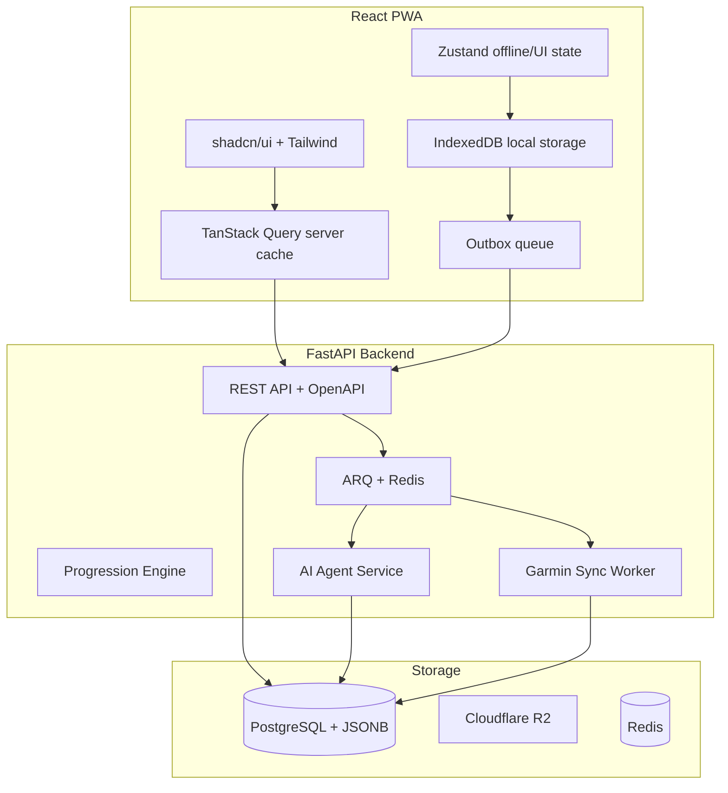

# Dokument wymagań produktu (PRD) - Trainer

## 1. Przegląd produktu

### 1.1 Wizja

Trainer to aplikacja PWA (Progressive Web App) do śledzenia progresu w treningu kalisthenics opartym na progresji krokowej, z programem głównym inspirowanym metodą Convict Conditioning („Skazany na trening”). Użytkownik loguje treningi, śledzi awanse i regresy w deterministycznym silniku progresji, dodaje własne ćwiczenia satelitarne (mobility, rehab, siła), rejestruje pomiary sylwetki oraz — w późniejszej fazie — korzysta z agenta AI i integracji Garmin do adaptacji planu treningowego.

### 1.2 Persona docelowa

Indywidualny użytkownik trenujący dla własnego rozwoju, śledzący progres w jednej metodzie treningowej. Produkt nie jest skierowany do trenerów personalnych ani zarządzania wieloma podopiecznymi.

### 1.3 Platforma i architektura

- Frontend: React PWA (mobile-first), Vite, TypeScript, Tailwind CSS, shadcn/ui
- Backend: FastAPI, Pydantic v2, SQLAlchemy 2.0, PostgreSQL + JSONB
- Infrastruktura: Redis + ARQ (kolejka zadań), Cloudflare R2 (pliki), Docker, GitHub Actions
- Observability: OpenTelemetry, Prometheus, Grafana, OpenAPI

### 1.4 Roadmapa produktu

| Faza | Czas | Zakres |
|------|------|--------|
| Faza 1 (MVP) | 8–10 tygodni | OAuth Google, onboarding, program CC, silnik progresji, logowanie sesji, satelity (max 10), pomiary sylwetki, offline sync, compliance |
| Faza 2 | 6–8 tygodni | Agent AI, Garmin (odczyt), powiadomienia regułowe, wykresy trendów, tworzenie ćwiczeń z YouTube, monetyzacja premium |
| Faza 3 | TBD | Własne programy, społeczność, płatności rozbudowane, import JSON/CSV, natywna aplikacja (rozważana) |

### 1.5 Model monetyzacji

| Plan | Funkcje |
|------|---------|
| Free | Program CC, logowanie sesji, progresja, do 10 satelitów, offline, pomiary sylwetki (log + historia) |
| Premium (Faza 2+) | Agent AI, integracja Garmin, wykresy trendów (trening + sylwetka), tworzenie ćwiczeń z wideo, przypomnienia o pomiarach |

### 1.6 Język i treści

Interfejs użytkownika i opisy ćwiczeń CC w języku polskim. Treści własne, inspirowane strukturą CC (6 ćwiczeń × 10 kroków), bez dosłownego kopiowania tekstów z książki.

---

## 2. Problem użytkownika

### 2.1 Opis problemu

Praktykujący metody progresji krokowej (np. Convict Conditioning) nie mają dedykowanego narzędzia łączącego:

- śledzenie kroków progresji z jasnymi regułami awansu i regresu,
- uzupełniające ćwiczenia (mobility, prehab, siła z obciążeniem),
- monitorowanie sylwetki (waga, obwody),
- adaptację treningu pod stan recovery (sen, HRV, obciążenie z Garmin).

Obecne rozwiązania wymuszają ręczne śledzenie w notatniku, arkuszu kalkulacyjnym lub generycznych aplikacjach fitness bez modelu progresji krokowej CC.

### 2.2 Bóle użytkownika

1. Trudność w pamiętaniu aktualnego kroku progresji dla każdego z 6 ćwiczeń bazowych.
2. Brak automatycznej oceny, czy spełniono warunki awansu (serie × powtórzenia, symetria stron).
3. Rozproszenie danych: treningi, mobility, pomiary ciała i dane z zegarka w różnych miejscach.
4. Brak szybkiego logowania sesji w warunkach siłowni (słaba sieć, presja czasu).
5. Trudność w korelowaniu zmian sylwetki i recovery z decyzjami treningowymi.

### 2.3 Propozycja wartości

Trainer oferuje jeden ekran „dzisiejsza sesja”, deterministyczny silnik progresji, offline-first PWA oraz — w Fazie 2 — agenta AI interpretującego historię treningów, pomiary sylwetki i dane Garmin, proponującego konkretną sesję z uzasadnieniem.

---

## 3. Wymagania funkcjonalne

Wymagania oznaczone fazą określają, kiedy funkcja jest dostarczana.

### 3.1 Uwierzytelnianie i konto (Faza 1)

| ID | Wymaganie |
|----|-----------|
| FR-001 | Logowanie przez OAuth Google (jedyna metoda auth w MVP) |
| FR-002 | Logowanie przez OAuth Apple — poza scope MVP (Faza 3+) |
| FR-003 | Brak rejestracji e-mail/hasło w Fazie 1 |
| FR-004 | Wylogowanie z unieważnieniem tokenu sesji |
| FR-005 | Dostęp do API i danych użytkownika wyłącznie po uwierzytelnieniu |
| FR-006 | Identyfikator użytkownika umożliwiający sync między urządzeniami |

### 3.2 Onboarding (Faza 1)

| ID | Wymaganie |
|----|-----------|
| FR-010 | Kwestionariusz startowy (3–5 pytań o doświadczenie treningowe) |
| FR-011 | Opcjonalny mini-test max powtórzeń na 2–3 ćwiczeniach CC |
| FR-012 | Rekomendacja kroku startowego per ćwiczenie CC na podstawie kwestionariusza i testu |
| FR-013 | Możliwość ręcznego nadpisania rekomendowanego kroku startowego |
| FR-014 | Akceptacja disclaimeru zdrowotnego przed pierwszą sesją |

### 3.3 Program Convict Conditioning (Faza 1)

| ID | Wymaganie |
|----|-----------|
| FR-020 | 6 ćwiczeń bazowych × 10 kroków progresji z własnymi opisami PL |
| FR-021 | Predefiniowany split 3-dniowy (Założenie PRD): D1 — pompki + pompki w staniu na rękach; D2 — podciągania + mostek biodrowy; D3 — przysiady + unoszenie nóg |
| FR-022 | Wyświetlanie ćwiczeń CC przypisanych do bieżącego dnia treningowego |
| FR-023 | Możliwość pominięcia ćwiczenia w sesji bez blokady zapisu sesji |
| FR-024 | Dni odpoczynku od CC — brak ćwiczeń CC na ekranie sesji; satelity „codzienne” nadal widoczne |

Ćwiczenia CC (Big Six):

1. Pompki (Push-ups)
2. Przysiady (Squats)
3. Podciągania (Pull-ups)
4. Unoszenie nóg (Leg raises)
5. Mostek biodrowy (Bridges)
6. Pompki w staniu na rękach (Handstand push-ups)

### 3.4 Silnik progresji (Faza 1)

| ID | Wymaganie |
|----|-----------|
| FR-030 | Deterministyczny silnik reguł — agent AI nie zastępuje silnika w Fazie 1 |
| FR-031 | Reguły progresji jako konfiguracja danych (JSONB w PostgreSQL), nie hardcode |
| FR-032 | Typ A (progresyjne): kroki z progami awansu i regresu |
| FR-033 | Awans (Założenie PRD): 3 serie × min. 10 powtórzeń; dla ćwiczeń jednostronnych — min. 10 powtórzeń na lewą i prawą stronę |
| FR-034 | Regres (Założenie PRD): 2 kolejne sesje poniżej minimum progu = powrót o 1 krok |
| FR-035 | Automatyczna ocena progresji po zapisie sesji CC |
| FR-036 | Powiadomienie w aplikacji o awansie lub regresie kroku |

### 3.5 Logowanie sesji treningowej (Faza 1)

| ID | Wymaganie |
|----|-----------|
| FR-040 | Jeden ekran „dzisiejsza sesja” z sekcjami: Program główny (CC) → Dodatki (satelity) → notatka sesji |
| FR-041 | Czas logowania standardowej sesji: docelowo poniżej 3 minut |
| FR-042 | Metryki logowania per ćwiczenie: reps, duration_sec, weight_kg, sides (none/left/right/both), notes |
| FR-043 | Formularz dostosowany do aktywnych metryk danego ćwiczenia |
| FR-044 | Historia sesji z datą, listą ćwiczeń i wynikami |
| FR-045 | Badge „cel osiągnięty” dla ćwiczeń typu B/C po spełnieniu progu |

### 3.6 Ćwiczenia satelitarne (Faza 1)

| ID | Wymaganie |
|----|-----------|
| FR-050 | Maksymalnie 10 aktywnych ćwiczeń satelitarnych na konto |
| FR-051 | Typ B (powtarzalne): stały cel serie × powtórzenia lub czas |
| FR-052 | Typ C (mobility/recovery): log „wykonane” + opcjonalny czas |
| FR-053 | Opcjonalna mini-progresja 2–5 kroków dla satelitów (ten sam silnik reguł co CC) |
| FR-054 | Tworzenie od zera lub klonowanie istniejącego ćwiczenia |
| FR-055 | Pole equipment[]: bodyweight, dumbbell, kettlebell, foam_roller, ball, bench i inne tagi |
| FR-056 | Harmonogram satelity: dzień tygodnia LUB codziennie LUB kategoria (dowolnie / po treningu / dzień odpoczynku) |
| FR-057 | Satelity „codziennie” widoczne każdego dnia, także w dni odpoczynku CC |
| FR-058 | Edycja i usuwanie ćwiczeń satelitarnych |

### 3.7 Pomiary sylwetki (Faza 1)

| ID | Wymaganie |
|----|-----------|
| FR-060 | Logowanie wagi (kg) i obwodów (cm) |
| FR-061 | Domyślne metryki (Założenie PRD): waga, pas, biceps; opcjonalnie: klatka, udo, szyja |
| FR-062 | Użytkownik wybiera, które metryki śledzi |
| FR-063 | Wpis pomiarowy z datą i opcjonalną notatką |
| FR-064 | Historia pomiarów w formie listy chronologicznej |
| FR-065 | Szybki formularz „dzisiejszy pomiar” |

### 3.8 Offline i synchronizacja (Faza 1)

| ID | Wymaganie |
|----|-----------|
| FR-070 | Lokalna baza: pełny program CC + ostatnie 30 sesji + historia pomiarów |
| FR-071 | Logowanie sesji i pomiarów bez połączenia z internetem |
| FR-072 | Outbox pattern: kolejka zmian lokalnych synchronizowana w tle po powrocie online |
| FR-073 | Rozwiązywanie konfliktów (Założenie PRD): last-write-wins per encja na podstawie timestamp; opcjonalny log konfliktu w UI |

### 3.9 Compliance (Faza 1)

| ID | Wymaganie |
|----|-----------|
| FR-080 | Disclaimer: aplikacja nie zastępuje porady lekarskiej ani fizjoterapeutycznej |
| FR-081 | Polityka prywatności obejmująca dane biometryczne i pomiary ciała |
| FR-082 | Agent AI i satelity rehab oznaczone jako uzupełnienie, nie diagnoza ani leczenie |
| FR-083 | Ostrzeżenie UI przy tworzeniu ćwiczeń z tagiem rehab/prehab (Założenie PRD) |

### 3.10 Agent AI (Faza 2, Premium)

| ID | Wymaganie |
|----|-----------|
| FR-090 | Propozycja konkretnej sesji treningowej z uzasadnieniem tekstowym |
| FR-091 | Akcje: „zaakceptuj” / „edytuj ręcznie” |
| FR-092 | Kontekst agenta: ostatnie 10 sesji + aktualny krok każdego ćwiczenia CC + recovery Garmin z 48h + trend pomiarów sylwetki |
| FR-093 | Agent interpretuje reguły silnika progresji; nie nadpisuje deterministycznej oceny awansu/regresu |
| FR-094 | Przy niskim recovery: redukcja objętości CC + sugestia mobility/recovery z satelitów użytkownika |
| FR-095 | Brak generowania treści powiadomień push przez LLM |

### 3.11 Tworzenie ćwiczeń z YouTube (Faza 2, Premium)

| ID | Wymaganie |
|----|-----------|
| FR-100 | Wklejenie linku YouTube → agent generuje propozycję ćwiczenia (nazwa, typ, metryki, kroki progresji) |
| FR-101 | Mechanizm analizy (Założenie PRD): transcript + metadata YouTube; Vision API jako fallback |
| FR-102 | Użytkownik edytuje propozycję agenta przed zapisaniem |
| FR-103 | Zapis jako ćwiczenie satelitarne z limitem 10 |

### 3.12 Integracja Garmin (Faza 2, Premium)

| ID | Wymaganie |
|----|-----------|
| FR-110 | Jednostronny odczyt: sen, HRV/Body Battery, obciążenie treningowe |
| FR-111 | OAuth Garmin przez backend (nie natywny SDK) |
| FR-112 | Reguła systemowa: niski recovery → redukcja objętości CC o 20% |
| FR-113 | Możliwość odłączenia konta Garmin |
| FR-114 | Pełna synchronizacja planu z kalendarzem Garmin — poza scope Fazy 2 |

### 3.13 Powiadomienia (Faza 2)

| ID | Wymaganie |
|----|-----------|
| FR-120 | Web Push: brak sesji 3 dni, awans kroku, niski Body Battery |
| FR-121 | iOS: wymaga dodania PWA do ekranu początkowego (iOS 16.4+) |
| FR-122 | Treść powiadomień generowana regułowo (szablony), nie przez LLM |
| FR-123 | Przypomnienie o pomiarze sylwetki co 7 dni (Premium) |

### 3.14 Analityka i wykresy (Faza 2, Premium)

| ID | Wymaganie |
|----|-----------|
| FR-130 | Wykresy trendów: powtórzenia, czas, obciążenie per ćwiczenie |
| FR-131 | Wykresy trendów pomiarów sylwetki per metryka |
| FR-132 | Zakres czasowy: 7 / 30 / 90 dni |

### 3.15 Monetyzacja (Faza 2)

| ID | Wymaganie |
|----|-----------|
| FR-140 | Bramka premium przed funkcjami: agent AI, Garmin, wykresy, tworzenie z wideo, przypomnienia o pomiarach |
| FR-141 | Użytkownik free ma pełny dostęp do Fazy 1 bez ograniczeń czasowych |

### 3.16 Poza scope (Faza 3 lub później)

- Własne programy treningowe (wiele programów głównych)
- Społeczność, rankingi, udostępnianie planów
- Import/eksport JSON/CSV
- Natywna aplikacja iOS/Android
- OAuth Apple (Sign in with Apple) — Faza 3+
- Zdjęcia sylwetki (progress photos)
- Diagnoza schorzeń, recepty rehabilitacyjne
- Dosłowne treści z książki Convict Conditioning

---

## 4. Granice produktu

### 4.1 W scope — Faza 1 (MVP)

- React PWA mobile-first (instalacja na ekran początkowy)
- OAuth Google (Apple OAuth poza scope MVP)
- Program CC: 6 ćwiczeń × 10 kroków, split 3-dniowy
- Silnik progresji typu A z regułami w JSONB
- Logowanie sesji (<3 min), historia, badge celu dla B/C
- Do 10 ćwiczeń satelitarnych (typ B/C, harmonogram w tym „codziennie”)
- Pomiary sylwetki: log + historia + konfiguracja metryk
- Offline + outbox sync (last-write-wins)
- Disclaimer zdrowotny, polityka prywatności

### 4.2 W scope — Faza 2

- Agent AI (premium): propozycja sesji, uzasadnienie, akceptacja/edycja
- Tworzenie satelitów z linku YouTube (premium)
- Garmin: odczyt sen/HRV/obciążenie (premium)
- Powiadomienia regułowe (Web Push)
- Wykresy trendów treningu i sylwetki (premium)
- Subskrypcja premium (mechanizm płatności — szczegóły TBD)

### 4.3 Poza scope (Fazy 1–2)

| Element | Uzasadnienie |
|---------|--------------|
| OAuth Apple | Poza scope MVP; Faza 1 = wyłącznie Google OAuth; Apple Sign In w Fazie 3+ |
| Natywna aplikacja iOS/Android | Decyzja: PWA w Fazie 1; native rozważane w Fazie 3+ |
| HealthKit / Garmin SDK natywnie | Integracja Garmin wyłącznie przez API backendu |
| Zdjęcia sylwetki | Tylko pomiary liczbowe w Fazach 1–2 |
| Trener i wielu klientów | Persona: indywidualny użytkownik |
| Diagnoza medyczna | Compliance: uzupełnienie, nie leczenie |
| Kopiowanie tekstów CC z książki | Ryzyko licencyjne; własne opisy PL |
| Zapisywanie planu do kalendarza Garmin | Faza 2+: jednostronny odczyt w Fazie 2 |
| Generowanie powiadomień przez LLM | Koszt i nieprzewidywalność; szablony regułowe |

### 4.4 Ograniczenia PWA (zaakceptowane)

- Push notifications na iOS wymagają dodania aplikacji do ekranu początkowego
- Brak natywnego dostępu do HealthKit i Garmin SDK w Fazie 1
- Ograniczona praca w tle vs natywna aplikacja
- Desktop web: wspierany, ale UX zoptymalizowany pod mobile

### 4.5 Założenia PRD (domknięcie nierozwiązanych kwestii)

| Kwestia | Decyzja |
|---------|---------|
| Split CC | D1: pompki + HSPU; D2: podciągania + mostek; D3: przysiady + unoszenie nóg |
| Progi progresji | 3×10 = awans; 2 sesje poniżej min = regres −1 krok |
| Sync konfliktów | last-write-wins + timestamp |
| Pomiary domyślne | waga, pas, biceps; przypomnienie co 7 dni (F2, premium) |
| Analiza wideo | Faza 2; transcript + metadata; Vision fallback |
| Content CC | Opisy i ilustracje tworzone przez zespół produktu na Fazę 1 |

---

## 5. Historyjki użytkowników

### 5.1 Uwierzytelnianie i konto

### US-001: Logowanie przez Google OAuth

Opis: Jako użytkownik chcę zalogować się kontem Google, aby szybko uzyskać dostęp do aplikacji bez tworzenia hasła.

Kryteria akceptacji:
- Ekran logowania zawiera przycisk „Zaloguj przez Google”.
- Po pomyślnym OAuth użytkownik trafia do onboardingu (nowe konto) lub ekranu głównego (istniejące konto).
- Token sesji jest przechowywany bezpiecznie po stronie klienta.
- Błąd OAuth wyświetla komunikat z możliwością ponowienia próby.

### US-002: Logowanie przez Apple OAuth (poza scope MVP — Faza 3+)

Opis: Jako użytkownik Apple chcę zalogować się przez Apple ID, aby korzystać z preferowanej metody logowania na iOS. Uwaga: ta historyjka nie jest wymagana w MVP; w Fazie 1 jedyną metodą auth jest Google OAuth (US-001).

Kryteria akceptacji:
- Ekran logowania zawiera przycisk „Zaloguj przez Apple” (dopiero Faza 3+).
- Po pomyślnym OAuth użytkownik trafia do onboardingu lub ekranu głównego.
- Obsługa ukrytego e-mail Apple (relay) nie blokuje utworzenia konta.
- Błąd OAuth wyświetla komunikat z możliwością ponowienia próby.
- W MVP (Faza 1) przycisk Apple nie jest widoczny; logowanie wyłącznie przez Google.

### US-003: Wylogowanie

Opis: Jako użytkownik chcę się wylogować, aby zabezpieczyć dane na współdzielonym urządzeniu.

Kryteria akceptacji:
- Ustawienia konta zawierają opcję „Wyloguj”.
- Po wylogowaniu token sesji jest usuwany lokalnie.
- Próba dostępu do chronionych ekranów przekierowuje na logowanie.
- Dane lokalne offline są czyszczone lub oznaczone jako należące do poprzedniego użytkownika (bez mieszania kont).

### US-004: Ochrona chronionych zasobów

Opis: Jako system chcę wymagać uwierzytelnienia do API i ekranów z danymi użytkownika, aby nieuprawnione osoby nie miały dostępu do danych treningowych.

Kryteria akceptacji:
- Żądanie API bez ważnego tokenu zwraca HTTP 401.
- Klient PWA przekierowuje na ekran logowania po otrzymaniu 401.
- Po ponownym logowaniu użytkownik wraca do zamierzonego ekranu (deep link / redirect).
- Endpointy publiczne (health check, statyczne assety) nie wymagają auth.

### US-005: Sync danych po logowaniu na nowym urządzeniu

Opis: Jako użytkownik chcę po zalogowaniu na nowym urządzeniu zobaczyć swoje dane z serwera, aby kontynuować trening bez utraty historii.

Kryteria akceptacji:
- Po pierwszym logowaniu na urządzeniu aplikacja pobiera: kroki CC, satelity, ostatnie sesje, pomiary.
- Aktualny krok progresji CC jest zgodny z serwerem.
- Czas pełnej synchronizacji początkowej poniżej 10 sekund przy typowym łączu.
- W trakcie sync wyświetlany jest wskaźnik ładowania.

### 5.2 Onboarding

### US-006: Ukończenie kwestionariusza startowego

Opis: Jako nowy użytkownik chcę odpowiedzieć na krótki kwestionariusz, aby aplikacja dopasowała startowy poziom progresji.

Kryteria akceptacji:
- Kwestionariusz zawiera 3–5 pytań (np. doświadczenie z kalisteniką, częstotliwość treningów).
- Wszystkie pytania wymagane muszą być wypełnione przed przejściem dalej.
- Odpowiedzi są zapisywane na koncie użytkownika.
- Użytkownik może wrócić do poprzedniego pytania.

### US-007: Opcjonalny test max powtórzeń

Opis: Jako użytkownik chcę wykonać opcjonalny test max powtórzeń na wybranych ćwiczeniach CC, aby precyzyjniej ustalić krok startowy.

Kryteria akceptacji:
- Test obejmuje 2–3 ćwiczenia CC z instrukcją wykonania.
- Użytkownik może pominąć test i przejść do rekomendacji opartej tylko na kwestionariuszu.
- Wprowadzone wyniki (liczba powtórzeń) są zapisywane.
- Test nie blokuje ukończenia onboardingu po pominięciu.

### US-008: Rekomendacja i nadpisanie kroku startowego

Opis: Jako użytkownik chcę zobaczyć rekomendowany krok startowy per ćwiczenie CC i móc go zmienić, aby zacząć na właściwym poziomie trudności.

Kryteria akceptacji:
- Ekran podsumowania onboardingu pokazuje rekomendowany krok (1–10) dla każdego z 6 ćwiczeń CC.
- Użytkownik może ręcznie zmienić krok dla dowolnego ćwiczenia przed zatwierdzeniem.
- Po zatwierdzeniu kroki są zapisywane jako aktualna pozycja progresji.
- Rekomendacja jest uzasadniona krótkim tekstem (np. „na podstawie testu pompek: 15 powtórzeń”).

### US-009: Akceptacja disclaimeru zdrowotnego

Opis: Jako użytkownik chcę zapoznać się z disclaimerem zdrowotnym przed rozpoczęciem treningu, aby zrozumieć ograniczenia aplikacji.

Kryteria akceptacji:
- Disclaimer jest wyświetlany przed pierwszą sesją treningową.
- Użytkownik musi zaznaczyć „Akceptuję” lub równoważną akcję, aby kontynuować.
- Bez akceptacji użytkownik nie może zapisać sesji treningowej.
- Disclaimer jest dostępny do ponownego odczytu w ustawieniach.

### 5.3 Sesja CC i progresja

### US-010: Wyświetlenie dzisiejszej sesji CC

Opis: Jako użytkownik chcę zobaczyć ćwiczenia CC przypisane do dzisiejszego dnia splitu, aby wiedzieć, co trenować.

Kryteria akceptacji:
- Ekran „dzisiejsza sesja” pokazuje 2 ćwiczenia CC zgodnie ze splitem dnia (D1/D2/D3).
- Każde ćwiczenie wyświetla nazwę, aktualny krok progresji i krótki opis.
- W dniu odpoczynku CC sekcja programu głównego jest pusta lub oznaczona jako „dzień odpoczynku”.
- Data sesji jest widoczna na ekranie.

### US-011: Logowanie wyników ćwiczenia CC

Opis: Jako użytkownik chcę zapisać serie i powtórzenia dla ćwiczenia CC, aby śledzić postęp w bieżącej sesji.

Kryteria akceptacji:
- Formularz logowania umożliwia wpisanie liczby serii i powtórzeń per seria.
- Dla ćwiczeń jednostronnych dostępny wybór strony (lewa/prawa/obie).
- Opcjonalne pole notatki per ćwiczenie.
- Zapis wyniku jest możliwy bez wypełniania wszystkich opcjonalnych pól.

### US-012: Pominięcie ćwiczenia w sesji

Opis: Jako użytkownik chcę pominąć ćwiczenie w bieżącej sesji (np. z powodu kontuzji), aby móc zapisać resztę treningu.

Kryteria akceptacji:
- Przy każdym ćwiczeniu CC dostępna akcja „Pomiń”.
- Pominięte ćwiczenie nie jest oceniane przez silnik progresji w tej sesji.
- Sesja może zostać zapisana z co najmniej jednym ćwiczeniem zalogowanym lub wszystkimi pominiętymi (z ostrzeżeniem).
- Pominięcie jest widoczne w historii sesji.

### US-013: Podgląd szczegółów kroku progresji

Opis: Jako użytkownik chcę zobaczyć opis i wymagania bieżącego kroku progresji, aby wiedzieć, jak prawidłowo wykonać ćwiczenie.

Kryteria akceptacji:
- Kliknięcie ćwiczenia otwiera widok kroku: opis PL, progi awansu (np. 3×10), numer kroku (1–10).
- Widoczna lista wszystkich 10 kroków z zaznaczeniem aktualnego.
- Opis nie zawiera dosłownych cytatów z książki CC.
- Widok działa offline (dane CC w lokalnej bazie).

### US-014: Automatyczny awans kroku progresji

Opis: Jako użytkownik chcę automatycznie awansować na wyższy krok po spełnieniu progu, aby nie musieć ręcznie śledzić reguł progresji.

Kryteria akceptacji:
- Po zapisie sesji silnik ocenia spełnienie progu awansu (3 serie × min. 10 powt.).
- Przy spełnieniu progu aktualny krok zwiększa się o 1 (max krok 10).
- Użytkownik widzi komunikat o awansie (in-app).
- Awans jest zapisany w historii progresji z datą i powiązaniem z sesją.

### US-015: Automatyczny regres kroku progresji

Opis: Jako użytkownik chcę wrócić o krok po dwóch nieudanych sesjach, aby trenować na bezpiecznym poziomie trudności.

Kryteria akceptacji:
- Po 2 kolejnych sesjach poniżej minimum progu krok zmniejsza się o 1 (min krok 1).
- Użytkownik widzi komunikat o regresie z wyjaśnieniem.
- Regres nie następuje poniżej kroku 1.
- Regres jest zapisany w historii progresji.

### US-016: Przeglądanie historii sesji

Opis: Jako użytkownik chcę przeglądać historię zapisanych sesji, aby analizować swój trening w czasie.

Kryteria akceptacji:
- Lista sesji posortowana od najnowszej z datą i skrótem ćwiczeń.
- Kliknięcie sesji otwiera szczegóły: wszystkie ćwiczenia, wyniki, notatki, pominięcia.
- Historia obejmuje minimum ostatnie 30 sesji offline.
- Pusta historia wyświetla komunikat zachęty do pierwszej sesji.

### US-017: Podgląd postępu CC (wszystkie ćwiczenia)

Opis: Jako użytkownik chcę zobaczyć aktualny krok progresji dla wszystkich 6 ćwiczeń CC, aby mieć pełny obraz postępu w programie.

Kryteria akceptacji:
- Ekran „Mój progres CC” listuje 6 ćwiczeń z aktualnym krokiem (1–10).
- Widoczna data ostatniej sesji per ćwiczenie.
- Możliwość przejścia do szczegółów kroku z tego ekranu.
- Dane spójne z silnikiem progresji po ostatniej sesji.

### 5.4 Ćwiczenia satelitarne

### US-018: Utworzenie ćwiczenia satelitarnego od zera

Opis: Jako użytkownik chcę utworzyć własne ćwiczenie satelitarne, aby śledzić mobility, rehab lub ćwiczenia uzupełniające poza programem CC.

Kryteria akceptacji:
- Formularz tworzenia: nazwa, typ (B lub C), aktywne metryki, opcjonalne kroki progresji (min. 2 jeśli progresyjne).
- Wybór tagów equipment[].
- Wybór harmonogramu: dzień tygodnia / codziennie / kategoria.
- Po zapisie ćwiczenie pojawia się w limicie max 10 satelitów.

### US-019: Klonowanie i edycja ćwiczenia satelitarnego

Opis: Jako użytkownik chcę sklonować istniejące ćwiczenie i je edytować, aby szybko stworzyć wariant bez wpisywania wszystkiego od zera.

Kryteria akceptacji:
- Akcja „Klonuj” tworzy kopię z sufiksem nazwy (np. „(kopia)”).
- Wszystkie pola (metryki, kroki, harmonogram, sprzęt) są edytowalne przed zapisem.
- Klon liczy się do limitu 10 satelitów.
- Klon nie jest tworzony, jeśli limit 10 jest już osiągnięty.

### US-020: Konfiguracja harmonogramu satelity

Opis: Jako użytkownik chcę przypisać satelitę do dnia tygodnia, ustawić jako codzienny lub przypisać kategorię, aby ćwiczenie pojawiało się we właściwym kontekście treningu.

Kryteria akceptacji:
- Harmonogram „codziennie”: ćwiczenie na ekranie sesji każdego dnia, także w dni odpoczynku CC.
- Harmonogram „dzień tygodnia”: ćwiczenie tylko w wybrane dni.
- Kategoria: dowolnie / po treningu / dzień odpoczynku — wpływa na sekcję „Dodatki” na ekranie sesji.
- Zmiana harmonogramu obowiązuje od następnej sesji.

### US-021: Logowanie ćwiczenia satelitarnego w sesji

Opis: Jako użytkownik chcę zalogować wynik satelity z elastycznymi metrykami, aby śledzić mobility, rehab lub ćwiczenia z obciążeniem.

Kryteria akceptacji:
- Formularz wyświetla tylko metryki skonfigurowane dla danego ćwiczenia (reps, duration_sec, weight_kg, sides).
- Typ C: minimum akcja „Wykonano” + opcjonalny czas.
- Typ B: wymagane pola zgodne z celem (np. 3×10 powtórzeń).
- Satelita zalogowany w tej samej sesji co CC lub w dniu odpoczynku.

### US-022: Osiągnięcie celu ćwiczenia typu B/C

Opis: Jako użytkownik chcę otrzymać badge „cel osiągnięty” po spełnieniu progu powtarzalnego ćwiczenia, aby mieć potwierdzenie wykonania planu.

Kryteria akceptacji:
- Po zapisie sesji system ocenia spełnienie celu dla typu B/C.
- Przy spełnieniu wyświetlany badge „cel osiągnięty” na ekranie sesji i w historii.
- Dla typu B z mini-progresją spełnienie progu może triggerować awans kroku (silnik progresji).
- Brak badge, jeśli cel nie został spełniony (bez blokady zapisu sesji).

### US-023: Edycja i usuwanie satelity

Opis: Jako użytkownik chcę edytować lub usunąć ćwiczenie satelitarne, aby utrzymywać aktualny zestaw ćwiczeń uzupełniających.

Kryteria akceptacji:
- Edycja wszystkich pól satelity z zachowaniem historii sesji (historyczne logi nie są usuwane).
- Usunięcie wymaga potwierdzenia.
- Po usunięciu ćwiczenie nie pojawia się na ekranie sesji.
- Slot w limicie 10 jest zwalniany po usunięciu.

### 5.5 Pomiary sylwetki

### US-024: Konfiguracja śledzonych metryk ciała

Opis: Jako użytkownik chcę wybrać, które pomiary ciała śledzę, aby formularz zawierał tylko istotne dla mnie metryki.

Kryteria akceptacji:
- Domyślnie włączone: waga, pas, biceps.
- Opcjonalnie włączalne: klatka, udo, szyja.
- Zmiana konfiguracji aktualizuje formularz „dzisiejszy pomiar”.
- Konfiguracja jest zapisywana na koncie użytkownika.

### US-025: Rejestracja pomiarów ciała

Opis: Jako użytkownik chcę zapisać dzisiejsze pomiary wagi i obwodów, aby monitorować zmiany sylwetki w czasie.

Kryteria akceptacji:
- Formularz „dzisiejszy pomiar” z polami dla aktywnych metryk (kg dla wagi, cm dla obwodów).
- Data domyślnie ustawiona na dziś; możliwość zmiany daty.
- Opcjonalne pole notatki.
- Walidacja: wartości numeryczne w sensownych zakresach (np. waga 30–300 kg).

### US-026: Przeglądanie historii pomiarów

Opis: Jako użytkownik chcę przeglądać historię pomiarów, aby porównywać wyniki z poprzednich tygodni.

Kryteria akceptacji:
- Lista pomiarów posortowana od najnowszego z datą i wartościami wszystkich aktywnych metryk.
- Możliwość edycji i usunięcia wpisu pomiarowego.
- Pomiary dostępne offline (lokalna baza + sync).
- Pusty stan z komunikatem zachęty do pierwszego pomiaru.

### US-027: Logowanie pomiarów offline

Opis: Jako użytkownik chcę zapisać pomiary bez internetu, aby nie odkładać pomiaru z powodu braku sieci.

Kryteria akceptacji:
- Pomiar zapisany offline trafia do lokalnej bazy i outbox.
- Po powrocie online pomiar synchronizuje się z serwerem automatycznie.
- Brak duplikacji wpisu po sync.
- Użytkownik widzi wskaźnik „oczekuje na sync” przy offline wpisach.

### 5.6 Offline i synchronizacja

### US-028: Logowanie sesji treningowej offline

Opis: Jako użytkownik chcę zapisać pełną sesję treningową bez internetu, aby trenować w siłowni ze słabym zasięgiem.

Kryteria akceptacji:
- CC + satelity + notatka sesji zapisywalne offline.
- Silnik progresji działa lokalnie (awans/regres obliczany offline).
- Program CC i kroki dostępne offline bez dodatkowego pobierania.
- Po zapisie sesji offline użytkownik widzi potwierdzenie z informacją o oczekującym sync.

### US-029: Automatyczna synchronizacja po powrocie online

Opis: Jako użytkownik chcę, aby dane zapisane offline synchronizowały się automatycznie po odzyskaniu połączenia, aby nie musieć ręcznie wysyłać danych.

Kryteria akceptacji:
- Przy wykryciu połączenia outbox wysyła kolejkowane zmiany w tle.
- Sesje, pomiary i zmiany progresji synchronizują się w kolejności chronologicznej.
- Po sync wskaźnik „oczekuje na sync” znika.
- Sync nie blokuje korzystania z aplikacji (praca w tle).

### US-030: Rozwiązywanie konfliktu sync (last-write-wins)

Opis: Jako użytkownik korzystający z dwóch urządzeń chcę, aby aplikacja rozwiązywała konflikty danych przewidywalnie, gdy te same dane edytowałem offline na dwóch urządzeniach.

Kryteria akceptacji:
- Przy konflikcie wersji wygrywa wpis z późniejszym timestamp.
- Użytkownik może zobaczyć informację o rozstrzygniętym konflikcie (opcjonalny log w ustawieniach).
- Brak utraty wszystkich danych — przynajmniej wersja zwycięska jest zachowana.
- Po sync oba urządzenia zbiegają do spójnego stanu.

### US-031: Ręczne wymuszenie synchronizacji

Opis: Jako użytkownik chcę ręcznie uruchomić synchronizację, gdy automatyczna nie zadziałała, aby mieć pewność, że dane są na serwerze.

Kryteria akceptacji:
- Ustawienia zawierają opcję „Synchronizuj teraz”.
- Akcja wysyła outbox i pobiera aktualizacje z serwera.
- Wyświetlany status: sukces, błąd, liczba zsynchronizowanych elementów.
- Przy braku sieci akcja wyświetla komunikat o braku połączenia.

### 5.7 PWA

### US-032: Instalacja PWA na ekran początkowy

Opis: Jako użytkownik mobile chcę dodać aplikację na ekran początkowy, aby uruchamiać ją jak natywną aplikację.

Kryteria akceptacji:
- Przeglądarka oferuje prompt instalacji PWA (where supported) lub instrukcja „Dodaj do ekranu początkowego”.
- Zainstalowana PWA uruchamia się w trybie standalone (bez paska URL).
- Ikona i nazwa aplikacji na ekranie początkowym są skonfigurowane (manifest).
- Po instalacji użytkownik ma dostęp do Web Push na iOS 16.4+ (Faza 2).

### 5.8 Agent AI (Faza 2, Premium)

### US-033: Otrzymanie rekomendacji sesji od agenta AI

Opis: Jako użytkownik premium chcę otrzymać propozycję następnej sesji treningowej z uzasadnieniem, aby trenować świadomie na podstawie moich danych.

Kryteria akceptacji:
- Agent generuje propozycję: lista ćwiczeń CC i satelitów z seriami/powtórzeniami lub czasem.
- Propozycja zawiera tekstowe uzasadnienie (min. 2 zdania).
- Kontekst obejmuje: ostatnie 10 sesji, aktualne kroki CC, dane Garmin 48h, trend pomiarów.
- Użytkownik free widzi ekran zachęty do premium zamiast propozycji.

### US-034: Akceptacja rekomendacji agenta

Opis: Jako użytkownik premium chcę zaakceptować propozycję agenta jednym kliknięciem, aby szybko rozpocząć zaplanowaną sesję.

Kryteria akceptacji:
- Przycisk „Zaakceptuj” kopiuje propozycję na ekran „dzisiejsza sesja”.
- Zaakceptowana propozycja jest oznaczona w logach jako pochodząca od agenta.
- Użytkownik może od razu rozpocząć logowanie wyników.
- Akceptacja jest zliczana do metryki „rekomendacje zaakceptowane bez edycji”.

### US-035: Ręczna edycja rekomendacji agenta

Opis: Jako użytkownik premium chcę edytować propozycję agenta przed treningiem, aby dostosować ją do bieżących możliwości.

Kryteria akceptacji:
- Przycisk „Edytuj ręcznie” otwiera edytowalną wersję propozycji.
- Użytkownik może zmienić ćwiczenia, serie, powtórzenia, pominąć elementy.
- Po edycji zmodyfikowana wersja trafia na ekran sesji.
- Edycja jest oznaczona w logach (nie liczy się jako „zaakceptowana bez edycji”).

### US-036: Adaptacja sesji przy niskim recovery

Opis: Jako użytkownik premium z podłączonym Garmin chcę, aby agent zaproponował lżejszą sesję przy niskim recovery, aby uniknąć przetrenowania.

Kryteria akceptacji:
- Przy niskim Body Battery/HRV agent proponuje redukcję objętości CC o ~20%.
- Uzasadnienie odwołuje się do konkretnych danych Garmin (np. „Body Battery 25”).
- Agent sugeruje ćwiczenia mobility/recovery z satelitów użytkownika.
- Reguła systemowa działa nawet bez pełnej propozycji agenta (fallback).

### US-037: Niedostępność agenta AI (fallback)

Opis: Jako użytkownik premium chcę móc trenować, gdy agent AI jest niedostępny, aby awaria LLM nie blokowała treningu.

Kryteria akceptacji:
- Przy błędzie API agenta wyświetlany jest komunikat o niedostępności.
- Ekran „dzisiejsza sesja” działa normalnie na podstawie splitu CC i satelitów (bez AI).
- Silnik progresji działa niezależnie od agenta.
- Użytkownik może ponowić żądanie propozycji agenta.

### 5.9 Tworzenie ćwiczeń z YouTube (Faza 2, Premium)

### US-038: Generowanie ćwiczenia satelitarnego z linku YouTube

Opis: Jako użytkownik premium chcę wkleić link YouTube i otrzymać propozycję ćwiczenia od agenta, aby szybko dodać nowe ćwiczenie bez ręcznej konfiguracji.

Kryteria akceptacji:
- Pole URL akceptuje linki YouTube (watch i shorts).
- Agent zwraca propozycję: nazwa, typ (B/C), metryki, opcjonalne kroki progresji, tagi sprzętu.
- Czas generowania poniżej 30 sekund w typowym przypadku.
- Błędny URL lub niedostępne wideo wyświetla komunikat błędu.

### US-039: Edycja i zapis propozycji ćwiczenia z YouTube

Opis: Jako użytkownik premium chcę edytować propozycję agenta przed zapisem, aby skorygować błędy rozpoznania ćwiczenia.

Kryteria akceptacji:
- Wszystkie pola propozycji są edytowalne przed zapisem.
- Zapis tworzy ćwiczenie satelitarne z limitem 10.
- Użytkownik wybiera harmonogram po zapisie.
- Odrzucenie propozycji nie tworzy ćwiczenia i nie zużywa slotu.

### 5.10 Integracja Garmin (Faza 2, Premium)

### US-040: Połączenie konta Garmin

Opis: Jako użytkownik premium chcę połączyć konto Garmin, aby aplikacja miała dostęp do danych recovery.

Kryteria akceptacji:
- Ustawienia zawierają opcję „Połącz Garmin” z flow OAuth Garmin.
- Po autoryzacji aplikacja pobiera: sen, HRV/Body Battery, obciążenie treningowe.
- Status połączenia widoczny w ustawieniach (połączono / nie połączono).
- Użytkownik free widzi ekran premium przy próbie połączenia.

### US-041: Podgląd danych recovery z Garmin

Opis: Jako użytkownik premium chcę zobaczyć ostatnie dane recovery z Garmin w aplikacji, aby rozumieć kontekst rekomendacji treningowych.

Kryteria akceptacji:
- Ekran lub sekcja „Recovery” pokazuje dane z ostatnich 48h: sen, HRV/Body Battery, obciążenie.
- Data ostatniej synchronizacji jest widoczna.
- Brak danych wyświetla komunikat z sugestią sprawdzenia połączenia lub zegarka.
- Dane pochodzą z backendu (sync worker ARQ), nie z natywnego SDK.

### US-042: Wpływ danych Garmin na objętość treningu

Opis: Jako użytkownik premium chcę, aby niski recovery automatycznie redukował objętość treningu CC, aby dostosować obciążenie do stanu organizmu.

Kryteria akceptacji:
- Reguła systemowa: niski recovery → redukcja serii/powtórzeń CC o 20%.
- Progi niskiego recovery zdefiniowane w konfiguracji (np. Body Battery < 30).
- Użytkownik widzi informację o zastosowanej redukcji na ekranie sesji.
- Redukcja nie usuwa ćwiczeń z sesji — tylko zmniejsza objętość.

### US-043: Odłączenie konta Garmin

Opis: Jako użytkownik premium chcę odłączyć konto Garmin, aby wycofać zgodę na dostęp do danych zdrowotnych.

Kryteria akceptacji:
- Ustawienia zawierają opcję „Odłącz Garmin” z potwierdzeniem.
- Po odłączeniu tokeny OAuth Garmin są usuwane z backendu.
- Dane historyczne Garmin pozostają w historii (z datą odłączenia) lub są anonimizowane zgodnie z polityką prywatności.
- Agent nie używa danych Garmin po odłączeniu.

### 5.11 Powiadomienia (Faza 2)

### US-044: Otrzymywanie powiadomień regułowych

Opis: Jako użytkownik chcę otrzymywać powiadomienia o braku treningu, awansie lub niskim recovery, aby utrzymać regularność i reagować na sygnały organizmu.

Kryteria akceptacji:
- Web Push działa na Android i desktop po udzieleniu zgody.
- Typy powiadomień: brak sesji 3 dni, awans kroku CC, niski Body Battery (premium + Garmin).
- Treść powiadomień z szablonów regułowych, nie generowana przez LLM.
- Użytkownik może wyłączyć poszczególne typy powiadomień w ustawieniach.

### US-045: Przypomnienie o pomiarze sylwetki (Premium)

Opis: Jako użytkownik premium chcę otrzymać przypomnienie o pomiarze ciała co tydzień, aby regularnie monitorować sylwetkę.

Kryteria akceptacji:
- Powiadomienie wysyłane po 7 dniach od ostatniego wpisu pomiarowego.
- Kliknięcie powiadomienia otwiera formularz „dzisiejszy pomiar”.
- Przypomnienie można wyłączyć w ustawieniach.
- Brak przypomnienia, jeśli użytkownik nie włączył żadnych metryk ciała.

### 5.12 Analityka (Faza 2, Premium)

### US-046: Wykres trendów treningowych

Opis: Jako użytkownik premium chcę zobaczyć wykresy postępu w ćwiczeniach, aby wizualnie ocenić trend siły i wytrzymałości.

Kryteria akceptacji:
- Wykres per ćwiczenie CC i satelita: oś Y = powtórzenia/czas/obciążenie (zależnie od metryki).
- Zakresy: 7 / 30 / 90 dni.
- Brak wystarczających danych wyświetla komunikat (min. 2 sesje).
- Użytkownik free widzi zachętę do premium zamiast wykresu.

### US-047: Wykres trendów pomiarów sylwetki

Opis: Jako użytkownik premium chcę zobaczyć wykres zmian wagi i obwodów w czasie, aby monitorować sylwetkę wizualnie.

Kryteria akceptacji:
- Osobny wykres per aktywna metryka ciała.
- Zakresy: 7 / 30 / 90 dni.
- Punkty na wykresie odpowiadają datom wpisów pomiarowych.
- Użytkownik free ma dostęp do listy historii, ale nie do wykresów.

### US-048: Porównanie trendu treningu i sylwetki

Opis: Jako użytkownik premium chcę widzieć korelację między postępem treningowym a pomiarami ciała, aby ocenić skuteczność programu.

Kryteria akceptacji:
- Ekran analityki umożliwia wybór ćwiczenia CC i metryki ciała w tym samym zakresie dat.
- Oba wykresy wyświetlane obok siebie lub w jednym widoku porównawczym.
- Zakres dat synchronizowany między wykresami.
- Brak danych w jednym wymiarze wyświetla informację zamiast pustego wykresu.

### 5.13 Monetyzacja (Faza 2)

### US-049: Dostęp do planu premium

Opis: Jako użytkownik chcę wykupić subskrypcję premium, aby odblokować agenta AI, Garmin, wykresy i tworzenie ćwiczeń z wideo.

Kryteria akceptacji:
- Ekran premium opisuje korzyści i cenę (TBD — placeholder akceptowalny w MVP płatności).
- Po zakupie funkcje premium są odblokowane natychmiast.
- Status subskrypcji widoczny w ustawieniach konta.
- Anulowanie subskrypcji zachowuje dostęp do końca okresu rozliczeniowego.

### US-050: Korzystanie z planu free bez ograniczeń czasowych

Opis: Jako użytkownik free chcę korzystać z pełnej funkcjonalności Fazy 1 bez limitu czasu, aby śledzić progres bez presji zakupu.

Kryteria akceptacji:
- Program CC, logowanie, progresja, 10 satelitów, pomiary (log + historia), offline — dostępne bezterminowo.
- Bramka premium pojawia się tylko przy funkcjach Fazy 2 (agent, Garmin, wykresy, wideo, przypomnienia pomiarów).
- Brak sztucznych limitów sesji tygodniowo w planie free.
- Reklamy nie są wyświetlane w planie free (brak ad-supported model w scope).

### 5.14 Compliance

### US-051: Wyświetlenie disclaimeru zdrowotnego

Opis: Jako użytkownik chcę mieć stały dostęp do disclaimeru zdrowotnego, aby pamiętać o ograniczeniach aplikacji.

Kryteria akceptacji:
- Disclaimer dostępny w ustawieniach i podczas onboardingu.
- Tekst jasno stwierdza: aplikacja nie zastępuje porady lekarskiej/fizjoterapeutycznej.
- Satelity rehab opisane jako uzupełnienie, nie leczenie.
- Wersja disclaimeru ma datę ostatniej aktualizacji.

### US-052: Ostrzeżenie przy ćwiczeniach rehab/prehab

Opis: Jako użytkownik tworzący ćwiczenie rehabilitacyjne chcę zobaczyć ostrzeżenie, aby nie traktować aplikacji jako narzędzia diagnostycznego.

Kryteria akceptacji:
- Przy tworzeniu/edycji satelity z tagiem rehab/prehab wyświetlane jest ostrzeżenie (modal lub banner).
- Użytkownik potwierdza zapoznanie się przed zapisem.
- Ostrzeżenie nie blokuje zapisu po potwierdzeniu.
- Ostrzeżenie widoczne także na ekranie logowania takiego ćwiczenia (skrócona wersja).

### 5.15 Scenariusze skrajne i alternatywne

### US-053: Trening w dniu odpoczynku CC (tylko satelity)

Opis: Jako użytkownik chcę w dniu odpoczynku od CC wykonać i zalogować ćwiczenia satelitarne (np. codzienną mobility), aby utrzymać rutynę uzupełniającą.

Kryteria akceptacji:
- W dniu odpoczynku CC sekcja programu głównego jest pusta lub oznaczona „odpoczynek”.
- Satelity „codzienne” i przypisane do kategorii „dzień odpoczynku” są widoczne.
- Sesja składająca się tylko z satelitów zapisuje się poprawnie.
- Silnik progresji CC nie jest uruchamiany (brak ćwiczeń CC).

### US-054: Osiągnięcie limitu 10 satelitów

Opis: Jako użytkownik chcę otrzymać jasny komunikat po osiągnięciu limitu satelitów, aby wiedzieć, że muszę usunąć ćwiczenie przed dodaniem nowego.

Kryteria akceptacji:
- Przy próbie utworzenia 11. satelity wyświetlany jest komunikat o limicie.
- Komunikat sugeruje usunięcie lub edycję istniejącego satelity.
- Klonowanie i tworzenie z YouTube również respektują limit.
- Licznik „X/10 satelitów” widoczny na liście satelitów.

### US-055: Nieudana synchronizacja z retry

Opis: Jako użytkownik chcę wiedzieć o nieudanej synchronizacji i móc ponowić próbę, aby nie stracić danych zapisanych offline.

Kryteria akceptacji:
- Przy błędzie sync wyświetlany jest komunikat z liczbą oczekujących elementów w outbox.
- Automatyczny retry co N minut (np. 5) przy aktywnym połączeniu.
- Ręczna akcja „Synchronizuj teraz” (US-031) ponawia próbę.
- Po 3 nieudanych próbach wyświetlana sugestia sprawdzenia połączenia lub kontaktu z supportem.
- Dane lokalne nie są usuwane przy błędzie sync.

---

## 6. Metryki sukcesu

### 6.1 Metryki produktowe (pierwsze 3 miesiące)

| ID | Metryka | Cel | Faza pomiaru |
|----|---------|-----|--------------|
| M-001 | Aktywność treningowa | ≥3 zalogowane sesje/tydzień na aktywnego użytkownika | Faza 1 |
| M-002 | Retencja D30 | ≥25% użytkowników wraca po 30 dniach | Faza 1 |
| M-003 | Czas do pierwszej sesji | <5 min od rejestracji do zapisu pierwszej sesji (median) | Faza 1 |
| M-004 | Czas logowania sesji | <3 min (median) dla standardowej sesji CC + satelity | Faza 1 |
| M-005 | Awans progresji | Średnio ≥1 awans kroku CC na użytkownika w 4 tygodnie | Faza 1 |
| M-006 | Regularność pomiarów | ≥1 wpis pomiarów/tydzień u użytkowników z włączonymi metrykami ciała | Faza 1 |
| M-007 | Akceptacja rekomendacji agenta | ≥70% propozycji zaakceptowanych bez ręcznej edycji | Faza 2 |
| M-008 | Sync Garmin | ≥95% udanych synchronizacji danych recovery (daily job) | Faza 2 |
| M-009 | Konwersja premium | ≥5% aktywnych użytkowników Fazy 1 przechodzi na premium w 60 dni po launchu F2 | Faza 2 |
| M-010 | Offline sync success | ≥99% elementów outbox zsynchronizowanych w ciągu 24h od powrotu online | Faza 1 |

### 6.2 Metody pomiaru

| Metryka | Źródło danych | Event / log |
|---------|---------------|-------------|
| Sesje treningowe | Backend PostgreSQL | session.created |
| Retencja D30 | Analytics (Mixpanel/Plausible/posthog — TBD) | user.return_day_30 |
| Czas logowania | Frontend telemetry | session.log_duration_ms |
| Awans progresji | Backend | progression.step_advanced |
| Pomiary ciała | Backend | body_measurement.created |
| Akceptacja agenta | Backend | agent.recommendation_accepted / agent.recommendation_edited |
| Garmin sync | Worker logs + Prometheus | garmin.sync_success / garmin.sync_failure |
| Konwersja premium | Backend billing | subscription.created |
| Offline sync | Frontend + backend | outbox.sync_success / outbox.sync_failure |

### 6.3 Cele per faza

Faza 1 (MVP):
- Dostarczyć pełną pętlę: onboarding → sesja → progresja → historia → pomiary.
- Osiągnąć M-001, M-002, M-003, M-004, M-006, M-010.
- Walidacja product-market fit bez funkcji premium.

Faza 2:
- Osiągnąć M-007, M-008, M-009.
- Wykresy i agent zwiększają retencję D30 do ≥30% (stretch goal).
- Garmin i agent jako główne argumenty konwersji premium.

### 6.4 Checklist jakości PRD

| Kryterium | Status |
|-----------|--------|
| Każda historyjka użytkownika (US-001–US-055) jest testowalna | Tak |
| Kryteria akceptacji są jasne i konkretne | Tak |
| Wystarczająca liczba story do zbudowania aplikacji Fazy 1 i Fazy 2 | Tak |
| Uwierzytelnianie i autoryzacja uwzględnione (MVP: US-001, US-003–US-005; Apple US-002 = Faza 3+) | Tak |
| Scenariusze podstawowe, alternatywne i skrajne uwzględnione | Tak |
| Spójność z docs/prd-planning-summary.md | Tak |
