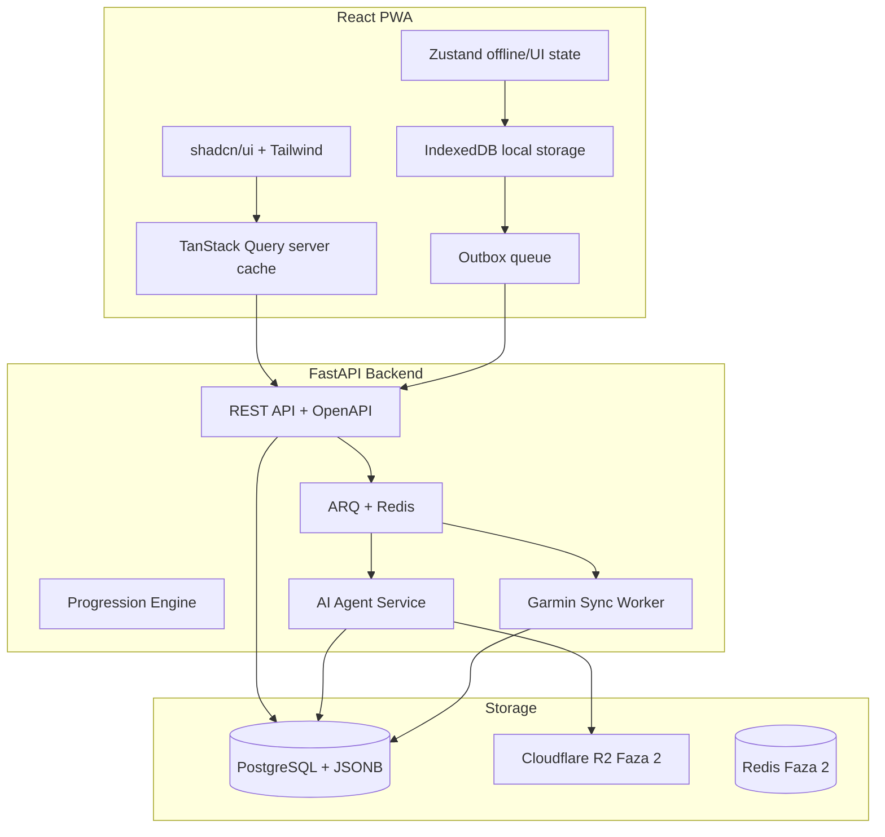

# Dokument wymagań produktu (PRD) - Trainer

## 1. Przegląd produktu

### 1.1 Wizja

Trainer to aplikacja PWA (Progressive Web App) do śledzenia progresu w treningu kalisthenics opartym na progresji krokowej, z programem głównym inspirowanym metodą Convict Conditioning („Skazany na trening”). Użytkownik loguje treningi, śledzi awanse i regresy w deterministycznym silniku progresji, dodaje własne ćwiczenia satelitarne (mobility, rehab, siła), rejestruje pomiary sylwetki oraz — w późniejszej fazie — korzysta z agenta AI i integracji Garmin do adaptacji planu treningowego.

### 1.2 Persona docelowa

Indywidualny użytkownik trenujący dla własnego rozwoju, śledzący progres w jednej metodzie treningowej. Produkt nie jest skierowany do trenerów personalnych ani zarządzania wieloma podopiecznymi.

### 1.3 Platforma i architektura

- Frontend: React PWA (mobile-first), Vite, TypeScript, Tailwind CSS, shadcn/ui
- Backend: FastAPI, Pydantic v2, SQLAlchemy 2.0, PostgreSQL + JSONB
- Infrastruktura (Faza 1): Docker, GitHub Actions, **backup/restore PostgreSQL** (FR-081a)
- Infrastruktura (Faza 2+): Redis + ARQ (kolejka zadań), Cloudflare R2 (pliki)
- Observability: OpenTelemetry, Prometheus, Grafana, OpenAPI

### 1.4 Roadmapa produktu

| Faza | Czas | Zakres |
|------|------|--------|
| Faza 1 (MVP) | 8–10 tygodni | OAuth Google, onboarding, program CC, silnik progresji (serwer), logowanie sesji, satelity (max 10), pomiary sylwetki, offline sync, compliance — **dostawa w kamieniach F1.0 → F1.1 → F1.prod (FR-084)** |
| Faza 2 | 6–8 tygodni | Agent AI, Garmin (odczyt), powiadomienia regułowe, wykresy trendów, tworzenie ćwiczeń z YouTube, monetyzacja premium, Cloudflare R2, Redis/ARQ |
| Faza 3 | TBD | Własne programy, społeczność, płatności rozbudowane, import JSON/CSV, natywna aplikacja (rozważana) |

### 1.4a Kamienie Fazy 1 i de-scope (FR-084)

Faza 1 nie jest monolitem „wszystko w tygodniu 10”. Dostawa i gate’y:

| Kamień | Zakres (minimum) | Gate |
|--------|------------------|------|
| **F1.0** | Online pętla: Google OAuth, onboarding, CC 6×10 (seed może `draft`), silnik progresji, sesje, satelity (create+log; max 10), pomiary, disclaimer; sync **happy-path** (push/pull, CAS FR-072d, immutability FR-038, evaluate); backup job wdrożony (FR-081a) | Internal dogfood |
| **F1.1** | Pełny offline/outbox: quarantine UX (FR-072b), UI konfliktów + recovery (FR-073a), defer-create w batchu (FR-072a), `storage.persist` (FR-070a), Trenuj mimo to (FR-024a), zmiana splitu/TZ (FR-022b/040c) | Public beta |
| **F1.prod** | Restore drill OK (FR-081a) + katalog CC **60× `ready`** (FR-020a); content = **osobny track od tygodnia 1**, nie „na końcu kodu” | Public prod |

**De-scope przy poślizgu** (wypada z F1.1 najpierw → F1.0 polish / późniejszy patch; **nie** z F1.0 core):

1. Lista konfliktów w Ustawieniach + recovery draft → **toast-only** + winning snapshot (uproszczenie FR-073a).
2. Autosave draft formularza sesji (PROD-10) — poza F1.0.
3. `replace_session` jako jedna mutacja — pozostaje opcjonalne F1.1+ (już w FR-072a).
4. Satelity: klonowanie / bogaty UX harmonogramu — F1.1; create + log zostaje w F1.0.
5. Content: **public beta** może iść z częścią kroków `ready` + jawny banner „katalog w przygotowaniu”; **prod** nadal wymaga 60× `ready` (FR-020a bez zmiany).

**Nie de-scopować przed F1.prod:** silnik progresji, FR-039, CAS LWW, backup/restore przed prod, IDOR suite.

### 1.5 Model monetyzacji

| Plan | Funkcje |
|------|---------|
| Free | Program CC, logowanie sesji, progresja, do 10 satelitów, offline, pomiary sylwetki (log + historia) |
| Premium (Faza 2+) | Agent AI, integracja Garmin, wykresy trendów (trening + sylwetka), tworzenie ćwiczeń z wideo, przypomnienia o pomiarach |

### 1.6 Język i treści

F1 dostarcza interfejs i katalog wyłącznie w `pl-PL`, ale architektura od pierwszej migracji jest i18n-ready:
- statyczne teksty PWA są kluczami i18n (bez tekstów domenowych hardcoded w komponentach), fallback = `pl-PL`;
- użytkownik ma kanoniczne `locale` BCP 47; F1 wspiera tylko `pl-PL`, kolejne locale wymagają kompletnego pakietu tłumaczeń i włączenia w konfiguracji;
- systemowe treści katalogu i dokumentów prawnych są w tabelach `*_translations`, nie w kolumnach `name_pl`/`name_en` ani JSONB;
- reguły progresji, identyfikatory, slugi i `error_code` są neutralne językowo; komunikaty lokalizuje klient;
- snapshot historyczny zapisuje faktycznie użyte `content_locale`; zmiana języka nie tłumaczy historii wstecz;
- treści własne użytkownika (nazwy satelitów, notatki) nie są automatycznie tłumaczone.

Treści własne są inspirowane strukturą CC (6 ćwiczeń × 10 kroków), bez dosłownego kopiowania tekstów z książki. Owner i gate release per locale: FR-020a (PCO; F1 prod = kompletny katalog `pl-PL`, w tym 60 kroków `ready`).

---

## 2. Problem użytkownika

### 2.1 Opis problemu

Praktykujący metody progresji krokowej (np. Convict Conditioning) nie mają dedykowanego narzędzia łączącego:

- śledzenie kroków progresji z jasnymi regułami awansu i regresu,
- uzupełniające ćwiczenia (mobility, prehab, siła z obciążeniem),
- monitorowanie sylwetki (waga, obwody),
- adaptację treningu pod stan recovery (sen, HRV, obciążenie z Garmin).

Obecne rozwiązania wymuszają ręczne śledzenie w notatniku, arkuszu kalkulacyjnym lub generycznych aplikacjach fitness bez modelu progresji krokowej CC.

### 2.2 Bóle użytkownika

1. Trudność w pamiętaniu aktualnego kroku progresji dla każdego z 6 ćwiczeń bazowych.
2. Brak automatycznej oceny, czy spełniono warunki awansu (serie × powtórzenia, symetria stron).
3. Rozproszenie danych: treningi, mobility, pomiary ciała i dane z zegarka w różnych miejscach.
4. Brak szybkiego logowania sesji w warunkach siłowni (słaba sieć, presja czasu).
5. Trudność w korelowaniu zmian sylwetki i recovery z decyzjami treningowymi.

### 2.3 Propozycja wartości

Trainer oferuje jeden ekran „dzisiejsza sesja”, deterministyczny silnik progresji **wyłącznie na backendzie**, PWA z offline logowaniem sesji (ocena awansu/regresu po sync) oraz — w Fazie 2 — agenta AI interpretującego historię treningów, pomiary sylwetki i dane Garmin, proponującego konkretną sesję z uzasadnieniem.

---

## 3. Wymagania funkcjonalne

Wymagania oznaczone fazą określają, kiedy funkcja jest dostarczana.

### 3.1 Uwierzytelnianie i konto (Faza 1)

| ID | Wymaganie |
|----|-----------|
| FR-001 | Logowanie przez OAuth Google (jedyna metoda auth w MVP): **Authorization Code + PKCE (S256)**; callback **tylko na backend**; zakaz implicit / token sesji app w URL. **State:** losowy ≥128 bit, store server-side (`oauth_states` w PG), TTL ≤10 min, po callbacku **consume** (jednorazowy) — replay → reject. **Wymiana code:** `code` + `code_verifier`; HTTP do Google ≤10 s; przy fail — brak częściowego CREATE user. **ID token (JWT) przed create/login:** podpis JWKS Google; `iss` ∈ {`https://accounts.google.com`,`accounts.google.com`}; `aud` = nasz Client ID; `exp` > now() (±60 s skew); `sub` niepusty. **Tożsamość:** lookup/create wyłącznie po `google_sub = sub` (nie po email). Email/display_name = snapshot; email może się zaktualizować przy kolejnym loginie. **`email_verified` musi być `true`** — inaczej reject + copy PL („Zweryfikuj e-mail w Google…”); **bez** tworzenia konta. Testy CI: zły aud/iss/exp, replay state, `email_verified=false`, ten sam `sub` → ten sam `users.id` |
| FR-002 | Logowanie przez OAuth Apple — poza scope MVP (Faza 3+) |
| FR-003 | Brak rejestracji e-mail/hasło w Fazie 1 |
| FR-004 | Wylogowanie (US-003): revoke **tylko bieżącej** `auth_sessions` (hash z cookie) + clear cookie + clear IndexedDB. Osobno: „Wyloguj ze wszystkich urządzeń” = revoke-all (FR-005d) |
| FR-005 | Dostęp do API i danych użytkownika wyłącznie po uwierzytelnieniu (sesja z cookie) |
| FR-005a | **Topologia F1 (wariant A — same-origin):** PWA i API pod **jednym originem** (np. `https://app…/` + API `https://app…/api` przez reverse proxy). **Zakaz** w F1 osobnego hosta API (`api.…`) bez redesignu auth. Sesja: losowy token w cookie **`__Host-trainer_session`** (lub równoważny prefiks `__Host-`): **`HttpOnly; Secure; Path=/; SameSite=Strict`**; **bez** atrybutu `Domain`; w DB wyłącznie `token_hash` (SHA-256); **zakaz** raw tokenu w `localStorage` / IndexedDB / JS. TTL / rotacja / limity: **FR-005d**. API z `credentials` (cookie), nie Bearer z JS storage. **CSRF (synchronizer / double-submit) obowiązkowy** na: `POST /account/export`, `POST /account/delete`, `PATCH /account/schedule` (i inne mutacje ustawień konta). Sync push w same-origin + Strict **bez** wymogu CSRF w F1. Split host `app`/`api` = F2+ (wtedy: CORS credentials, ewentualnie `SameSite=None`, CSRF na **wszystkich** mutacjach, utrata `__Host-` lub inny model). **Zakaz** GET export z samym cookie sesji |
| FR-005b | Izolacja tenantów w F1 **bez RLS na większości tabel**: `user_id` wyłącznie z sesji (nie z body/query jako źródło prawdy). Odczyt/mutacja zasobów user-owned wyłącznie przez `… WHERE id = :id AND user_id = :session_user_id` (deny-by-default) — w tym **`POST /sync/push` apply** (UPDATE/DELETE po `entity_id`). INSERT: `user_id` tylko z sesji (inny w body → ignoruj lub 422). Cudzy lub nieistniejący ID → **HTTP 404** / item `rejected` `not_found` (jedna polityka; bez 403 na enumerację). Obowiązkowa **IDOR suite** w CI (`pytest -m idor`) na: sessions, logs, measurements, satelity, progress (GET **i** override), sync_conflict_logs, sync_devices, onboarding, legal acceptances, **`POST /sync/push`** (cudzy `entity_id`), **`GET /sync/conflicts/{id}`**, **`GET /sessions/{id}`** (detail), **`POST /account/export`**, **`POST /account/delete`**, **`PATCH /account/schedule`** (FR-022b/040c). **Wyjątek F1:** RLS **włączone** na `body_measurements` (`SET LOCAL app.user_id`); pozostałe tabele RLS = Faza 2+ |
| FR-005c | Abuse / CORS (S7) + **rate-limit store (Perf7 / wariant A):** przy topologii FR-005a **prod bez CORS** dla PWA↔API; dev allowlist tylko localhost; **zakaz** localhost na prod. Limity: **100 req/min** / authenticated user (`u:{id}:api`); **20** `POST /sync/push` / min (`u:{id}:sync_push`); OAuth (start/callback) **10 req/min** / IP (`ip:{sha256}:oauth`); override dzienny wg FR-038. Przekroczenie → **429** + `Retry-After`. Max body ~**1 MB** → 422 `payload_too_large`. **Store prod/staging F1:** wyłącznie **PostgreSQL** tabela `rate_limit_buckets` — fixed window (np. `date_trunc('minute')`); atomowy `INSERT…ON CONFLICT DO UPDATE…RETURNING count`; **zakaz** in-memory jako store prod (działa źle przy N workerach). Cleanup cron: usuń okna starsze niż ~2h. Dev/test: opcjonalnie `RATE_LIMIT_STORE=memory`. F2 może podmienić implementację na Redis bez zmiany limitów. API F1 **może** mieć >1 worker — limity globalne per klucz |
| FR-005d | **TTL sesji auth (Pr15 / SEC-02):** (1) Przy loginie: `expires_at = now() + 30d`, cookie `Max-Age` ≈ 30d. (2) **Sliding:** przy udanym requestcie autoryzowanym — bump max **1× / 24 h**: `expires_at = now() + 30d` + odśwież cookie; przy bumpie **rotacja** tokenu (nowy raw + `token_hash`, stary wiersz `revoked_at=now()` albo UPDATE hash w tym samym id — preferuj nowy wiersz + revoke starego). (3) **Hard cap:** sesja nieważna gdy `now() > created_at + 90d` (nawet po slidingu) → 401 + re-login. (4) Lookup: `revoked_at IS NULL AND expires_at > now() AND created_at > now() - 90d`. (5) **Logout** = revoke tylko bieżącej sesji (FR-004). **„Wyloguj ze wszystkich urządzeń”** (Ustawienia) = revoke-all aktywnych. Delete konta = revoke-all (FR-006a). (6) Max **10** aktywnych sesji / user; przy 11. loginie revoke najstarszej (`created_at ASC`). **Anti-race (obowiązkowe):** w TX loginu przed COUNT/revoke/INSERT — `SELECT id FROM users WHERE id = :uid FOR UPDATE` (serializacja per user); **zakaz** samego `COUNT(*)` bez locka. Test CI: dwa równoległe loginy przy 9 aktywnych → nadal ≤10 aktywnych. (7) Cron cleanup: hard-delete wierszy z `expires_at < now() - 7d` lub `revoked_at < now() - 7d`. (8) Wygaśnięcie / 401: outbox **nie** drop (FR-072b) |
| FR-006 | Identyfikator użytkownika umożliwiający sync między urządzeniami |
| FR-006a | Usunięcie konta (Rel5): **`POST /account/delete` + CSRF** (jak export — FR-005a); potwierdzenie w UI; `users.deleted_at`; revoke wszystkich `auth_sessions`; anonimizacja `email`/`google_sub`/`display_name`; clear cookie + IndexedDB. **Natychmiast hard delete:** `body_measurements`, `sync_conflict_logs`, `sync_devices`, `client_mutations`, onboarding/legal acceptances. Sesje/logi/`progression_events`/satelity/`user_exercise_progress`: soft + **grace 30 dni** (`purge_after`), potem hard purge **wyłącznie lokalnym cronem w Docker Compose** (wywołanie CLI / entrypoint serwisu w sieci compose — **bez** publicznego ani internal HTTP **triggera** w F1; bez Redis/ARQ). Szczegóły kolejności / TX / monitoringu: **FR-006c**. Copy UI o retencji. Re-login Google = nowe `users.id`. Zakaz `ON DELETE CASCADE` od `users` — tylko `AccountDeletionService` |
| FR-006b | **Export danych (RODO, F1 / Sec10+Perf10 / wariant A):** **`POST /account/export` + CSRF** — **pełny** zakres user-owned (nie „skrót”): profil (email, display_name, locale, timezone, prefs), onboarding, legal acceptances (w tym accepted locale/hash), `user_exercise_progress`, `progression_events`, **wszystkie** sesje + logi (`sets`, `goal_met`, `content_locale`, snapshoty nazw/kroków; **bez** `rules_snapshot` w bulk jak SyncPull), satelity + `exercise_steps`, **wszystkie** pomiary, `sync_devices` (bez sekretów). **Wyłączone:** `token_hash`, `oauth_states`, `rate_limit_buckets`, `client_mutations`, dane innych userów. **Dostawa:** streaming (`application/x-ndjson` lub równoważne chunki per kolekcja) — **zakaz** budowania całego drzewa JSON w RAM; cursor/keyset po tabelach. Domyślnie stream na tym samym POST (bez tokenu w URL). Opcjonalny one-time `download_token` (TTL ~60s, jednorazowy) tylko jako fallback — unikać logowania tokenu. `Cache-Control: no-store`. UI: przycisk „Pobierz”, nie `<a href>` GET. Po `deleted_at` export niedostępny. Test: duża historia → bounded memory; brak `token_hash`; CSRF/IDOR |
| FR-006c | **Hard purge job (Rel2 / wariant A):** cron Compose wybiera userów `purge_after ≤ today AND purge_status IS DISTINCT FROM 'done'`. Per user: claim `purge_status = pending_job`, potem **jedna TX** z kolejnością DELETE pod FK RESTRICT: (1) `session_exercise_logs`, (2) `progression_events`, (3) `workout_sessions`, (4) `user_exercise_progress`, (5) `user_program_enrollments`, (6) user-owned `exercises` (satelity) + ich `exercise_steps`, (7) pozostałe user-owned nieusunięte w grace, (8) `purge_status = done` na `users` (wiersz users zostaje zanonimizowany — nie hard-delete users row w F1, albo soft tombstone). Rerun-safe (DELETE idempotentny). Fail TX → log `purge.fail`, status zostaje `pending_job` (lub wraca do retryable); nie oznaczaj `done`. Monitoring: structured log `purge.ok` / `purge.fail` + heartbeat; **cisza ≥ 36 h = incydent**. Runbook query: `purge_after < today - 7 AND status ≠ done` = incydent. **Opcjonalny** egress ping (np. healthchecks.io) po udanym runie — dozwolony (to nie jest HTTP trigger purge). Test CI: pełny graf → purge → zero child rows + `done`; drugi run = no-op |
| FR-007 | **i18n-ready od F1:** `users.locale` (BCP 47, default `pl-PL`); statyczne teksty PWA przez `react-i18next`/równoważne klucze; API zwraca stabilne `error_code`, nie tekst jako kontrakt. Systemowy katalog/program/dni/kroki i dokumenty prawne używają relacyjnych `*_translations` z UNIQUE `(entity_id, locale)`. Resolver: żądane wspierane locale → `pl-PL`; odpowiedź jawnie podaje `requested_locale` i `resolved_locale`. F1 gate i UI obejmują tylko `pl-PL`; dodanie locale nie zmienia reguł progresji ani historycznych snapshotów. Testy: brak klucza UI → fallback PL; brak tłumaczenia katalogu → cały katalog PL (zakaz mieszanego języka w jednym payloadzie); nieznane locale → PL |

### 3.2 Onboarding (Faza 1)

| ID | Wymaganie |
|----|-----------|
| FR-010 | Kwestionariusz startowy (3–5 pytań o doświadczenie treningowe) |
| FR-011 | Opcjonalny mini-test max powtórzeń na 2–3 ćwiczeniach CC |
| FR-012 | Rekomendacja kroku startowego per ćwiczenie CC na podstawie kwestionariusza i testu |
| FR-013 | Możliwość ręcznego nadpisania rekomendowanego kroku startowego |
| FR-014 | Akceptacja disclaimeru zdrowotnego przed pierwszą sesją |
| FR-014a | **Disclaimer offline + sync (Pr8 / Rel9):** akceptacja zapisuje lokalnie (IndexedDB) + outbox `legal_acceptance` (`client_mutation_id`, `document_slug`, `document_version` / `document_id`, `accepted_locale`, `accepted_content_hash` jako lowercase SHA-256 hex, `accepted_at`, `schema_version`). Gate zapisu sesji lokalnie sprawdza cache (wersja i hash = aktualnie wymagane). Po sync: upsert `user_legal_acceptances`; composite FK gwarantuje, że hash odpowiada dokładnej translacji dokumentu. **Serwer:** przed apply **sesji** (`workout_sessions` create / online POST) wymagany acceptance `health_disclaimer` w wersji ≥ aktualnie opublikowanej — brak → `rejected` `error_code=legal_required` → quarantine. Jeśli w **tym samym batchu** jest jeszcze nieprzetworzony pasujący `legal_acceptance` → **defer** sesji (nie od razu quarantine). Pomiary i satelity **bez** tego gate. Opublikowany `(document_id, locale)` jest immutable; każda zmiana `title/body` wymaga nowej `legal_documents.version`, więc stary acceptance nie wystarcza. Testy: legal+sesja; dokładny locale/hash; sesja z legal w batchu (defer); sesja bez legal → quarantine; pomiar bez legal → applied |

### 3.3 Program Convict Conditioning (Faza 1)

| ID | Wymaganie |
|----|-----------|
| FR-020 | 6 ćwiczeń bazowych × 10 kroków progresji; neutralne językowo encje/reguły + własne tłumaczenia `pl-PL` w `exercise_translations` i `exercise_step_translations` |
| FR-020a | Content CC (Pr5): **Product Content Owner (PCO)** = founder/product (akceptacja `ready` **per locale**). DoD kroku `ready`: translation `name` + `description` (2–6 zdań) + neutralne `rules` z `schema_version`; zakaz cytatów z książki CC. Seed F1 zawiera `pl-PL`; może być `draft` (placeholdery `[DRAFT]…`) pod scaffold/CI; **public beta** może iść z częścią PL `ready` + banner „katalog w przygotowaniu”; **F1 prod** wymaga kompletnego `pl-PL`: program, 3 dni, 6 ćwiczeń i 60/60 kroków `ready` (CI: zero pustych wymaganych pól / `[DRAFT]`). Nowe locale jest włączane dopiero po takim samym gate kompletności; fallback całego katalogu do PL, bez mieszania języków w payloadzie. Content = **osobny track od tygodnia 1**. Ilustracje per-step poza F1. Zmiana tłumaczenia → bump `catalog_version` **dla tego locale**; bez reinterpretacji `rules_snapshot` |
| FR-021 | Predefiniowany split 3-dniowy (Założenie PRD): D1 — pompki + pompki w staniu na rękach; D2 — podciągania + mostek biodrowy; D3 — przysiady + unoszenie nóg |
| FR-022 | Wyświetlanie ćwiczeń CC przypisanych do bieżącego dnia treningowego |
| FR-022a | Algorytm dnia CC F1 (**fixed weekdays**, nie rolling): `wd` = ISO weekday `local_date` (1=Mon…7=Sun); `anchor` = `user_program_enrollments.anchor_weekday` (default 1); `offset = (wd - anchor + 7) % 7`; `0→D1`, `2→D2`, `4→D3`, inaczej **rest**. `rotation_offset` ∈ {0,1,2}: gdy nie rest, `day_index' = ((day_index - 1 + rotation_offset) % 3) + 1`. `started_on`: brak planu CC dla `local_date < started_on`. Jedna funkcja domenowa `resolve_cc_day` (serwer źródło prawdy; klient może cache’ować regułę offline). Późniejsza zmiana: FR-022b |
| FR-022b | **Zmiana splitu po onboardingu (wariant A):** Ustawienia → wybór Pn/Śr/Pt (`anchor_weekday=1`) lub Wt/Czw/Sob (`=2`). `rotation_offset` **bez UI w F1** (zostaje 0 / bez zmiany). `PATCH` (CSRF) ustawia `pending_anchor_weekday` + `schedule_effective_on = jutro` w bieżącej aktywnej TZ użytkownika; do tego dnia `resolve_cc_day` / `GET /today` używają **aktywnego** (starego) anchora; w dniu `effective_on` serwer **promote** pending→active. Historia logów / `local_date` **bez** przepisywania. Copy: „Nowy plan od jutra”. Nie mutuje `started_on` |
| FR-023 | Możliwość pominięcia ćwiczenia w sesji bez blokady zapisu sesji |
| FR-024 | Dni odpoczynku od CC (`resolve_cc_day` = rest) — domyślnie brak ćwiczeń CC na ekranie sesji; satelity `daily` / `rest_day` nadal wg swojego harmonogramu. Nadrobienie CC: FR-024a |
| FR-024a | **„Trenuj mimo to” (wariant A):** w dniu `is_rest_day` obowiązkowe CTA → wybór D1/D2/D3 (bez zmiany `anchor_weekday` / enrollment). UI pokazuje 2 ćwiczenia wybranego dnia; copy ostrzegawcze, że split tygodnia może się rozjechać — **bez** blokady zapisu. Online: `GET /today?cc_day_override=1\|2\|3` (lub równoważny) zwraca `cc_exercises` dla wybranego dnia + `is_rest_day=true`, `cc_day_override`; offline: ten sam wybór z cache `program_days`. Zapis sesji = zwykłe logi CC (FR-039); serwer **nie** odrzuca CC tylko dlatego, że `resolve_cc_day` = rest. Override **nie** mutuje enrollment. Rolling nadal poza F1 |

Ćwiczenia CC (Big Six):

1. Pompki (Push-ups)
2. Przysiady (Squats)
3. Podciągania (Pull-ups)
4. Unoszenie nóg (Leg raises)
5. Mostek biodrowy (Bridges)
6. Pompki w staniu na rękach (Handstand push-ups)

### 3.4 Silnik progresji (Faza 1)

| ID | Wymaganie |
|----|-----------|
| FR-030 | Deterministyczny silnik reguł — wyłącznie na backendzie (FastAPI); klient nie oblicza awansu/regresu; agent AI nie zastępuje silnika |
| FR-031 | Reguły progresji jako konfiguracja JSONB z obowiązkowym `schema_version` + kontrakt Pydantic per wersja; nie hardcode progów |
| FR-032 | Typ A (progresyjne): kroki z progami awansu i regresu |
| FR-033 | Awans (Założenie PRD): 3 serie × min. 10 powtórzeń; dla ćwiczeń jednostronnych — min. 10 powtórzeń na lewą i prawą stronę |
| FR-034 | Regres (Założenie PRD): 2 kolejne **zaliczone próby** danego ćwiczenia poniżej minimum progu = powrót o 1 krok. „Kolejne” = następne w historii **tylko** logów `counts_for_progression=true` po `(local_date ASC, performed_at ASC, id)` — **nie** sąsiednie daty kalendarzowe i **nie** 2 wiersze `workout_sessions` tego samego dnia (FR-039: max 1 aktywny log CC / ćwiczenie / `local_date`). Odstęp kalendarzowy (tydzień splitu, urlop) **nie** przerywa streaku. Szczegóły resetów: FR-034a; spóźnione logi: FR-035 |
| FR-034a | **`fail_streak` (wariant A):** fold aktywnych logów (`skipped=false`, `superseded_at IS NULL`, **`counts_for_progression=true`**) po `(local_date, performed_at, id)`. Fail poniżej progu → `fail_streak += 1`; gdy `fail_streak >= rules.regress.fail_sessions` (MVP: 2) → regres −1 krok (min 1), potem **`fail_streak = 0`**. Sukces progu / awans → `fail_streak = 0`. `manual_override` → `fail_streak = 0` (FR-038). Kolumna `user_exercise_progress.fail_streak` = **cache** wyniku folda; źródło prawdy = historia logów z `counts_for_progression=true` (zapis obu w tej samej TX co evaluate tip). Spóźnione logi (`counts_for_progression=false`) **nie** wchodzą do folda — FR-035 |
| FR-035 | Automatyczna ocena progresji na serwerze po utrwaleniu sesji CC (zapis online lub apply outbox). **Klasyfikacja tip vs spóźniony (F1):** log CC jest **tip**, gdy nie istnieje już aktywny oceniony log tego samego `(user_id, exercise_id)` o ściśle większym `(local_date, performed_at, id)`; w przeciwnym razie jest **spóźniony**. **Tip:** pełny `ProgressionEngine` — `goal_met` / `rules_snapshot` / `goal_evaluated_at` / `step_number` względem bieżącego kroku; `counts_for_progression=true`; fold `fail_streak` + advance/regress wg FR-034a; INSERT `progression_events` gdy dotyczy. **Spóźniony:** sesja/log **applied** (historia zachowana); `goal_met` / `rules_snapshot` / `goal_evaluated_at` / `step_number` względem **bieżącego** kroku (audyt + immutability FR-038); **`counts_for_progression=false`**; **zakaz** mutacji `user_exercise_progress` i INSERT `advance`/`regress`; **zakaz** rewind/replay wcześniejszych eventów/kroku. Odpowiedź itemu: `applied` + `progression_skipped=late_log` (brak nowych eventów awansu/regresu). Soft-delete spóźnionej sesji jak zwykle ustawia `superseded_at`. Test CI: nowszy tip → awans; późniejszy push starszego logu → applied bez zmiany kroku/`fail_streak`; kolejny tip nie liczy spóźnionego w foldzie |)
| FR-036 | Po nowych `progression_events` (advance/regress) z serwera — **obowiązkowy** surface UI: modal (preferowany) lub sticky banner z nazwą ćwiczenia i nowym krokiem; ta sama ścieżka po zapisie online i po sync. Zakaz cichej-only zmiany numeru kroku. Web Push awansu = Faza 2 |
| FR-037 | Przy ocenie sesji serwer zapisuje `rules_snapshot` + `progression_schema_version` na logu; późniejsza zmiana seedu nie reinterpretuje historii |
| FR-038 | **Daty sesji (Rel4 / wariant A):** `workout_sessions.performed_at` i `local_date` są **immutable od create** (także przed evaluate) — push zmieniający te pola przy `existing+1` → `409` + `conflict_kind=session_date_immutable` (lub ten sam `session_immutable_after_evaluate` z `error_code=session_date_immutable`); korekta daty = soft-delete + **nowa** sesja. Denorm na logach kopiowana **tylko przy INSERT** — brak kaskady UPDATE (nieaktualna). Po pierwszej udanej ocenie sesji (A1): pola wpływające na progresję (`sets`, `skipped`, `step_number`, skład logów CC) są **immutable**; push z `revision == existing + 1` i innym content hash pól zamrożonych → `409 session_immutable_after_evaluate` (bez nadpisu). Poprawka wyniku = soft-delete sesji + **nowa** sesja. Soft-delete **nie** cofa automatycznie `progression_events` / kroku (brak rewind+replay w F1). Przy soft-delete **ocenionej** sesji UI **musi** pokazać modal no-rewind (PL) z CTA do `manual_override` (US-016b). **`manual_override` = first-class F1** (nie „opcjonalny”): jawna zmiana `current_step_number` + `fail_streak=0` + `progression_events.event_type=manual_override`; bez reinterpretacji historii logów. `notes` wolno zmienić bez re-evaluate |
| FR-039 | Jednostka progresji CC = `(user, exercise, local_date)`: max **jeden** aktywny log CC danego ćwiczenia na dany `local_date` — aktywny = `skipped=false` AND `superseded_at IS NULL` (soft-delete sesji w tej samej TX ustawia `superseded_at` na child logach). Egzekucja: **obowiązkowy** partial UNIQUE w DB + check serwisowy; drugi INSERT → `409 duplicate_exercise_same_day` (także przy race dual-device). Korekta = soft-delete sesji + nowa sesja (FR-038). `fail_streak` liczy kolejne **zaliczone próby tip** (`counts_for_progression=true`; jedna na `local_date` dzięki UNIQUE), nie kalendarzowe sąsiedztwo dat — FR-034a/035. Wiele `workout_sessions` na dzień dozwolone (np. rano satelity, wieczór CC) |

### 3.5 Logowanie sesji treningowej (Faza 1)

| ID | Wymaganie |
|----|-----------|
| FR-040 | Jeden ekran „dzisiejsza sesja” (widok złożony): agreguje wszystkie aktywne `workout_sessions` z `local_date = dziś`; sekcje Program główny (CC) → Dodatki (satelity) → notatki; dopisanie po evaluate wcześniejszego bloku = **nowa** sesja tego samego dnia (spójne z FR-038) |
| FR-040a | `local_date` i timezone (Pr4 + Rel4/PROD-06): `users.timezone` (IANA; default `Europe/Warsaw`). Online **GET /today**: `local_date = dziś w aktywnej users.timezone` (serwer). Offline: ta sama reguła z cache timezone. **Reguła klienta:** `local_date` sesji = data **rozpoczęcia** logowania w aktywnej TZ (nie data „zapisz” po północy); `performed_at` = moment startu bloku (lub pierwszego zapisu serii). Zapis: klient wysyła `local_date` + `performed_at`; serwer akceptuje, jeśli \|`local_date` − data(`performed_at` w **strefie walidacji**)\| ≤ 1 dzień; inaczej `422 local_date_mismatch`. Strefa walidacji: aktywna `users.timezone`, a dla itemów outbox także opcjonalne `client_timezone` (FR-040c / Rel10). **`local_date` / `performed_at` immutable od create** (FR-038); zmiana timezone **nie** przepisuje historycznych `local_date`. Progresja / FR-039 zawsze po utrwalonym `local_date` wiersza. Flow zmiany TZ: FR-040c |
| FR-040c | **Zmiana timezone (wariant A):** Ustawienia → IANA (lista / z urządzenia). `PATCH` (CSRF): `pending_timezone` + `timezone_effective_on = jutro` w **bieżącej aktywnej** TZ; do promote jak FR-022b. Historia bez zmian. UI: przed zapisem **preferowany flush** outbox; copy o wejściu od jutra. Outbox apply: nie quarantine tylko dlatego, że TZ się zmieniła — waliduj `local_date_mismatch` względem aktywnej TZ **lub** `client_timezone` zapisanego przy enqueue (FR-040a) |
| FR-040b | Read-model dnia (Perf6): **jeden** `GET /today` → `TodaySessionDto`: `local_date`, `timezone`, `split_day`, `is_rest_day`, opcjonalnie `cc_day_override` (1–3), `cc_exercises[]` (id, name, step, progi), `satellites[]` (dziś), `sessions[]` (aktywne tego `local_date` + logs **bez** `rules_snapshot`), `progress[]` (CC). Query `cc_day_override` tylko gdy rest (FR-024a); przy non-rest ignoruj lub 422. Offline: ten sam kształt z cache + `resolve_cc_day` |
| FR-041 | Czas logowania standardowej sesji: docelowo poniżej 3 minut |
| FR-042 | Metryki logowania per ćwiczenie w kontrakcie JSONB z `schema_version` (np. `SessionSetsV1`: reps, duration_sec, weight_kg, sides, notes) |
| FR-043 | Formularz dostosowany do aktywnych metryk danego ćwiczenia |
| FR-044 | Historia sesji z datą, listą ćwiczeń i wynikami |
| FR-045 | Badge „cel osiągnięty” dla ćwiczeń typu B/C — wyliczany na serwerze przy utrwaleniu sesji (`goal_met`) z **`rules_snapshot.goal`** (kopia `exercise_steps.rules` bieżącego kroku; FR-051a) |
| FR-046 | Każdy payload JSON (reguły, sety, pomiary, onboarding, outbox) musi przejść kontrakt wersjonowany; brak `schema_version` → 422 |
| FR-046a | Write DTO (S5): modele create/update/push sesji, logów, progress **nie przyjmują** z klienta: `goal_met`, `goal_evaluated_at`, `rules_snapshot`, `progression_schema_version`, `counts_for_progression`, `current_step_number`, `fail_streak`, `progression_events`. Pola te ustawia wyłącznie serwer / `ProgressionEngine`. Jeśli klient je wyśle — **strip** (ignoruj) + metryka; nie zapisuj. Test: push z `goal_met: true` nie ustawia pola przed evaluate |

### 3.6 Ćwiczenia satelitarne (Faza 1)

| ID | Wymaganie |
|----|-----------|
| FR-050 | Maksymalnie 10 aktywnych ćwiczeń satelitarnych na konto (`kind='satellite' AND deleted_at IS NULL`). Create / undelete / sync push create: przy limicie → **403** (lub item `rejected` z limitem). **Anti-race (obowiązkowe):** w TX przed COUNT/INSERT — `SELECT id FROM users WHERE id = :uid FOR UPDATE`; trigger DB dodatkowo `pg_advisory_xact_lock` + COUNT (defense-in-depth). **Zakaz** egzekucji limitu samym nieserializowanym `COUNT(*)`. Test CI: dwa równoległe create przy 9 aktywnych → dokładnie jeden sukces, drugi 403 / reject; nigdy 11 aktywnych |
| FR-051 | Typ B (powtarzalne): stały cel serie × powtórzenia lub czas — cel w `exercise_steps.rules.goal` (FR-051a) |
| FR-051a | **Cel B/C = zawsze w `exercise_steps` (wariant A):** każdy satelita (`kind='satellite'`) ma **≥1** wiersz `exercise_steps` z `rules` + `schema_version` + `progression_schema_id`. Bez mini-progresji: dokładnie **1** krok (`step_number=1`) niosący cel (`goal`). Typ C: `goal.type = completed` (wykonane ± opcjonalny czas w `sets`). Typ B: `goal` z progiem (np. `sets`×`min_reps` lub `min_duration_sec`). **Zakaz** satelity bez kroków. Przy evaluate: serwer kopiuje `rules` → `rules_snapshot`, ustawia `goal_met` / `goal_evaluated_at` (FR-045) — ten sam silnik ścieżki co CC |
| FR-052 | Typ C (mobility/recovery): log „wykonane” + opcjonalny czas; cel z kroku 1 (FR-051a) |
| FR-053 | Opcjonalna mini-progresja **dodatkowych** kroków: łącznie **2–5** `exercise_steps` (ten sam silnik reguł co CC / `advance`/`regress`); bez mini-progresji pozostaje **1** krok-cel (FR-051a) |
| FR-054 | Tworzenie od zera lub klonowanie istniejącego ćwiczenia |
| FR-055 | Pole equipment[]: bodyweight, dumbbell, kettlebell, foam_roller, ball, bench i inne tagi |
| FR-056 | Harmonogram satelity: dzień tygodnia LUB codziennie LUB kategoria (dowolnie / po treningu / dzień odpoczynku) |
| FR-057 | Satelity „codziennie” widoczne każdego dnia, także w dni odpoczynku CC |
| FR-058 | Edycja i usuwanie ćwiczeń satelitarnych |

### 3.7 Pomiary sylwetki (Faza 1)

| ID | Wymaganie |
|----|-----------|
| FR-060 | Logowanie wagi (kg) i obwodów (cm) |
| FR-061 | Domyślne metryki (Założenie PRD): waga, pas, biceps; opcjonalnie: klatka, udo, szyja, brzuch, biodra, łydka |
| FR-062 | Użytkownik wybiera, które metryki śledzi |
| FR-063 | Wpis pomiarowy z datą i opcjonalną notatką |
| FR-064 | Historia pomiarów w formie listy chronologicznej |
| FR-065 | Szybki formularz „dzisiejszy pomiar” |

### 3.8 Offline i synchronizacja (Faza 1)

| ID | Wymaganie |
|----|-----------|
| FR-070 | Lokalna baza (IndexedDB): pełny program CC + **ostatnie 30** aktywnych sesji + pomiary z okna **365 dni** + cache kroków z serwera (read-only). **Te same limity obowiązują API pull** — klient nie trzyma więcej niż serwer oddaje w sync offline. Trwałość storage: FR-070a |
| FR-070a | **Persistent storage (Rel5 / wariant A):** przy starcie PWA oraz przy **pierwszym** enqueue outbox wywołaj `navigator.storage.persist()` (best-effort; przeglądarka może odmówić). Zapisz wynik lokalnie (`persisted: boolean`); opcjonalna metryka/log bez PII. Gdy `persisted === false` **i** liczba itemów outbox w stanie `pending`/`in_flight`/`quarantine` **> 0**: obowiązkowy badge/banner PL o ryzyku utraty niezsynchronizowanych danych + CTA instalacji PWA / „Dodaj do ekranu początkowego” (iOS). Ustawienia → Synchronizacja: status persistence + wiek najstarszego pending. **Nie** traktuj `persist()` jako twardej gwarancji — warstwa UX |
| FR-071 | Logowanie sesji i pomiarów bez połączenia z internetem (bez lokalnej oceny progresji) |
| FR-071a | Po zapisie sesji offline: obowiązkowy badge „Oczekuje na synchronizację” + copy, że ocena awansu/regresu nastąpi po sync; krok CC = ostatni znany z cache z etykietą „Stan z ostatniego syncu”. **Zakaz** celebracji awansu/`goal_met` lokalnie przed wynikiem serwera |
| FR-072 | Outbox pattern: kolejka zmian lokalnych synchronizowana w tle po powrocie online |
| FR-072a | Kolejność outbox (Rel3 / Rel9): przed POST klient sortuje; serwer sortuje defensywnie ponownie. **Typy w batchu (kolejność segmentów):** `legal_acceptance` → sesje → pomiary → satelity. Sesje: `(performed_at ASC, id ASC)`; pomiary: `(measured_at ASC, id ASC)`; satelity: `(client_updated_at ASC, id ASC)`; legal: `(accepted_at ASC, id ASC)`. **Korekta A1 / FR-038–039:** soft-delete (tombstone) sesji **przed** create nowej sesji kolidującej po `(exercise_id, local_date)` CC — nawet gdy surowy sort `(performed_at, id)` sugeruje odwrotnie. Serwer: przy `409 duplicate_exercise_same_day`, jeśli w **tym samym batchu** jest jeszcze nieprzetworzony soft-delete rodzica kolidującego aktywnego logu → **odłóż create** (przetwórz delete najpierw / defer w batchu), **nie** od razu quarantine. Analogicznie: sesja + pending `legal_acceptance` → defer (FR-014a). Zakaz sortu po `updated_at` serwera / FIFO enqueue jako arbiter apply. `replace_session` (jedna mutacja) = opcjonalne uproszczenie F1.1, nie wymagane MVP |
| FR-072b | Retry outbox (Rel4): klasyfikacja — `applied`/`idempotent` → drop z kolejki; konflikty Pr3 (`conflict_*` / immutable) → ACK+UI, bez retry sieciowego; **401** → stop flush, kolejka nienaruszona, login, po reauth flush; **422** / **409 duplicate_*** / **403** limit / **`revision_jump`** / `mutation_payload_mismatch` / **`legal_required`** → **quarantine** (auto-retry off; UI „Wymaga uwagi”); **408/429/5xx/network** → retryable: backoff `min(15min, 15s×2^attempt) + jitter 0–30%`; po 5 kolejnych transport fail — escalation UI (US-055), ale retry w tle z cap; brak sieci → pause do `online`. Stany itemu: `pending\|in_flight\|quarantine\|synced`. Zakaz drop kolejki po N failach. Kompatybilne z partial ACK (FR-072c) |
| FR-072c | Batch push (Perf3/Rel8): `POST /sync/push` — max **20** items (po sort FR-072a); `len>20` → `422 batch_too_large`. Serwer: **per-item transakcja** (encja + idempotencja + silnik/conflict); odpowiedź **200** z `results[]` 1:1 (`client_mutation_id` + status); opcjonalnie `truncated: true` + krótsze `results` przy budżecie czasu (~10s) — nieprzetworzone zostają `pending`. Klient: pętla okien ≤20; mutex 1 flush naraz; ACK tylko po jawnym `results[i]` (FR-072b). Response może zawierać `progression_events[]` z requestu. Zakaz jednej TX all-or-nothing na cały batch; zakaz cichego ACK bez wyniku itemu |
| FR-072d | Idempotencja / races (Rel6 / Rel3 concurrency): każdy item push / create z klienta **musi** mieć `client_mutation_id` (UUID) — brak → 422. Na początku per-item tx: **claim** `INSERT client_mutations` (UNIQUE `user_id, client_mutation_id`); konflikt → ten sam content hash ⇒ `idempotent`, inny hash ⇒ `rejected` `mutation_payload_mismatch` (quarantine, bez nadpisu). **Update LWW (anti lost-update):** apply jako atomowy CAS — `UPDATE … SET … WHERE id = :id AND user_id = :session_user_id AND revision = :incoming - 1`; `rowcount = 1` → `applied`; `rowcount = 0` → ponowny `SELECT` i klasyfikacja (`conflict_lost` / `conflict_tie` / `revision_jump` / `not_found`) — **zakaz** ścieżki „odczyt existing.revision → decide → UPDATE bez guardu”. Alternatywa równoważna: `SELECT … FOR UPDATE` na wierszu encji **przed** porównaniem revision (wtedy lock order: claim → encja → progress). Przy sesji CC: `FOR UPDATE` na `user_exercise_progress` (**exercise_id ASC** jeśli wiele) **po** claim i po zapisie/CAS sesji — stała kolejność locków (anti-deadlock). Kolumny `client_mutation_id` na encjach syncowanych z klienta (`workout_sessions`, `body_measurements`, satelity): **NOT NULL** + UNIQUE `(user_id, client_mutation_id)`. Klient generuje id przy enqueue, nie zmienia payloadu bez nowego id. **Test CI:** dwa równoległe pushe `rev = existing+1` (różne hashe) → dokładnie jeden `applied`, drugi `conflict_tie` + `sync_conflict_logs`; nigdy dwa `applied` |
| FR-073 | Rozwiązywanie konfliktów (Założenie PRD): last-write-wins per encja po **`revision`** (nie po zegarze klienta); `client_updated_at` = hint; `updated_at` tylko serwer. **Accept update tylko gdy `incoming.revision == existing.revision + 1`**, egzekwowane atomowo (CAS / FR-072d) — nie przez niesynchronizowany odczyt `existing`. Create: serwer wymusza `revision=1`. `incoming < existing` → `conflict_lost`; `incoming == existing` + ten sam content hash → idempotent; `incoming == existing` + różny hash → `409 conflict_tie`; **`incoming > existing + 1` → `rejected` `error_code=revision_jump` (quarantine, bez nadpisu)**. Log konfliktów w UI. **Wyjątki sesji:** (1) `local_date`/`performed_at` immutable od create (FR-038) — LWW **nie** zmienia dat nawet przed evaluate; (2) po evaluate: FR-038 — nawet przy `existing+1` LWW nie nadpisuje `sets` |
| FR-073a | UX konfliktów sync (Pr3): po ACK `conflict_lost` → toast + link do szczegółów; `conflict_tie` / `session_immutable_after_evaluate` → **modal** (obowiązkowy). Lokalnie zawsze winning snapshot. Lista: Ustawienia → Synchronizacja → Konflikty (`sync_conflict_logs` / pull). Badge „Konflikt” na encji do lokalnego ack (`conflict.id` w IndexedDB). Recovery: CTA „Zapisz przegraną jako nową encję” z `losing_payload` (nowe `id`, `revision=1`) — **zakaz** nadpisu serwera przegraną / merge pól. Batch flush: max 1 modal zbiorczy + lista; lost_push może być toast-only. Retencja logów serwerowych: 90 dni (best-effort F1). **De-scope poślizg (FR-084):** lista + recovery draft → toast-only + winning (F1.0/beta); pełny FR-073a = F1.1 gdy czas pozwala |
| FR-074 | Po sync/apply sesji **tip** serwer uruchamia pełny silnik i zwraca zaktualizowane `progress[]` oraz nowe `progression_events[]` (w odpowiedzi push i/lub w `SyncPull`); klient nadpisuje cache i uruchamia surface FR-036 (idempotentnie po `event.id`). Po apply **spóźnionego** logu (FR-035): `applied` + `progression_skipped=late_log`; `progress[]` bez zmiany kroku/`fail_streak`; **brak** nowych `advance`/`regress`; surface FR-036 **nie** uruchamiać. Ponowne apply tej samej treści nie dubluje eventów; zmiana treści po evaluate → FR-038. UI (F1.1+): opcjonalny toast PL, że sesja zapisana, ale nie wpłynęła na krok (spóźniony sync) |
| FR-075 | **Pull sync (`SyncPull` / Perf1 / wariant A):** jeden read-model — sesje z **zagnieżdżonymi** logami (bez N+1); projekcja offline **bez** `rules_snapshot`; soft-deleted w oknie = tombstone; katalog CC osobno (FR-075a); starsza historia — lazy online. **Dwufazowo:** (1) **Initial** (brak `since` / po clear IDB): pełne okno FR-070 (≤30 sesji, pomiary 365d, aktywne satelity). (2) **Incremental:** klient **musi** wysłać `since=<last_pull_server_time>`; serwer zwraca encje z `updated_at > since` w tych oknach + tombstones. Każda odpowiedź: `server_time` (TIMESTAMPTZ); klient zapisuje jako kursor. **`progress[]`:** zawsze pełny snapshot CC (mały). Jeśli `since` nieparsowalny lub starszy niż **30 dni** → `resync_required: true` + full window (jak initial), nie cichy 4xx. Po `POST /sync/push`: incremental pull (lub eventy z push) — **zakaz** domyślnego full pull po każdym pushu. Testy: initial; delta tylko zmiany+tombstone; stary since → resync |
| FR-075a | Katalog CC (Perf7/i18n): `GET /catalog/cc?locale=<BCP47>` honoruje `If-None-Match`; ETag zawiera `program + resolved_locale + catalog_version` → **304** gdy bez zmian. Odpowiedź zwraca `requested_locale`, `resolved_locale`, `catalog_version`. `catalog_version` jest per locale i rośnie przy każdej zmianie jego tłumaczeń `ready`. Jeśli żądane locale nie jest wspierane/kompletne, cały katalog fallback do `pl-PL` (zakaz mieszania locale w jednym katalogu) |

### 3.9 Compliance (Faza 1)

| ID | Wymaganie |
|----|-----------|
| FR-080 | Disclaimer: aplikacja nie zastępuje porady lekarskiej ani fizjoterapeutycznej |
| FR-081 | Polityka prywatności obejmująca dane biometryczne i pomiary ciała; opisuje delete (FR-006a: pomiary od razu, treningi do 30 dni), export (FR-006b) oraz **kopie zapasowe** (FR-081a: dane mogą pozostawać w backupach do ≤30 dni po usunięciu). Szyfrowanie kolumn / at-rest volume — **poza F1** (świadomie); **szyfrowanie plików backupu — wymagane w F1** (FR-081a) |
| FR-081a | Backup i restore PostgreSQL (Rel1 / F1, **wymagane przed public beta/prod**): nocny pełny `pg_dump` (lub równoważny) **poza hostem aplikacji**; **RPO ≤ 24 h**, **RTO ≤ 4 h**; retencja backupów **≤ 30 dni** (spójna z grace delete FR-006a); pliki backupu **szyfrowane** (np. age/gpg) w spoczynku; job wyłącznie lokalnym cronem / serwisem Compose (jak purge — **zakaz** publicznego ani internal HTTP triggera); structured log `backup.ok` / `backup.fail` + heartbeat (cisza = incydent). Restore: udokumentowany runbook + **restore drill** (CI lub okresowy checklist) przed prod. Przed migracją Alembic na prod — świeży backup (Rel16). Klient IndexedDB **nie** jest backupem serwera. Szczegóły: `docs/db-plan.md` § Backup & restore |
| FR-082 | Agent AI i satelity rehab oznaczone jako uzupełnienie, nie diagnoza ani leczenie |
| FR-082a | Analytics (S8): tylko allowlist nazw zdarzeń; **zakaz** w props: wartości cm/kg, email, pełne `sets`, `rules_snapshot`. Dozwolone: `exercise_slug`, `step_number`, counts, booleans, opcjonalnie `local_date`. Dotyczy Mixpanel/PostHog/Plausible |
| FR-083 | Ostrzeżenie UI przy tworzeniu ćwiczeń z tagiem rehab/prehab (Założenie PRD) |
| FR-084 | **Kamienie F1 i de-scope (Pr10):** dostawa F1.0 → F1.1 → F1.prod wg §1.4a. F1.0 = online pętla + sync happy-path + backup job; F1.1 = pełny offline/konflikty/persist/Trenuj mimo to/schedule settings; F1.prod = restore drill + 60× `ready` (content track od tyg. 1). Przy poślizgu: lista de-scope z §1.4a (kolejność 1→5). **Zakaz** de-scope silnika, FR-039, CAS, backup przed prod, IDOR suite |

### 3.10 Agent AI (Faza 2, Premium)

| ID | Wymaganie |
|----|-----------|
| FR-090 | Propozycja konkretnej sesji treningowej z uzasadnieniem tekstowym |
| FR-091 | Akcje: „zaakceptuj” / „edytuj ręcznie” |
| FR-092 | Kontekst agenta: ostatnie 10 sesji + aktualny krok każdego ćwiczenia CC + recovery Garmin z 48h + trend pomiarów sylwetki |
| FR-093 | Agent interpretuje reguły silnika progresji; nie nadpisuje deterministycznej oceny awansu/regresu |
| FR-094 | Przy niskim recovery: redukcja objętości CC + sugestia mobility/recovery z satelitów użytkownika |
| FR-095 | Brak generowania treści powiadomień push przez LLM |

### 3.11 Tworzenie ćwiczeń z YouTube (Faza 2, Premium)

| ID | Wymaganie |
|----|-----------|
| FR-100 | Wklejenie linku YouTube → agent generuje propozycję ćwiczenia (nazwa, typ, metryki, kroki progresji) |
| FR-101 | Mechanizm analizy (Założenie PRD): transcript + metadata YouTube; Vision API jako fallback |
| FR-102 | Użytkownik edytuje propozycję agenta przed zapisaniem |
| FR-103 | Zapis jako ćwiczenie satelitarne z limitem 10 |

### 3.12 Integracja Garmin (Faza 2, Premium)

| ID | Wymaganie |
|----|-----------|
| FR-110 | Jednostronny odczyt: sen, HRV/Body Battery, obciążenie treningowe |
| FR-111 | OAuth Garmin przez backend (nie natywny SDK) |
| FR-112 | Reguła systemowa: niski recovery → redukcja objętości CC o 20% |
| FR-113 | Możliwość odłączenia konta Garmin |
| FR-114 | Pełna synchronizacja planu z kalendarzem Garmin — poza scope Fazy 2 |

### 3.13 Powiadomienia (Faza 2)

| ID | Wymaganie |
|----|-----------|
| FR-120 | Web Push: brak sesji 3 dni, awans kroku, niski Body Battery |
| FR-121 | iOS: wymaga dodania PWA do ekranu początkowego (iOS 16.4+) |
| FR-122 | Treść powiadomień generowana regułowo (szablony), nie przez LLM |
| FR-123 | Przypomnienie o pomiarze sylwetki co 7 dni (Premium) |

### 3.14 Analityka i wykresy (Faza 2, Premium)

| ID | Wymaganie |
|----|-----------|
| FR-130 | Wykresy trendów: powtórzenia, czas, obciążenie per ćwiczenie |
| FR-131 | Wykresy trendów pomiarów sylwetki per metryka |
| FR-132 | Zakres czasowy: 7 / 30 / 90 dni |

### 3.15 Monetyzacja (Faza 2)

| ID | Wymaganie |
|----|-----------|
| FR-140 | Bramka premium przed funkcjami: agent AI, Garmin, wykresy, tworzenie z wideo, przypomnienia o pomiarach |
| FR-141 | Użytkownik free ma pełny dostęp do Fazy 1 bez ograniczeń czasowych |

### 3.16 Poza scope (Faza 3 lub później)

- Własne programy treningowe (wiele programów głównych)
- Społeczność, rankingi, udostępnianie planów
- Import/eksport JSON/CSV
- Natywna aplikacja iOS/Android
- OAuth Apple (Sign in with Apple) — Faza 3+
- Zdjęcia sylwetki (progress photos)
- Diagnoza schorzeń, recepty rehabilitacyjne
- Dosłowne treści z książki Convict Conditioning

---

## 4. Granice produktu

### 4.1 W scope — Faza 1 (MVP)

- React PWA mobile-first (instalacja na ekran początkowy)
- OAuth Google (Apple OAuth poza scope MVP)
- Program CC: 6 ćwiczeń × 10 kroków, split 3-dniowy (fixed weekdays / FR-022a)
- Silnik progresji typu A z regułami w JSONB + `schema_version` / kontrakty — **tylko na serwerze** (nie w PWA/offline); `rules_snapshot` na logach
- Logowanie sesji (<3 min), historia, badge celu dla B/C (badge/ocena po stronie serwera)
- Do 10 ćwiczeń satelitarnych (typ B/C, harmonogram w tym „codziennie”)
- Pomiary sylwetki: log + historia + konfiguracja metryk
- Offline + outbox sync (LWW po **`revision`**, **CAS** FR-072d): offline zapisuje sesje/pomiary; awans/regres po sync z obowiązkowym surface UI (FR-036/071a); order FR-072a; retry/quarantine FR-072b; batch ≤20 + partial ACK FR-072c; idempotencja FR-072d; **SyncPull** ≤30 sesji / pomiary 365d / bez `rules_snapshot` + **obowiązkowa delta `since`** (FR-070/075) — **F1.1** dla pełnego UX konfliktów; F1.0 = happy-path (FR-084)
- Disclaimer zdrowotny, polityka prywatności (w tym retencja backupów ≤30 dni — FR-081a)
- Backup/restore PostgreSQL przed public beta/prod (FR-081a)
- Kamienie F1.0 / F1.1 / F1.prod + lista de-scope (FR-084 / §1.4a)

### 4.2 W scope — Faza 2

- Agent AI (premium): propozycja sesji, uzasadnienie, akceptacja/edycja
- Tworzenie satelitów z linku YouTube (premium)
- Garmin: odczyt sen/HRV/obciążenie (premium)
- Powiadomienia regułowe (Web Push)
- Wykresy trendów treningu i sylwetki (premium)
- Subskrypcja premium (mechanizm płatności — szczegóły TBD)
- Cloudflare R2 (storage plików / assetów; nie wymagane w Fazie 1)
- Redis + ARQ (workery: agent AI, sync Garmin, push)

### 4.3 Poza scope (Fazy 1–2)

| Element | Uzasadnienie |
|---------|--------------|
| Cloudflare R2 | Poza scope Fazy 1 (MVP); brak uploadu plików użytkownika — wprowadzenie w Fazie 2 |
| OAuth Apple | Poza scope MVP; Faza 1 = wyłącznie Google OAuth; Apple Sign In w Fazie 3+ |
| Natywna aplikacja iOS/Android | Decyzja: PWA w Fazie 1; native rozważane w Fazie 3+ |
| HealthKit / Garmin SDK natywnie | Integracja Garmin wyłącznie przez API backendu |
| Zdjęcia sylwetki | Tylko pomiary liczbowe w Fazach 1–2 |
| Trener i wielu klientów | Persona: indywidualny użytkownik |
| Diagnoza medyczna | Compliance: uzupełnienie, nie leczenie |
| Kopiowanie tekstów CC z książki | Ryzyko licencyjne; własne opisy PL |
| Zapisywanie planu do kalendarza Garmin | Faza 2+: jednostronny odczyt w Fazie 2 |
| Generowanie powiadomień przez LLM | Koszt i nieprzewidywalność; szablony regułowe |

### 4.4 Ograniczenia PWA (zaakceptowane)

- Push notifications na iOS wymagają dodania aplikacji do ekranu początkowego
- Brak natywnego dostępu do HealthKit i Garmin SDK w Fazie 1
- Ograniczona praca w tle vs natywna aplikacja
- Desktop web: wspierany, ale UX zoptymalizowany pod mobile
- Ocena progresji (awans/regres, `goal_met`) wymaga utrwalenia sesji na serwerze — po sesji offline wynik pojawia się dopiero po sync

### 4.5 Założenia PRD (domknięcie nierozwiązanych kwestii)

| Kwestia | Decyzja |
|---------|---------|
| Split CC | D1: pompki + HSPU; D2: podciągania + mostek; D3: przysiady + unoszenie nóg |
| Split / TZ (Pr4) | Fixed weekdays; rest + Trenuj mimo to (FR-024a); zmiana `anchor`/`timezone` w ustawieniach od jutra (FR-022b/040c); historia bez przepisywania; rolling poza F1 |
| Progi progresji | 3×10 = awans; 2 kolejne **zaliczone próby** poniżej min = regres −1; przerwa kalendarzowa nie zeruje; sukces/awans/regres/override → `fail_streak=0` (FR-034/034a/039) |
| Silnik progresji | Wyłącznie backend (FastAPI); brak drugiej implementacji w kliencie; offline nie liczy awansu/regresu |
| Offline UX awansu (Pr2) | Pending: obowiązkowy copy + badge (FR-071a); po sync: obowiązkowy modal/banner awansu/regresu (FR-036/074); bez lokalnej celebracji |
| Kontrakty JSON | Każdy JSONB/`schema` API ma `schema_version`; Pydantic + Zod; snapshot reguł na logu sesji (FR-037) |
| i18n (FR-007) | F1 tylko `pl-PL`, ale UI od początku używa kluczy i18n; `users.locale`; systemowe treści w `*_translations`; fallback całego katalogu do PL; błędy po `error_code`; treści użytkownika bez auto-translate |
| Snapshot językowy | `session_exercise_logs.content_locale` + snapshot nazw/kroku w faktycznie rozwiązanym locale; historia nie zmienia języka po zmianie ustawienia |
| Legal i18n | Dokument ma wspólny slug/version, translacje mają locale+content_hash; acceptance zapisuje dokładny locale/hash; każda zmiana opublikowanego title/body = nowa wersja dokumentu |
| Sync konfliktów | LWW po **`revision`**: accept tylko `existing+1` (create=1), **atomowy CAS** (FR-072d); jump → `revision_jump` quarantine; remis → 409; `client_updated_at` hint; stan progresji = silnik (FR-073) |
| Konflikt UX (Pr3) | Surface per kind (FR-073a); lista + badge; recovery = nowa encja z `losing_payload`; bez merge / overwrite serwera |
| Sesja po evaluate (A1) | Immutable `sets`/progresja po ocenie; **`local_date`/`performed_at` immutable od create** (Rel4); poprawka daty/wyniku = soft-delete + nowa sesja; `local_date` = start logowania (PROD-06); soft-delete nie rewinduje kroku + modal no-rewind; `manual_override` first-class F1 (FR-038/040a) |
| Sesje / dzień (P1) | Wiele wierszy sesji na `local_date` OK; UI jeden ekran agregujący; max 1 aktywny log CC / ćwiczenie / dzień (`superseded_at` + partial UNIQUE); streak po kolejnych próbach (FR-034a/039) |
| Sync pull (Perf1 / FR-075) | Okno 30/365; bez `rules_snapshot`; **initial full + obowiązkowa delta `since`/`server_time`**; `progress[]` zawsze pełny; stary since → `resync_required`; zakaz full pull po każdym pushu |
| Outbox order (Rel3 / Rel9) | Sort: **legal → sesje → pomiary → satelity**; tombstone przed create (A1); defer create przy duplicate+delete; defer sesji przy pending legal (FR-072a/014a) |
| Outbox retry (Rel4) | Macierz 401/422/5xx/`legal_required`; backoff+jitter; quarantine poison; bez drop kolejki (FR-072b) |
| Outbox batch (Perf3/Rel8) | ≤20 items; per-item tx; `results[]` + opcjonalnie `truncated`; pętla okien (FR-072c) |
| Idempotencja (Rel6) | `client_mutation_id` obowiązkowe; claim-first; **CAS na revision** przy update; lock order claim→encja→progress; mismatch → reject (FR-072d) |
| Indeks silnika (Perf5) | Denorm `performed_at`/`local_date` na logu **tylko INSERT**; daty sesji immutable od create (Rel4); partial index; bez sortu po `created_at` |
| Write DTO (S5) | Strip `goal_met` / `rules_snapshot` / progress fields z body (FR-046a) |
| Today read-model (Perf6) | Jeden `GET /today` = TodaySessionDto (FR-040b) |
| Disclaimer offline (Pr8 / Rel9) | Lokalny gate + outbox legal; **legal-first** w batchu; serwer `legal_required` przed apply sesji (+ defer); pomiary/satelity bez gate (FR-014a/072a) |
| Abuse (S7 / Perf7) | Rate limit 429; body ≤1MB; CORS tylko dev; **store = PG `rate_limit_buckets`** (fixed window); zakaz in-memory prod; OAuth 10/min/IP (FR-005c) |
| Analytics (S8) | Allowlist event props; zakaz cm/kg (FR-082a) |
| Catalog cache (Perf7) | `If-None-Match` / 304 (FR-075a) |
| At-rest encryption | Column / volume encryption poza F1 (świadomie). **Wyjątek F1:** szyfrowanie plików backupu PG (FR-081a) |
| Backup / restore (Rel1) | F1 wymagane przed prod: nocny dump poza hostem; RPO 24h; RTO 4h; retencja ≤30d; szyfrowanie pliku; cron Compose bez HTTP; restore drill; zapis w polityce prywatności (FR-081/081a) |
| Auth F1 (S1/S4) | Google Auth Code + PKCE + jednorazowy `state`; walidacja ID token (iss/aud/exp/sub JWKS); `email_verified=true` wymagane; tożsamość = `google_sub`; cookie `__Host-…`; zakaz Bearer w JS (FR-001/005a) |
| Topologia / CSRF (Pr14 / FR-005a) | Wariant A: same-origin PWA+`/api`; zakaz split host F1; CSRF na export/delete/schedule; sync push bez CSRF w F1; split = F2+ |
| TTL sesji (Pr15 / FR-005d) | Sliding 30d (bump ≤1×/24h + rotacja tokenu); hard cap 90d od `created_at`; logout = bieżąca; „Wyloguj wszędzie” = revoke-all; max 10 aktywnych z `users FOR UPDATE` przed COUNT/revoke/INSERT; cron cleanup 7d |
| OAuth claimy (Pr16 / FR-001) | Wariant A: JWKS + iss/aud/exp/sub; state jednorazowy w PG; email_verified hard-require; zakaz linkowania po email |
| Izolacja (S3) | Deny-by-default `get_for_user` + sync push; IDOR suite (w tym sync/account/session detail); RLS F1 tylko `body_measurements`; reszta RLS F2+ (FR-005b) |
| Delete account (Rel5) | Pomiary+sync meta hard od razu; treningi grace 30d → hard purge cron Compose: kolejność FK + 1 TX/user + heartbeat (FR-006a/c); zakaz HTTP trigger; opcjonalny egress ping; **delete i export = POST+CSRF**; export = pełny zakres + stream (FR-006b) |
| Export RODO (Pr20 / FR-006b) | Wariant A: pełny user-owned (nie skrót); streaming per kolekcja; bez `rules_snapshot`/sekretów; POST stream domyślnie; token URL tylko fallback |
| Pomiary domyślne | waga, pas, biceps; opcjonalnie klatka/udo/szyja/brzuch/biodra/łydka; przypomnienie co 7 dni (F2, premium); offline/pull: ostatnie 365 dni |
| Analiza wideo | Faza 2; transcript + metadata; Vision fallback |
| Content CC (Pr5) | PCO = founder; scaffold=`draft` OK; beta = częściowy ready + banner; prod=60×`ready`; content track od tyg. 1 (FR-020a/084) |
| Satelity cel B/C (Pr6 / FR-051a) | Wariant A: każdy satelita ≥1 `exercise_steps`; cel w `rules.goal`; bez mini-progresji = 1 krok; mini-progresja = 2–5; zakaz satelity bez kroków; `goal_met` z snapshotu przy evaluate |
| fail_streak (Pr7 / FR-034a) | Wariant A: kolejne zaliczone próby z `counts_for_progression=true` (nie sąsiednie daty); przerwa nie zeruje; sukces/awans/regres/override → 0; kolumna = cache folda |
| Spóźnione logi (FR-035) | Brak automatycznej oceny progresji spóźnionych logów: tip = pełny silnik; late = applied + `counts_for_progression=false`, bez mutacji kroku/`fail_streak`/eventów advance\|regress; bez rewind/replay |
| Trenuj mimo to (Pr8 / FR-024a) | Wariant A: rest-day CTA → wybór D1/D2/D3 bez zmiany enrollment; ostrzeżenie bez blokady; serwer akceptuje log CC w rest |
| Split/TZ ustawienia (Pr9 / FR-022b, FR-040c) | Wariant A: zmiana Pn↔Wt i IANA w ustawieniach; wejście od jutra (pending→promote); historia bez zmian; outbox: `client_timezone` lub flush |
| Kamienie F1 (Pr10 / FR-084) | F1.0 online+happy-path sync; F1.1 pełny offline/konflikty; F1.prod drill+60×ready; de-scope §1.4a; nie ruszać silnika/CAS/backup/IDOR |
| Daty sesji (Pr11 / Rel4) | Wariant A: `local_date`/`performed_at` immutable od create; denorm logów tylko INSERT; korekta = soft-delete+nowa; `local_date` = start logowania |
| Purge kont (Pr12 / FR-006c) | Wariant A: kolejność DELETE pod RESTRICT; 1 TX/user; status pending_grace→pending_job→done; heartbeat cisza≥36h; opcjonalny egress ping |
| Persistent storage (Pr13 / FR-070a) | Wariant A: `storage.persist()` przy starcie/pierwszym offline; badge gdy !persisted ∧ pending>0; Settings: wiek pending; best-effort |

---

## 5. Historyjki użytkowników

### 5.1 Uwierzytelnianie i konto

### US-001: Logowanie przez Google OAuth

Opis: Jako użytkownik chcę zalogować się kontem Google, aby szybko uzyskać dostęp do aplikacji bez tworzenia hasła.

Kryteria akceptacji:
- Ekran logowania zawiera przycisk „Zaloguj przez Google”.
- Flow: Google Authorization Code + PKCE (S256); backend wymienia code; waliduje ID token (iss/aud/exp/sub, JWKS); `email_verified=true`; tożsamość po `google_sub` (FR-001).
- Zły / brak / replay `state` → odrzucenie logowania; `email_verified=false` → reject + komunikat PL (bez CREATE konta).
- Sesja aplikacji jest w cookie `__Host-…` HttpOnly Secure SameSite=Strict Path=/ — **niedostępna z JS** (nie localStorage / IndexedDB).
- PWA i API działają na **tym samym originie** (FR-005a); klient woła `/api/…` z `credentials: 'include'`.
- Po pomyślnym OAuth użytkownik trafia do onboardingu (nowe konto) lub ekranu głównego (istniejące konto); ten sam Google `sub` → to samo konto.
- Błąd OAuth wyświetla komunikat z możliwością ponowienia próby.

### US-002: Logowanie przez Apple OAuth (poza scope MVP — Faza 3+)

Opis: Jako użytkownik Apple chcę zalogować się przez Apple ID, aby korzystać z preferowanej metody logowania na iOS. Uwaga: ta historyjka nie jest wymagana w MVP; w Fazie 1 jedyną metodą auth jest Google OAuth (US-001).

Kryteria akceptacji:
- Ekran logowania zawiera przycisk „Zaloguj przez Apple” (dopiero Faza 3+).
- Po pomyślnym OAuth użytkownik trafia do onboardingu lub ekranu głównego.
- Obsługa ukrytego e-mail Apple (relay) nie blokuje utworzenia konta.
- Błąd OAuth wyświetla komunikat z możliwością ponowienia próby.
- W MVP (Faza 1) przycisk Apple nie jest widoczny; logowanie wyłącznie przez Google.

### US-003: Wylogowanie

Opis: Jako użytkownik chcę się wylogować, aby zabezpieczyć dane na współdzielonym urządzeniu.

Kryteria akceptacji:
- Ustawienia konta zawierają opcję „Wyloguj”.
- Po wylogowaniu: serwer revoke **tylko bieżącej** `auth_sessions` (FR-005d); przeglądarka traci cookie sesji (Clear-Site-Data / Set-Cookie expired).
- Ustawienia zawierają też „Wyloguj ze wszystkich urządzeń” → revoke-all aktywnych sesji + clear lokalne na tym urządzeniu.
- Próba dostępu do chronionych ekranów przekierowuje na logowanie.
- Dane lokalne offline są czyszczone lub oznaczone jako należące do poprzedniego użytkownika (bez mieszania kont).
- Outbox lokalny nie jest wysyłany po 401 bez ponownego logowania; po reauth — flush (FR-072b: kolejka nienaruszona, itemy `pending`).
- Sesja wygasa wg FR-005d (sliding 30d / hard cap 90d) → ten sam flow 401 + zachowany outbox.

### US-003a: Usunięcie konta

Opis: Jako użytkownik chcę trwale usunąć konto i powiązane dane, aby skorzystać z prawa do usunięcia.

Kryteria akceptacji:
- Ustawienia zawierają „Usuń konto” z potwierdzeniem (np. wpisanie USUŃ).
- Klient woła **`POST /account/delete`** z `credentials` + CSRF token; bez / zły CSRF → **403**.
- Po potwierdzeniu: sesje auth revoked, cookie wyczyszczone, IndexedDB wyczyszczone; użytkownik na ekranie logowania.
- Pomiary ciała i meta sync są usunięte od razu; copy informuje, że historia treningów jest usuwana w ciągu 30 dni przez job purge (FR-006a/c — kolejność FK, monitoring).
- Ponowne logowanie tym samym Google tworzy **nowe** konto (pusty start).
- Dostępne „Pobierz moje dane” (export JSON) przed usunięciem (FR-006b / US-003b).

### US-003b: Export danych konta

Opis: Jako użytkownik chcę pobrać kopię swoich danych przed usunięciem konta lub na żądanie.

Kryteria akceptacji:
- Ustawienia / flow delete oferują przycisk „Pobierz moje dane” (nie zwykły link GET).
- Klient woła **`POST /account/export`** z `credentials` + CSRF; odpowiedź to **stream** (NDJSON / chunki kolekcji) z `Cache-Control: no-store` — zapis do pliku po stronie klienta.
- Zakres **pełny** user-owned (profil, legal, progress, events, wszystkie sesje+logi z `sets`, satelity, wszystkie pomiary, devices) — FR-006b; **nie** skrót 30 sesji.
- Export nie zawiera `rules_snapshot` w bulk, `token_hash`, raw session tokenów ani danych innych użytkowników.
- Endpoint wymaga ważnej sesji; POST bez / z nieprawidłowym CSRF → **403**; po `deleted_at` export niedostępny.
- Top-level / cross-site **GET** na ścieżkę exportu nie oddaje body z pomiarami (405/404 lub brak trasy GET).
- (Opcja) one-time download URL — tylko fallback; domyślnie stream na POST.

### US-003c: Zmiana dni splitu i strefy czasowej

Opis: Jako użytkownik chcę zmienić dni treningowe CC i strefę czasową w ustawieniach, aby dopasować plan do nowego grafiku pracy lub podróży — bez utraty historii.

Kryteria akceptacji:
- Ustawienia konta: wybór Pn/Śr/Pt ↔ Wt/Czw/Sob (`anchor_weekday` 1|2) oraz strefa IANA (FR-022b / FR-040c).
- `rotation_offset` nie jest edytowalny w UI F1.
- Po zapisie copy: „Nowy plan / strefa od jutra”; historia sesji i `local_date` bez zmian.
- Do dnia wejścia w życie ekran today nadal wg starego anchora / starej TZ; od `effective_on` — nowy układ (promote na serwerze).
- Mutacja online: `PATCH` + CSRF; IDOR: tylko własne konto.
- Przed zmianą TZ UI **preferuje** flush outbox; pending itemy nie wpadają w quarantine wyłącznie z powodu nowej TZ (`client_timezone` / FR-040a).
- Offline: zmiana ustawień wymaga online (brak lokalnego silnika promote) — jasny komunikat; po sync cache enrollment/TZ z pull.

### US-004: Ochrona chronionych zasobów

Opis: Jako system chcę wymagać uwierzytelnienia do API i ekranów z danymi użytkownika, aby nieuprawnione osoby nie miały dostępu do danych treningowych.

Kryteria akceptacji:
- Żądanie API bez ważnej sesji (brak / wygasłe / revoked cookie) zwraca HTTP 401.
- Klient PWA przekierowuje na ekran logowania po otrzymaniu 401.
- Po ponownym logowaniu użytkownik wraca do zamierzonego ekranu (deep link / redirect).
- Endpointy publiczne (health check, statyczne assety, start OAuth) nie wymagają auth.
- Raw session token nie jest odczytywalny z JS (HttpOnly).
- User A nie odczyta ani nie zmieni zasobu User B po znanym UUID → **404** / sync item `not_found` (FR-005b); testy IDOR w CI obejmują sync push, account export/delete, session/conflict detail.
- `user_id` w body/query nie rozszerza uprawnień — źródłem jest wyłącznie sesja.

### US-005: Sync danych po logowaniu na nowym urządzeniu

Opis: Jako użytkownik chcę po zalogowaniu na nowym urządzeniu zobaczyć swoje dane z serwera, aby kontynuować trening bez utraty historii.

Kryteria akceptacji:
- Po pierwszym logowaniu na urządzeniu aplikacja robi **initial** SyncPull (bez `since`) — FR-075: kroki CC (`progress[]` pełny), satelity, **ostatnie ≤30 sesji** (logi bez `rules_snapshot`, z `content_locale`), pomiary **365 dni**, `requested_locale`, `resolved_locale`, `catalog_version`, `server_time`.
- Klient zapisuje `last_pull_server_time`; kolejne pulle = incremental z `since` (nie full window).
- Aktualny krok progresji CC jest zgodny z serwerem.
- Czas pełnej synchronizacji początkowej poniżej 10 sekund przy typowym łączu (przy 500+ sesjach na koncie pull nadal ≤30 sesji — nie pełna historia).
- W trakcie sync wyświetlany jest wskaźnik ładowania.
- Odpowiedź initial/delta pull **nie** zawiera `rules_snapshot`; pełny snapshot dostępny tylko w detail sesji (opcjonalnie) lub wyłącznie na serwerze.
- Stary `since` (>30 dni) → `resync_required` + full window; klient nadpisuje lokalny store.

### 5.2 Onboarding

### US-006: Ukończenie kwestionariusza startowego

Opis: Jako nowy użytkownik chcę odpowiedzieć na krótki kwestionariusz, aby aplikacja dopasowała startowy poziom progresji.

Kryteria akceptacji:
- Kwestionariusz zawiera 3–5 pytań (np. doświadczenie z kalisteniką, częstotliwość treningów).
- Wszystkie pytania wymagane muszą być wypełnione przed przejściem dalej.
- Odpowiedzi są zapisywane na koncie użytkownika.
- Użytkownik może wrócić do poprzedniego pytania.
- Onboarding ustawia `users.timezone` (domyślnie z urządzenia / `Europe/Warsaw`) oraz enrollment CC: wybór Pn/Śr/Pt lub Wt/Czw/Sob → `anchor_weekday` (FR-022a). Późniejsza zmiana: US-003c.

### US-007: Opcjonalny test max powtórzeń

Opis: Jako użytkownik chcę wykonać opcjonalny test max powtórzeń na wybranych ćwiczeniach CC, aby precyzyjniej ustalić krok startowy.

Kryteria akceptacji:
- Test obejmuje 2–3 ćwiczenia CC z instrukcją wykonania.
- Użytkownik może pominąć test i przejść do rekomendacji opartej tylko na kwestionariuszu.
- Wprowadzone wyniki (liczba powtórzeń) są zapisywane.
- Test nie blokuje ukończenia onboardingu po pominięciu.

### US-008: Rekomendacja i nadpisanie kroku startowego

Opis: Jako użytkownik chcę zobaczyć rekomendowany krok startowy per ćwiczenie CC i móc go zmienić, aby zacząć na właściwym poziomie trudności.

Kryteria akceptacji:
- Ekran podsumowania onboardingu pokazuje rekomendowany krok (1–10) dla każdego z 6 ćwiczeń CC.
- Użytkownik może ręcznie zmienić krok dla dowolnego ćwiczenia przed zatwierdzeniem.
- Po zatwierdzeniu kroki są zapisywane jako aktualna pozycja progresji.
- Rekomendacja jest uzasadniona krótkim tekstem (np. „na podstawie testu pompek: 15 powtórzeń”).

### US-009: Akceptacja disclaimeru zdrowotnego

Opis: Jako użytkownik chcę zapoznać się z disclaimerem zdrowotnym przed rozpoczęciem treningu, aby zrozumieć ograniczenia aplikacji.

Kryteria akceptacji:
- Disclaimer jest wyświetlany przed pierwszą sesją treningową.
- Użytkownik musi zaznaczyć „Akceptuję” lub równoważną akcję, aby kontynuować.
- Bez akceptacji użytkownik nie może zapisać sesji treningowej — także **offline** (lokalny gate, FR-014a).
- Akceptacja trafia do lokalnego store + outbox `legal_acceptance` (przed sesjami w kolejce); po sync jest na serwerze (`user_legal_acceptances`).
- Serwer odrzuca apply sesji bez aktualnego acceptance (`legal_required` → quarantine); pomiary bez disclaimer OK.
- Po bumpie wersji disclaimera wymagana ponowna akceptacja przed kolejnym zapisem sesji.
- Disclaimer jest dostępny do ponownego odczytu w ustawieniach.

### 5.3 Sesja CC i progresja

### US-010: Wyświetlenie dzisiejszej sesji CC

Opis: Jako użytkownik chcę zobaczyć ćwiczenia CC przypisane do dzisiejszego dnia splitu, aby wiedzieć, co trenować.

Kryteria akceptacji:
- Ekran „dzisiejsza sesja” pokazuje 2 ćwiczenia CC zgodnie z `resolve_cc_day` (D1/D2/D3) dla `local_date` w `users.timezone` (FR-022a/040a).
- Online: dane dnia z **jednego** `GET /today` (`TodaySessionDto` — FR-040b): `local_date`, `split_day`, `is_rest_day`, `timezone`, CC, satelity, sesje dnia, progress.
- Offline: ten sam kształt z cache + `resolve_cc_day`.
- Każde ćwiczenie wyświetla nazwę, aktualny krok progresji i krótki opis.
- W dniu odpoczynku CC (`is_rest_day`) sekcja programu głównego domyślnie pusta / „dzień odpoczynku”; widoczne CTA **„Trenuj mimo to”** (FR-024a / US-053b); satelity `daily` / kategoria `rest_day` nadal widoczne (FR-024).
- Data sesji (`local_date`) jest widoczna na ekranie.
- Jeśli tego dnia istnieje już zapisana/oceniona sesja, ekran agreguje jej wyniki i umożliwia **dopisanie** kolejnego bloku jako nowej sesji (np. wieczór po porannych satelitach) — bez edycji ocenionych `sets` (FR-038/039/040).
- Onboarding ustawia enrollment: domyślnie `anchor_weekday=1` (Pn/Śr/Pt), `rotation_offset=0`, `started_on` = dziś lokalne; opcjonalnie Wt/Czw/Sob (`anchor_weekday=2`).

### US-011: Logowanie wyników ćwiczenia CC

Opis: Jako użytkownik chcę zapisać serie i powtórzenia dla ćwiczenia CC, aby śledzić postęp w bieżącej sesji.

Kryteria akceptacji:
- Formularz logowania umożliwia wpisanie liczby serii i powtórzeń per seria.
- Dla ćwiczeń jednostronnych dostępny wybór strony (lewa/prawa/obie).
- Opcjonalne pole notatki per ćwiczenie.
- Zapis wyniku jest możliwy bez wypełniania wszystkich opcjonalnych pól.
- Przy starcie bloku sesji klient ustawia `local_date` = data **rozpoczęcia** logowania w TZ użytkownika oraz `performed_at` (FR-040a); **brak** edycji daty po create — korekta daty = soft-delete + nowa sesja (FR-038).
- Ponowny zapis tego samego ćwiczenia CC na ten sam `local_date` (gdy aktywny log już istnieje) jest odrzucony z komunikatem PL i opcją korekty przez soft-delete + nowa sesja (`409 duplicate_exercise_same_day`, FR-039).

### US-012: Pominięcie ćwiczenia w sesji

Opis: Jako użytkownik chcę pominąć ćwiczenie w bieżącej sesji (np. z powodu kontuzji), aby móc zapisać resztę treningu.

Kryteria akceptacji:
- Przy każdym ćwiczeniu CC dostępna akcja „Pomiń”.
- Pominięte ćwiczenie nie jest oceniane przez silnik progresji w tej sesji.
- Sesja może zostać zapisana z co najmniej jednym ćwiczeniem zalogowanym lub wszystkimi pominiętymi (z ostrzeżeniem).
- Pominięcie jest widoczne w historii sesji.

### US-013: Podgląd szczegółów kroku progresji

Opis: Jako użytkownik chcę zobaczyć opis i wymagania bieżącego kroku progresji, aby wiedzieć, jak prawidłowo wykonać ćwiczenie.

Kryteria akceptacji:
- Kliknięcie ćwiczenia otwiera widok kroku: opis PL, progi awansu (np. 3×10), numer kroku (1–10).
- Widoczna lista wszystkich 10 kroków z zaznaczeniem aktualnego.
- Opis nie zawiera dosłownych cytatów z książki CC.
- W środowisku prod opis kroku jest niepusty i bez prefiksu `[DRAFT]` (FR-020a); drafty tylko non-prod / jawny tryb deweloperski.
- Widok działa offline (dane CC w lokalnej bazie).
- Brak wymogu ilustracji per krok w F1.

### US-014: Automatyczny awans kroku progresji

Opis: Jako użytkownik chcę automatycznie awansować na wyższy krok po spełnieniu progu, aby nie musieć ręcznie śledzić reguł progresji.

Kryteria akceptacji:
- Po utrwaleniu sesji na serwerze (zapis online lub po sync outbox) backendowy silnik ocenia próg awansu (3 serie × min. 10 powt.).
- Przy spełnieniu progu aktualny krok zwiększa się o 1 (max krok 10) wyłącznie po stronie serwera; `fail_streak = 0` (FR-034a).
- Użytkownik **musi** zobaczyć surface awansu (modal lub sticky banner) z ćwiczeniem i nowym krokiem — po odpowiedzi API zapisu online albo po sync (FR-036); nie wystarczy sama zmiana numeru w UI.
- Awans jest zapisany w historii progresji na serwerze z datą, powiązaniem z sesją oraz `rules_snapshot` / `progression_schema_version` zgodnymi z regułami użytymi przy ocenie.
- Klient nie wylicza awansu lokalnie; do czasu sync pokazuje ostatni znany krok z cache z etykietą „Stan z ostatniego syncu” (FR-071a).
- Surface awansu jest idempotentny po `progression_events.id` (powtórny pull nie pokazuje tego samego modala drugi raz).

### US-015: Automatyczny regres kroku progresji

Opis: Jako użytkownik chcę wrócić o krok po dwóch nieudanych próbach, aby trenować na bezpiecznym poziomie trudności.

Kryteria akceptacji:
- Po 2 kolejnych **zaliczonych próbach** poniżej minimum (ocena na serwerze; sort po `local_date` / FR-034a) krok zmniejsza się o 1 (min krok 1); odstęp kalendarzowy (np. tydzień splitu) nie przerywa streaku.
- Po regresie `fail_streak = 0` (kolejny pojedynczy fail nie powoduje od razu kolejnego regresu).
- Sukces progu / awans / `manual_override` zerują streak (FR-034a).
- Dwa fail-logi CC tego samego ćwiczenia w tym samym `local_date` nie są możliwe przy aktywnych sesjach (FR-039); streak nie rośnie o 2 w jeden dzień.
- Użytkownik **musi** zobaczyć surface regresu (modal lub sticky banner) po API / sync — copy: „dwie kolejne nieudane **próby**” + obie daty prób (nie „dwa zapisy tego samego dnia”) — FR-036.
- Regres nie następuje poniżej kroku 1.
- Regres jest zapisany w historii progresji na serwerze.
- Klient nie wylicza regresu lokalnie.

### US-016: Przeglądanie historii sesji

Opis: Jako użytkownik chcę przeglądać historię zapisanych sesji, aby analizować swój trening w czasie.

Kryteria akceptacji:
- Lista sesji posortowana od najnowszej z datą i skrótem ćwiczeń.
- Kliknięcie sesji otwiera szczegóły: wszystkie ćwiczenia, wyniki, notatki, pominięcia.
- Historia obejmuje minimum ostatnie 30 sesji offline.
- Pusta historia wyświetla komunikat zachęty do pierwszej sesji.
- Sesja oceniona (`goal_evaluated_at` na logach) jest oznaczona jako „oceniona”; UI nie oferuje edycji wyników (sets) — tylko soft-delete / „zapisz jako nową sesję” oraz opcjonalna edycja notatki (FR-038).

### US-016a: Korekta wyniku po ocenie sesji (A1)

Opis: Jako użytkownik chcę poprawić błędnie zapisane wyniki po tym, jak serwer już ocenił sesję, bez psucia spójności kroków progresji.

Kryteria akceptacji:
- Próba sync/LWW zmieniająca `sets` ocenionej sesji zwraca `409 session_immutable_after_evaluate`; lokalny stan wraca do wersji serwera; UI pokazuje **modal** z CTA korekty (FR-073a / FR-038).
- Korekta wyniku (serie): użytkownik soft-delete’uje ocenioną sesję i tworzy nową sesję z poprawnymi wynikami (nowe `id`, `revision=1`) — także z poziomu szczegółów konfliktu („Utwórz nową sesję z przegranych wyników”). Outbox: soft-delete **przed** create (FR-072a); sync nie kończy się quarantine na `duplicate_exercise_same_day` w happy path.
- Soft-delete ocenionej sesji **nie** cofa automatycznie awansu/regresu ani nie usuwa `progression_events` (F1 A1).
- Przy potwierdzeniu soft-delete ocenionej sesji UI pokazuje **obowiązkowy modal no-rewind** (PL), np. „Usunięcie nie cofa awansu ani regresu. Aby zmienić krok: Dostosuj krok.” — CTA: **Dostosuj krok** (→ US-016b) | Kontynuuj bez zmiany kroku.
- Nowa sesja jest oceniana na bieżącym `user_exercise_progress` (krok po soft-delete = ten sam, dopóki nie ma override).
- Soft-deleted sesje / logi z `superseded_at` nie wchodzą do fail_streak ani do „ostatnie 30” aktywnych.

### US-016b: Ręczna korekta kroku (`manual_override`)

Opis: Jako użytkownik chcę świadomie zmienić aktualny krok ćwiczenia CC (np. po błędnym awansie), bez edycji historii sesji i bez rewind+replay.

Kryteria akceptacji:
- Wejście: ekran „Mój progres CC” (przy ćwiczeniu: „Dostosuj krok”) **oraz** CTA z modalu no-rewind po soft-delete ocenionej sesji (US-016a).
- Flow: wybór nowego `step_number` ∈ 1…10 → potwierdzenie (copy: zmiana nie edytuje starych sesji) → opcjonalny krótki powód (notes).
- Serwer: `POST /progress/{exercise_id}/override` (lub równoważny) — `user_id` z sesji; `SELECT … FOR UPDATE` na `user_exercise_progress`; ustawia `current_step_number`, `fail_streak = 0`; INSERT `progression_events` z `event_type=manual_override`, `from_step`, `to_step`, opcjonalnie `reason`; **nie** zmienia historycznych `session_exercise_logs` / `goal_met` / `rules_snapshot`.
- Limit: ok. **10** override / użytkownik / kalendarzowy dzień (TZ konta) → `429` + `Retry-After` lub `403 override_rate_limited`; IDOR → 404.
- Po sukcesie UI odświeża cache progress (jak po sync); brak lokalnego override offline jako źródła prawdy (wymaga online; offline → komunikat „wymaga połączenia”).
- Analytics (jeśli włączone): tylko `exercise_slug`, `from_step`, `to_step` — bez free-text reason w props (FR-082a).

### US-017: Podgląd postępu CC (wszystkie ćwiczenia)

Opis: Jako użytkownik chcę zobaczyć aktualny krok progresji dla wszystkich 6 ćwiczeń CC, aby mieć pełny obraz postępu w programie.

Kryteria akceptacji:
- Ekran „Mój progres CC” listuje 6 ćwiczeń z aktualnym krokiem (1–10).
- Widoczna data ostatniej sesji per ćwiczenie.
- Możliwość przejścia do szczegółów kroku z tego ekranu.
- Przy każdym ćwiczeniu CC dostępne „Dostosuj krok” (US-016b / FR-038).
- Dane spójne z ostatnim wynikiem silnika na serwerze (po ostatniej zsynchronizowanej / zapisanej online sesji).

### 5.4 Ćwiczenia satelitarne

### US-018: Utworzenie ćwiczenia satelitarnego od zera

Opis: Jako użytkownik chcę utworzyć własne ćwiczenie satelitarne, aby śledzić mobility, rehab lub ćwiczenia uzupełniające poza programem CC.

Kryteria akceptacji:
- Formularz tworzenia: nazwa, typ (B lub C), aktywne metryki; **zawsze** cel w kroku 1 (FR-051a); opcjonalna mini-progresja → łącznie 2–5 kroków (FR-053).
- Typ C bez mini-progresji: jeden krok z celem „wykonane”; typ B bez mini-progresji: jeden krok z progiem (serie×powt. lub czas).
- Wybór tagów equipment[].
- Wybór harmonogramu: dzień tygodnia / codziennie / kategoria.
- Po zapisie ćwiczenie pojawia się w limicie max 10 satelitów; serwer odrzuca create bez `exercise_steps` (422).

### US-019: Klonowanie i edycja ćwiczenia satelitarnego

Opis: Jako użytkownik chcę sklonować istniejące ćwiczenie i je edytować, aby szybko stworzyć wariant bez wpisywania wszystkiego od zera.

Kryteria akceptacji:
- Akcja „Klonuj” tworzy kopię z sufiksem nazwy (np. „(kopia)”).
- Wszystkie pola (metryki, kroki, harmonogram, sprzęt) są edytowalne przed zapisem.
- Klon liczy się do limitu 10 satelitów.
- Klon nie jest tworzony, jeśli limit 10 jest już osiągnięty.

### US-020: Konfiguracja harmonogramu satelity

Opis: Jako użytkownik chcę przypisać satelitę do dnia tygodnia, ustawić jako codzienny lub przypisać kategorię, aby ćwiczenie pojawiało się we właściwym kontekście treningu.

Kryteria akceptacji:
- Harmonogram „codziennie”: ćwiczenie na ekranie sesji każdego dnia, także w dni odpoczynku CC.
- Harmonogram „dzień tygodnia”: ćwiczenie tylko w wybrane dni.
- Kategoria: dowolnie / po treningu / dzień odpoczynku — wpływa na sekcję „Dodatki” na ekranie sesji.
- Zmiana harmonogramu obowiązuje od następnej sesji.

### US-021: Logowanie ćwiczenia satelitarnego w sesji

Opis: Jako użytkownik chcę zalogować wynik satelity z elastycznymi metrykami, aby śledzić mobility, rehab lub ćwiczenia z obciążeniem.

Kryteria akceptacji:
- Formularz wyświetla tylko metryki skonfigurowane dla danego ćwiczenia (reps, duration_sec, weight_kg, sides).
- Typ C: minimum akcja „Wykonano” + opcjonalny czas; zapis sesji (także same satelity / rest day) **nie** wymaga ręcznego `rules_snapshot` — serwer ustawia snapshot z kroku 1 przy evaluate (FR-051a).
- Typ B: wymagane pola zgodne z celem kroku (np. 3×10 powtórzeń).
- Satelita zalogowany w tej samej sesji co CC lub w dniu odpoczynku.

### US-022: Osiągnięcie celu ćwiczenia typu B/C

Opis: Jako użytkownik chcę otrzymać badge „cel osiągnięty” po spełnieniu progu powtarzalnego ćwiczenia, aby mieć potwierdzenie wykonania planu.

Kryteria akceptacji:
- Po utrwaleniu sesji na serwerze system ocenia spełnienie celu dla typu B/C z **`rules_snapshot.goal`** (kopia kroku — FR-051a) i ustawia `goal_met`.
- Przy spełnieniu wyświetlany badge „cel osiągnięty” na ekranie sesji i w historii (po odpowiedzi API / po sync).
- Dla typu B z mini-progresją spełnienie progu może triggerować awans kroku wyłącznie przez silnik na serwerze.
- Typ C (1 krok `goal.type=completed`): odhaczenie „Wykonano” → `goal_met` po sync; sesja tylko z satelitami zapisuje się poprawnie (US-053).
- Brak badge, jeśli cel nie został spełniony (bez blokady zapisu sesji).
- Offline: sesja zapisuje się lokalnie bez lokalnego wyliczania badge; wynik pojawia się po sync.

### US-023: Edycja i usuwanie satelity

Opis: Jako użytkownik chcę edytować lub usunąć ćwiczenie satelitarne, aby utrzymywać aktualny zestaw ćwiczeń uzupełniających.

Kryteria akceptacji:
- Edycja wszystkich pól satelity z zachowaniem historii sesji (historyczne logi nie są usuwane).
- Usunięcie wymaga potwierdzenia.
- Po usunięciu ćwiczenie nie pojawia się na ekranie sesji.
- Slot w limicie 10 jest zwalniany po usunięciu.

### 5.5 Pomiary sylwetki

### US-024: Konfiguracja śledzonych metryk ciała

Opis: Jako użytkownik chcę wybrać, które pomiary ciała śledzę, aby formularz zawierał tylko istotne dla mnie metryki.

Kryteria akceptacji:
- Domyślnie włączone: waga, pas, biceps.
- Opcjonalnie włączalne: klatka, udo, szyja, brzuch, biodra, łydka.
- Zmiana konfiguracji aktualizuje formularz „dzisiejszy pomiar”.
- Konfiguracja jest zapisywana na koncie użytkownika.

### US-025: Rejestracja pomiarów ciała

Opis: Jako użytkownik chcę zapisać dzisiejsze pomiary wagi i obwodów, aby monitorować zmiany sylwetki w czasie.

Kryteria akceptacji:
- Formularz „dzisiejszy pomiar” z polami dla aktywnych metryk (kg dla wagi, cm dla obwodów).
- Data domyślnie ustawiona na dziś; możliwość zmiany daty.
- Opcjonalne pole notatki.
- Walidacja: wartości numeryczne w sensownych zakresach (np. waga 30–300 kg).

### US-026: Przeglądanie historii pomiarów

Opis: Jako użytkownik chcę przeglądać historię pomiarów, aby porównywać wyniki z poprzednich tygodni.

Kryteria akceptacji:
- Lista pomiarów posortowana od najnowszego z datą i wartościami wszystkich aktywnych metryk.
- Możliwość edycji i usunięcia wpisu pomiarowego.
- Offline: dostępne pomiary z okna **365 dni** (FR-070); starsze dociągane online (lazy).
- Pusty stan z komunikatem zachęty do pierwszego pomiaru.

### US-027: Logowanie pomiarów offline

Opis: Jako użytkownik chcę zapisać pomiary bez internetu, aby nie odkładać pomiaru z powodu braku sieci.

Kryteria akceptacji:
- Pomiar zapisany offline trafia do lokalnej bazy i outbox.
- Po powrocie online pomiar synchronizuje się z serwerem automatycznie.
- Brak duplikacji wpisu po sync.
- Użytkownik widzi wskaźnik „oczekuje na sync” przy offline wpisach.

### 5.6 Offline i synchronizacja

### US-028: Logowanie sesji treningowej offline

Opis: Jako użytkownik chcę zapisać pełną sesję treningową bez internetu, aby trenować w siłowni ze słabym zasięgiem.

Kryteria akceptacji:
- CC + satelity + notatka sesji zapisywalne offline (outbox).
- Silnik progresji **nie** działa offline — awans/regres nie są obliczane na urządzeniu.
- Program CC i ostatni znany stan kroków (cache z serwera) dostępne offline do podglądu i logowania; przy pending sesji etykieta „Stan z ostatniego syncu”.
- Po zapisie sesji offline użytkownik **musi** zobaczyć: badge „Oczekuje na synchronizację” oraz copy, że ocena awansu/regresu nastąpi po synchronizacji (FR-071a).
- Przy pierwszym enqueue outbox (oraz przy starcie PWA) klient wywołuje `navigator.storage.persist()` (FR-070a). Gdy `persisted === false` i jest pending outbox — dodatkowy badge/banner o ryzyku utraty danych + CTA instalacji / „Dodaj do ekranu początkowego”.
- Zakaz toastów/UI sugerujących awans lub zaliczenie progu przed wynikiem serwera.

### US-029: Automatyczna synchronizacja po powrocie online

Opis: Jako użytkownik chcę, aby dane zapisane offline synchronizowały się automatycznie po odzyskaniu połączenia, aby nie musieć ręcznie wysyłać danych.

Kryteria akceptacji:
- Przy wykryciu połączenia outbox wysyła kolejkowane zmiany w tle.
- Przed wysyłką klient sortuje outbox wg FR-072a (**legal → sesje → pomiary → satelity**) i tnie na batche ≤20 (FR-072c); serwer ponownie sortuje batch przed apply; przy korekcie A1 soft-delete sesji jest **przed** create kolidującym; sesja z pending legal w batchu → defer (test: obie kolejności enqueue → applied, bez quarantine / bez fałszywego `legal_required`).
- Sesja bez legal w DB i bez legal w batchu → `legal_required` quarantine (FR-014a); pomiar bez legal → applied.
- Każdy item w osobnej transakcji serwera; odpowiedź zawiera `results[]` per `client_mutation_id`; przy `truncated` nieprzetworzone zostają w kolejce.
- Po apply sesji CC **tip** serwer uruchamia silnik progresji (FR-035 — streak z historii tipów po `local_date`); eventy wracają w odpowiedzi push / SyncPull.
- Po apply **spóźnionego** logu: `applied` + `progression_skipped=late_log`; bez nowych advance/regress; krok/`fail_streak` bez zmian (FR-035/074).
- Odpowiedź push i/lub `SyncPull` zawiera `progress[]` oraz (gdy tip) nowe `progression_events[]`; lokalny cache progresji jest nadpisywany wynikiem serwera.
- Pull po sync: **incremental** z `since=last_pull_server_time` (FR-075); zakaz full-window pull po każdym pushu. Initial / `resync_required` = pełne okno.
- Po sync wskaźnik „oczekuje na sync” znika dla zsynchronizowanych; przy nowych eventach advance/regress klient **musi** pokazać surface FR-036; przy `late_log` — **bez** celebracji awansu.
- Sync nie blokuje korzystania z aplikacji (praca w tle); max 1 flush równolegle.
- Out-of-order (np. starsza sesja po nowszej już ocenionej): starsza = spóźniona — zapisana, **bez** automatycznej oceny progresji; bez cofania wcześniejszych awansów; bez późniejszego wciągania spóźnionego do `fail_streak`.

### US-030: Rozwiązywanie konfliktu sync (last-write-wins po revision)

Opis: Jako użytkownik korzystający z dwóch urządzeń chcę, aby aplikacja rozwiązywała konflikty danych przewidywalnie, gdy te same dane edytowałem offline na dwóch urządzeniach — bez zależności od zegara telefonu.

Kryteria akceptacji:
- Przy konflikcie wersji wygrywa wyłącznie push z **`revision == existing + 1`**, egzekwowany **atomowym CAS** na wierszu encji (FR-072d) — nie niesynchronizowanym odczytem `existing`. Create: serwer zapisuje `revision=1` niezależnie od wartości klienta.
- Dwa równoległe pushe z tym samym `incoming.revision = existing+1` i różną treścią: dokładnie jeden `applied`, drugi `conflict_tie` + wpis `sync_conflict_logs` (nigdy dwa `applied` / cichy lost update).
- Skok `incoming > existing + 1` → item `rejected` / `error_code=revision_jump` → **quarantine** (FR-072b); serwer bez nadpisu; UI „Wymaga uwagi”.
- `client_updated_at` jest przechowywany jako hint/diagnostyka; nie rozstrzyga LWW.
- `conflict_lost` (`incoming < existing`): toast + link do szczegółów; lokalnie winning snapshot; przegrana w `sync_conflict_logs` (`lost_push`).
- `conflict_tie` (ten sam `revision`, różna treść): **modal** obowiązkowy; winning z serwera; log `tie_revision`.
- `session_immutable_after_evaluate`: **modal** + CTA soft-delete / nowa sesja (FR-038); zakaz LWW na `sets` nawet przy `existing+1`.
- Ustawienia → Synchronizacja → Konflikty: lista konfliktów; badge „Konflikt” na encji do lokalnego ack; szczegóły pokazują winning + `losing_payload` (read-only).
- Recovery: „Zapisz przegraną jako nową encję” (nowe `id`, `revision=1`) — **bez** nadpisu serwera i **bez** merge pól (FR-073a).
- Po sync oba urządzenia zbiegają do spójnego stanu (winning).
- Przyszły lub mocno przesunięty `client_updated_at` **nie** pozwala nadpisać encji (arbiter = wyłącznie reguła revision).
- W jednym flushu wiele konfliktów: max jeden modal zbiorczy + przejście do listy (lost_push może pozostać toast-only).

### US-031: Ręczne wymuszenie synchronizacji

Opis: Jako użytkownik chcę ręcznie uruchomić synchronizację, gdy automatyczna nie zadziałała, aby mieć pewność, że dane są na serwerze.

Kryteria akceptacji:
- Ustawienia zawierają opcję „Synchronizuj teraz”.
- Akcja wysyła outbox i pobiera aktualizacje z serwera.
- Wyświetlany status: sukces, błąd, liczba zsynchronizowanych elementów.
- Przy braku sieci akcja wyświetla komunikat o braku połączenia.
- Ustawienia → Synchronizacja pokazują status `navigator.storage` persistence oraz wiek najstarszego itemu pending (FR-070a).

### 5.7 PWA

### US-032: Instalacja PWA na ekran początkowy

Opis: Jako użytkownik mobile chcę dodać aplikację na ekran początkowy, aby uruchamiać ją jak natywną aplikację.

Kryteria akceptacji:
- Przeglądarka oferuje prompt instalacji PWA (where supported) lub instrukcja „Dodaj do ekranu początkowego”.
- Zainstalowana PWA uruchamia się w trybie standalone (bez paska URL).
- Ikona i nazwa aplikacji na ekranie początkowym są skonfigurowane (manifest).
- CTA instalacji jest dostępne z bannera FR-070a (gdy `!persisted` ∧ pending outbox > 0), szczególnie na iOS.
- Po instalacji użytkownik ma dostęp do Web Push na iOS 16.4+ (Faza 2).

### 5.8 Agent AI (Faza 2, Premium)

### US-033: Otrzymanie rekomendacji sesji od agenta AI

Opis: Jako użytkownik premium chcę otrzymać propozycję następnej sesji treningowej z uzasadnieniem, aby trenować świadomie na podstawie moich danych.

Kryteria akceptacji:
- Agent generuje propozycję: lista ćwiczeń CC i satelitów z seriami/powtórzeniami lub czasem.
- Propozycja zawiera tekstowe uzasadnienie (min. 2 zdania).
- Kontekst obejmuje: ostatnie 10 sesji, aktualne kroki CC, dane Garmin 48h, trend pomiarów.
- Użytkownik free widzi ekran zachęty do premium zamiast propozycji.

### US-034: Akceptacja rekomendacji agenta

Opis: Jako użytkownik premium chcę zaakceptować propozycję agenta jednym kliknięciem, aby szybko rozpocząć zaplanowaną sesję.

Kryteria akceptacji:
- Przycisk „Zaakceptuj” kopiuje propozycję na ekran „dzisiejsza sesja”.
- Zaakceptowana propozycja jest oznaczona w logach jako pochodząca od agenta.
- Użytkownik może od razu rozpocząć logowanie wyników.
- Akceptacja jest zliczana do metryki „rekomendacje zaakceptowane bez edycji”.

### US-035: Ręczna edycja rekomendacji agenta

Opis: Jako użytkownik premium chcę edytować propozycję agenta przed treningiem, aby dostosować ją do bieżących możliwości.

Kryteria akceptacji:
- Przycisk „Edytuj ręcznie” otwiera edytowalną wersję propozycji.
- Użytkownik może zmienić ćwiczenia, serie, powtórzenia, pominąć elementy.
- Po edycji zmodyfikowana wersja trafia na ekran sesji.
- Edycja jest oznaczona w logach (nie liczy się jako „zaakceptowana bez edycji”).

### US-036: Adaptacja sesji przy niskim recovery

Opis: Jako użytkownik premium z podłączonym Garmin chcę, aby agent zaproponował lżejszą sesję przy niskim recovery, aby uniknąć przetrenowania.

Kryteria akceptacji:
- Przy niskim Body Battery/HRV agent proponuje redukcję objętości CC o ~20%.
- Uzasadnienie odwołuje się do konkretnych danych Garmin (np. „Body Battery 25”).
- Agent sugeruje ćwiczenia mobility/recovery z satelitów użytkownika.
- Reguła systemowa działa nawet bez pełnej propozycji agenta (fallback).

### US-037: Niedostępność agenta AI (fallback)

Opis: Jako użytkownik premium chcę móc trenować, gdy agent AI jest niedostępny, aby awaria LLM nie blokowała treningu.

Kryteria akceptacji:
- Przy błędzie API agenta wyświetlany jest komunikat o niedostępności.
- Ekran „dzisiejsza sesja” działa normalnie na podstawie splitu CC i satelitów (bez AI).
- Silnik progresji działa niezależnie od agenta.
- Użytkownik może ponowić żądanie propozycji agenta.

### 5.9 Tworzenie ćwiczeń z YouTube (Faza 2, Premium)

### US-038: Generowanie ćwiczenia satelitarnego z linku YouTube

Opis: Jako użytkownik premium chcę wkleić link YouTube i otrzymać propozycję ćwiczenia od agenta, aby szybko dodać nowe ćwiczenie bez ręcznej konfiguracji.

Kryteria akceptacji:
- Pole URL akceptuje linki YouTube (watch i shorts).
- Agent zwraca propozycję: nazwa, typ (B/C), metryki, opcjonalne kroki progresji, tagi sprzętu.
- Czas generowania poniżej 30 sekund w typowym przypadku.
- Błędny URL lub niedostępne wideo wyświetla komunikat błędu.

### US-039: Edycja i zapis propozycji ćwiczenia z YouTube

Opis: Jako użytkownik premium chcę edytować propozycję agenta przed zapisem, aby skorygować błędy rozpoznania ćwiczenia.

Kryteria akceptacji:
- Wszystkie pola propozycji są edytowalne przed zapisem.
- Zapis tworzy ćwiczenie satelitarne z limitem 10.
- Użytkownik wybiera harmonogram po zapisie.
- Odrzucenie propozycji nie tworzy ćwiczenia i nie zużywa slotu.

### 5.10 Integracja Garmin (Faza 2, Premium)

### US-040: Połączenie konta Garmin

Opis: Jako użytkownik premium chcę połączyć konto Garmin, aby aplikacja miała dostęp do danych recovery.

Kryteria akceptacji:
- Ustawienia zawierają opcję „Połącz Garmin” z flow OAuth Garmin.
- Po autoryzacji aplikacja pobiera: sen, HRV/Body Battery, obciążenie treningowe.
- Status połączenia widoczny w ustawieniach (połączono / nie połączono).
- Użytkownik free widzi ekran premium przy próbie połączenia.

### US-041: Podgląd danych recovery z Garmin

Opis: Jako użytkownik premium chcę zobaczyć ostatnie dane recovery z Garmin w aplikacji, aby rozumieć kontekst rekomendacji treningowych.

Kryteria akceptacji:
- Ekran lub sekcja „Recovery” pokazuje dane z ostatnich 48h: sen, HRV/Body Battery, obciążenie.
- Data ostatniej synchronizacji jest widoczna.
- Brak danych wyświetla komunikat z sugestią sprawdzenia połączenia lub zegarka.
- Dane pochodzą z backendu (sync worker ARQ), nie z natywnego SDK.

### US-042: Wpływ danych Garmin na objętość treningu

Opis: Jako użytkownik premium chcę, aby niski recovery automatycznie redukował objętość treningu CC, aby dostosować obciążenie do stanu organizmu.

Kryteria akceptacji:
- Reguła systemowa: niski recovery → redukcja serii/powtórzeń CC o 20%.
- Progi niskiego recovery zdefiniowane w konfiguracji (np. Body Battery < 30).
- Użytkownik widzi informację o zastosowanej redukcji na ekranie sesji.
- Redukcja nie usuwa ćwiczeń z sesji — tylko zmniejsza objętość.

### US-043: Odłączenie konta Garmin

Opis: Jako użytkownik premium chcę odłączyć konto Garmin, aby wycofać zgodę na dostęp do danych zdrowotnych.

Kryteria akceptacji:
- Ustawienia zawierają opcję „Odłącz Garmin” z potwierdzeniem.
- Po odłączeniu tokeny OAuth Garmin są usuwane z backendu.
- Dane historyczne Garmin pozostają w historii (z datą odłączenia) lub są anonimizowane zgodnie z polityką prywatności.
- Agent nie używa danych Garmin po odłączeniu.

### 5.11 Powiadomienia (Faza 2)

### US-044: Otrzymywanie powiadomień regułowych

Opis: Jako użytkownik chcę otrzymywać powiadomienia o braku treningu, awansie lub niskim recovery, aby utrzymać regularność i reagować na sygnały organizmu.

Kryteria akceptacji:
- Web Push działa na Android i desktop po udzieleniu zgody.
- Typy powiadomień: brak sesji 3 dni, awans kroku CC, niski Body Battery (premium + Garmin).
- Treść powiadomień z szablonów regułowych, nie generowana przez LLM.
- Użytkownik może wyłączyć poszczególne typy powiadomień w ustawieniach.

### US-045: Przypomnienie o pomiarze sylwetki (Premium)

Opis: Jako użytkownik premium chcę otrzymać przypomnienie o pomiarze ciała co tydzień, aby regularnie monitorować sylwetkę.

Kryteria akceptacji:
- Powiadomienie wysyłane po 7 dniach od ostatniego wpisu pomiarowego.
- Kliknięcie powiadomienia otwiera formularz „dzisiejszy pomiar”.
- Przypomnienie można wyłączyć w ustawieniach.
- Brak przypomnienia, jeśli użytkownik nie włączył żadnych metryk ciała.

### 5.12 Analityka (Faza 2, Premium)

### US-046: Wykres trendów treningowych

Opis: Jako użytkownik premium chcę zobaczyć wykresy postępu w ćwiczeniach, aby wizualnie ocenić trend siły i wytrzymałości.

Kryteria akceptacji:
- Wykres per ćwiczenie CC i satelita: oś Y = powtórzenia/czas/obciążenie (zależnie od metryki).
- Zakresy: 7 / 30 / 90 dni.
- Brak wystarczających danych wyświetla komunikat (min. 2 sesje).
- Użytkownik free widzi zachętę do premium zamiast wykresu.

### US-047: Wykres trendów pomiarów sylwetki

Opis: Jako użytkownik premium chcę zobaczyć wykres zmian wagi i obwodów w czasie, aby monitorować sylwetkę wizualnie.

Kryteria akceptacji:
- Osobny wykres per aktywna metryka ciała.
- Zakresy: 7 / 30 / 90 dni.
- Punkty na wykresie odpowiadają datom wpisów pomiarowych.
- Użytkownik free ma dostęp do listy historii, ale nie do wykresów.

### US-048: Porównanie trendu treningu i sylwetki

Opis: Jako użytkownik premium chcę widzieć korelację między postępem treningowym a pomiarami ciała, aby ocenić skuteczność programu.

Kryteria akceptacji:
- Ekran analityki umożliwia wybór ćwiczenia CC i metryki ciała w tym samym zakresie dat.
- Oba wykresy wyświetlane obok siebie lub w jednym widoku porównawczym.
- Zakres dat synchronizowany między wykresami.
- Brak danych w jednym wymiarze wyświetla informację zamiast pustego wykresu.

### 5.13 Monetyzacja (Faza 2)

### US-049: Dostęp do planu premium

Opis: Jako użytkownik chcę wykupić subskrypcję premium, aby odblokować agenta AI, Garmin, wykresy i tworzenie ćwiczeń z wideo.

Kryteria akceptacji:
- Ekran premium opisuje korzyści i cenę (TBD — placeholder akceptowalny w MVP płatności).
- Po zakupie funkcje premium są odblokowane natychmiast.
- Status subskrypcji widoczny w ustawieniach konta.
- Anulowanie subskrypcji zachowuje dostęp do końca okresu rozliczeniowego.

### US-050: Korzystanie z planu free bez ograniczeń czasowych

Opis: Jako użytkownik free chcę korzystać z pełnej funkcjonalności Fazy 1 bez limitu czasu, aby śledzić progres bez presji zakupu.

Kryteria akceptacji:
- Program CC, logowanie, progresja, 10 satelitów, pomiary (log + historia), offline — dostępne bezterminowo.
- Bramka premium pojawia się tylko przy funkcjach Fazy 2 (agent, Garmin, wykresy, wideo, przypomnienia pomiarów).
- Brak sztucznych limitów sesji tygodniowo w planie free.
- Reklamy nie są wyświetlane w planie free (brak ad-supported model w scope).

### 5.14 Compliance

### US-051: Wyświetlenie disclaimeru zdrowotnego

Opis: Jako użytkownik chcę mieć stały dostęp do disclaimeru zdrowotnego, aby pamiętać o ograniczeniach aplikacji.

Kryteria akceptacji:
- Disclaimer dostępny w ustawieniach i podczas onboardingu.
- Tekst jasno stwierdza: aplikacja nie zastępuje porady lekarskiej/fizjoterapeutycznej.
- Satelity rehab opisane jako uzupełnienie, nie leczenie.
- Wersja disclaimeru ma datę ostatniej aktualizacji.

### US-052: Ostrzeżenie przy ćwiczeniach rehab/prehab

Opis: Jako użytkownik tworzący ćwiczenie rehabilitacyjne chcę zobaczyć ostrzeżenie, aby nie traktować aplikacji jako narzędzia diagnostycznego.

Kryteria akceptacji:
- Przy tworzeniu/edycji satelity z tagiem rehab/prehab wyświetlane jest ostrzeżenie (modal lub banner).
- Użytkownik potwierdza zapoznanie się przed zapisem.
- Ostrzeżenie nie blokuje zapisu po potwierdzeniu.
- Ostrzeżenie widoczne także na ekranie logowania takiego ćwiczenia (skrócona wersja).

### 5.15 Scenariusze skrajne i alternatywne

### US-053: Trening w dniu odpoczynku CC (tylko satelity)

Opis: Jako użytkownik chcę w dniu odpoczynku od CC wykonać i zalogować ćwiczenia satelitarne (np. codzienną mobility), aby utrzymać rutynę uzupełniającą.

Kryteria akceptacji:
- W dniu odpoczynku CC sekcja programu głównego domyślnie pusta lub oznaczona „odpoczynek”; widoczne CTA „Trenuj mimo to” (US-053b) — ten scenariusz dotyczy ścieżki **bez** override CC.
- Satelity „codzienne” i przypisane do kategorii „dzień odpoczynku” są widoczne.
- Sesja składająca się tylko z satelitów zapisuje się poprawnie; serwer ustawia `rules_snapshot` / `goal_met` z kroku satelity (FR-051a).
- Silnik progresji CC nie jest uruchamiany, gdy w sesji brak ćwiczeń CC.

### US-053b: Trening CC w dniu odpoczynku („Trenuj mimo to”)

Opis: Jako użytkownik chcę w dniu odpoczynku od CC nadrobić pominięty dzień splitu (np. D1 we wtorek po pominiętym poniedziałku), aby nie stracić całego tygodnia Big Six.

Kryteria akceptacji:
- Na rest-day widoczne CTA **„Trenuj mimo to”** → wybór D1 / D2 / D3 (nazwy dni + 2 ćwiczenia).
- Po wyborze ekran pokazuje ćwiczenia CC wybranego dnia (online: `GET /today?cc_day_override=…`; offline: cache `program_days`) — enrollment / `anchor_weekday` **bez zmian**.
- Copy ostrzegawcze PL (np. że to poza planowanym dniem splitu) — zapis **nie** jest blokowany.
- Zapis sesji z logami CC działa jak w dniu treningowym; evaluate / `fail_streak` / awans działają (FR-039/034a).
- FR-039 nadal obowiązuje: drugi aktywny log tego samego CC na ten sam `local_date` → `409 duplicate_exercise_same_day`.
- Użytkownik może wrócić do widoku „tylko odpoczynek + satelity” (wyczyścić override lokalnie).

### US-054: Osiągnięcie limitu 10 satelitów

Opis: Jako użytkownik chcę otrzymać jasny komunikat po osiągnięciu limitu satelitów, aby wiedzieć, że muszę usunąć ćwiczenie przed dodaniem nowego.

Kryteria akceptacji:
- Przy próbie utworzenia 11. satelity wyświetlany jest komunikat o limicie.
- Komunikat sugeruje usunięcie lub edycję istniejącego satelity.
- Klonowanie i tworzenie z YouTube również respektują limit.
- Licznik „X/10 satelitów” widoczny na liście satelitów.
- Serwer egzekwuje limit z serializacją (FR-050: `users FOR UPDATE` + trigger); dwa równoległe create przy 9 aktywnych nie tworzą 11. satelity.

### US-055: Nieudana synchronizacja z retry

Opis: Jako użytkownik chcę wiedzieć o nieudanej synchronizacji i móc ponowić próbę, aby nie stracić danych zapisanych offline.

Kryteria akceptacji:
- Przy błędzie sync wyświetlany jest komunikat z liczbą elementów `pending` / `quarantine` w outbox.
- **Retryable** (5xx / sieć / 429): automatyczny retry z backoff + jitter (FR-072b) przy aktywnym połączeniu; po 5 kolejnych failach transportowych — sugestia sprawdzenia połączenia / support, bez zatrzymania retry w tle.
- **422** / niemendowalne 4xx biznesowe: item w **quarantine** — bez auto-retry; UI „Wymaga uwagi” + możliwość ręcznej poprawy / „Spróbuj ponownie”.
- **401**: stop flush; outbox nie jest dropowany; po ponownym logowaniu automatyczny flush.
- Konflikty LWW / immutable: ścieżka FR-073a (nie liczone jako „nieudany sync” do escalation).
- Ręczna akcja „Synchronizuj teraz” (US-031) ponawia `pending` (nie force’uje quarantine bez akcji usera); flush idzie batchami ≤20 z partial ACK (FR-072c).
- Dane lokalne nie są usuwane przy błędzie sync.
- Item bez wpisu w `results[]` (np. `truncated`) pozostaje `pending` — nigdy ciche `synced`.

---

## 6. Metryki sukcesu

### 6.1 Metryki produktowe (pierwsze 3 miesiące)

| ID | Metryka | Cel | Faza pomiaru |
|----|---------|-----|--------------|
| M-001 | Aktywność treningowa | ≥3 zalogowane sesje/tydzień na aktywnego użytkownika | Faza 1 |
| M-002 | Retencja D30 | ≥25% użytkowników wraca po 30 dniach | Faza 1 |
| M-003 | Czas do pierwszej sesji | <5 min od rejestracji do zapisu pierwszej sesji (median) | Faza 1 |
| M-004 | Czas logowania sesji | <3 min (median) dla standardowej sesji CC + satelity | Faza 1 |
| M-005 | Awans progresji | Średnio ≥1 awans kroku CC na użytkownika w 4 tygodnie | Faza 1 |
| M-006 | Regularność pomiarów | ≥1 wpis pomiarów/tydzień u użytkowników z włączonymi metrykami ciała | Faza 1 |
| M-007 | Akceptacja rekomendacji agenta | ≥70% propozycji zaakceptowanych bez ręcznej edycji | Faza 2 |
| M-008 | Sync Garmin | ≥95% udanych synchronizacji danych recovery (daily job) | Faza 2 |
| M-009 | Konwersja premium | ≥5% aktywnych użytkowników Fazy 1 przechodzi na premium w 60 dni po launchu F2 | Faza 2 |
| M-010 | Offline sync success | ≥99% elementów outbox zsynchronizowanych w ciągu 24h od powrotu online | Faza 1 |

### 6.2 Metody pomiaru

| Metryka | Źródło danych | Event / log |
|---------|---------------|-------------|
| Sesje treningowe | Backend PostgreSQL | session.created |
| Retencja D30 | Analytics (Mixpanel/Plausible/posthog — TBD) | user.return_day_30 |
| Czas logowania | Frontend telemetry | session.log_duration_ms |
| Awans progresji | Backend | progression.step_advanced |
| Pomiary ciała | Backend | body_measurement.created |
| Akceptacja agenta | Backend | agent.recommendation_accepted / agent.recommendation_edited |
| Garmin sync | Worker logs + Prometheus | garmin.sync_success / garmin.sync_failure |
| Konwersja premium | Backend billing | subscription.created |
| Offline sync | Frontend + backend | outbox.sync_success / outbox.sync_failure / outbox.retry / outbox.quarantine |

### 6.3 Cele per faza

Faza 1 (MVP):
- Dostarczyć pętlę wg kamieni FR-084: F1.0 (online + sync happy-path) → F1.1 (pełny offline) → F1.prod (60× `pl-PL` ready + restore drill).
- Osiągnąć M-001, M-002, M-003, M-004, M-006, M-010 (M-010 w pełni od F1.1).
- Walidacja product-market fit bez funkcji premium.

Faza 2:
- Osiągnąć M-007, M-008, M-009.
- Wykresy i agent zwiększają retencję D30 do ≥30% (stretch goal).
- Garmin i agent jako główne argumenty konwersji premium.

### 6.4 Checklist jakości PRD

| Kryterium | Status |
|-----------|--------|
| Każda historyjka użytkownika (US-001–US-055, w tym US-016a/b, US-003a/b) jest testowalna | Tak |
| Kryteria akceptacji są jasne i konkretne | Tak |
| Wystarczająca liczba story do zbudowania aplikacji Fazy 1 i Fazy 2 | Tak |
| Uwierzytelnianie i autoryzacja uwzględnione (MVP: US-001, US-003–US-005, US-003a/b; Apple US-002 = Faza 3+) | Tak |
| Scenariusze podstawowe, alternatywne i skrajne uwzględnione | Tak |
| Spójność z docs/db-plan.md (sync, schema) | Tak |
